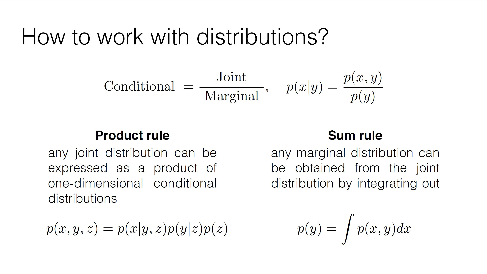
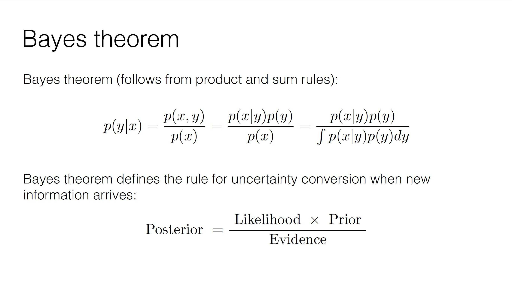
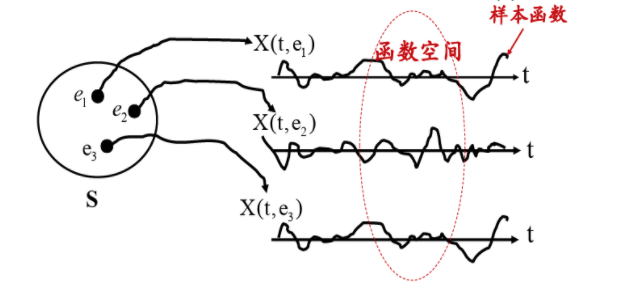

**事需缓图，欲速不达也。**

**本笔记仅为自己学习记录所用，参考的其他作者的内容见文中链接。如有不便，可以私信删除。**

# 第一部分 概率基础知识
## 1. 概率论
### 切比雪夫大数定律
设 $ x_1,x_2,...,x_n $ 是一组相互独立的随机变量（或两两不相关，但是不一定是同分布），它们分别存在期望 $E(x_k)$ 和方差 $D(x_k)$ 若存在常数 $C$ 使得 $D(x_k) \le C \text{, }(k=1,2,...n)$ ,则对任意小的正数 $\epsilon$  
$$
\lim\limits_{n\to\infty}P\lbrace|\frac{1}{n}\sum_{k=1}^nx_k-\frac{1}{n}\sum_{k=1}^nE_{x_k}|<\epsilon\rbrace=1
$$

### 辛钦大数定律
设 $\lbrace{a_i, i\ge1}\rbrace$ 为独立同分布的随机变量序列,若 $a_i$ 的数学期望存在,则服从大数定律:  
即对任意的 $\epsilon>0$ 有
$$
\lim\limits_{n\to\infty}P ( |\frac{1}{n}\sum_{i=1}^na_i-\mu|<\epsilon)=1
$$

### 变量替换公式
设 $X$ 是一个连续型随机变量,概率密度函数为 $f_x$ , 并设存在一个区间 $I \subset R$ 使得当 $x \notin I$ 时, $f_x ( x ) = 0$ . 设 $g:I \to R$ 是一个可微函数,其反函数是 $h$ ,除了有限多个点处的导数可能为0外, $g$ 的导数在I中始终为正或者始终为负.
令 $Y=g(x)$ ,那么
$$
f_Y(y)=f_X(h(y))|h'(y)|
$$
推广到多维连续型随机变量的情况时,导数的绝对值换成Jacobian矩阵的行列式.
$$
f_Y(y)=f_X(h(y))|\frac{\partial h(y)}{\partial y}|
$$

### 加法和乘法法则

### 贝叶斯定理

## 2. 随机过程
### 参考内容
https://zhuanlan.zhihu.com/p/93836989  

### 2.1 随机过程的定义
自然界和现实生活中发生的两类现象：**确定性现象（必然现象）和不确定性现象（随机现象，偶然现象）**

**随机现象**就每一次试验结果来说具有不确定性，但在相同条件下大量重复试验，其结果就呈现出某种规律性。

**随机试验**：满足三个特点
1. 可以在相同的条件下重复进行。
2. 每次试验可能结果不止一个，并且能实现确定试验的所有可能结果。
3. 每次试验前不能确定哪个结果会出现。

**随机事件**：随机试验的所有可能出现的结果

**样本空间**：随机试验中所有可能出现的结果组成的集合，记为 $S$

**随机变量**：设 $E$ 是随机试验，它的样本空间 $S= \lbrace e \rbrace$ ，如果对于每一个 $e$ ，都有一个实数 $X(e)$ 与之对应，则 $X$ 为定义在S上的随机变量。

**随机过程**：设 $E$ 是随机试验，它的样本空间是 $S$ ，若对于每一个 $e_i \in S$ ，总有一个确定的时间函数与之对应 $X(t,e_i)$ 与之对应，这样对于所有的 $e$ ，就可以得到一族时间 $t$ 的函数 $X(t,e_1),X(t,e_2),...,X(t,e_n)$ ，称为随机过程。族中的每一个函数称为这个随机过程的样本函数。

随机过程由可以看成是依赖于时间t的一族随机变量。由此可以省略 $e$ ，用 $X(t)$ 表示随机过程。

### 2.2 随机过程分类
根据时间 $t$ ，和随机变量 $X(t,e)$ 是否连续可分为四类：
1. 连续型随机过程：$t,X(t,e)$ 都连续
2. 离散型随机过程： $t$ 连续， $X(t,e)$ 离散
3. 连续型随机序列： $t$ 离散， $X(t,e)$ 连续
4. 离散型随机序列： $t$ 离散， $X(t,e)$ 离散

### 2.3 常见随机过程
#### 2.3.1 正态过程（高斯过程 Gaussian Process）
给定随机过程 $\lbrace X(t), t \in T \rbrace$ ，若对任意的正整数 $n \ge 1$ 及任意的 $t_1,t_2,...,t_n \in T$ ，随机变量 $X_{t_1}, X_{t_2},..., X_{t_n}$ 的联合分布是 $n$ 维正态分布。即
$$
f_{t_1,t_2,...,t_n}(x_1, x_2, ..., x_n) = \frac{1}{(2\pi)^{\frac{n}{2}}(det C)^{\frac{1}{2}}}exp \lbrace -\frac{1}{2}(X-\mu)^TC^{-1}(X-\mu) \rbrace
$$
则称 ${X(t),t \in T}$ 是正态过程（高斯过程）。其中 $\mu = (m(t_1), m(t_2),...,m(t_n))^T,m(t)=E(X_t),C=(c_{ij}),c_{ij} = Cov(X_{t_i},X_{t_j}),i,j=1,2,...,n$

### 2.3.2 维纳过程（布朗运动 Brouwn Motion）
维纳过程对布朗运动在理论上做出了精确的数学描述。布朗运动是物理学家布朗在观察漂浮在液面上的花粉的不规则运动而提出的。因而布朗运动又称为维纳过程。

如果随机过程 ${W(t),t \ge 0s}$ 满足下列条件：
1. $W(0)=0$
2. $E[W(t)] = 0$
3. 具有平稳独立增量
4. $t > 0, W(t) \thicksim N(0, \sigma^2t), \sigma > 0$
称随机过程 ${W(t),t \ge 0s}$ 是参数为 $\sigma^2$ 的维纳过程。（若 $\sigma=1$ ，则称为标准维纳过程）

### 2.3.3 马尔科夫过程
**马尔科夫性**：
设 $\lbrace X(t),t \in T \rbrace$ 为一随机过程，若对任意的 $t_1 < t_2 <...<t_n < t$ ，任意的 $x_1, x_2,...,x_n \in S$ ，随机变量 $X(t)$ 在已知变量 $X(t_1)=x_1,...,X(t_n)=x_n$ 之下的条件分布函数只与 $X(t_n) = x_n$ 有关，而与 $X(t_1)=x_1,...,X(t_{n-1})=x_{n-1}$ 即条件分布函数满足等式：
$$
F(x,t|x_n, x_{n-1}, ..., x_2, x_1, t_n, t_{n-1}, ..., t_2, t_1) = F(x, t |  x_n, t_n)
$$
即
$$
P(X(t) \le x | X(t_n)=x_n, ..., X(t_1)=x_1) = P(X(t) \le x | X(t_n) = x_n)
$$
此性质称为马尔科夫性，也称作无后效性或无记忆性。

**马尔科夫过程**：
若随机过程满足马尔科夫性，则称为马尔科夫过程。
**维那过程也属于马尔科夫过程**
