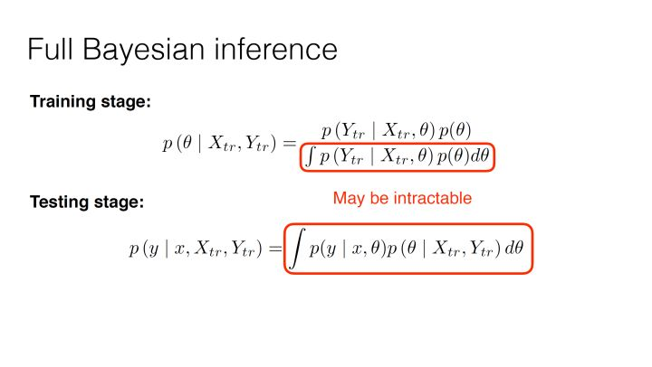
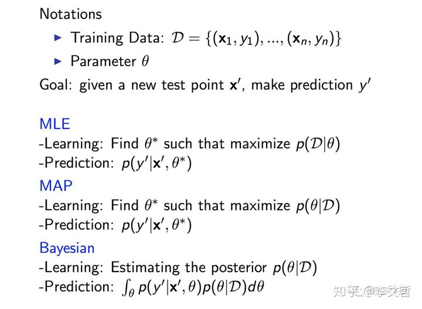

**由缓至急，循循而进。深沟高垒，步步为营。**

**本笔记仅为自己学习记录所用，参考的其他作者的内容见文中链接。如有不便，可以私信删除。**

# 第二部分 机器学习基础
### 参考内容
https://zhuanlan.zhihu.com/p/48521073  
https://zhuanlan.zhihu.com/p/37215276  
https://blog.csdn.net/liu1194397014/article/details/52766760  
https://zhuanlan.zhihu.com/p/355019238  
Deep Learning（花书第五章）

## 1.机器学习与统计推断
**统计推断**是通过样本推断总体的统计方法。
机器学习领域中的一个方向是通过统计推断中的数值优化来解决问题，称为统计学习。
机器学习更关注最小化预测误差的某种度量，比如模型的泛化能力，预测的准确率。统计推断更关注推断本身，比如模型或参数的显著性水平，置信度以及统计量意义。

**直白的理解，对于一个图像生成任务来说，图像数据集相当于是从图像的分布中 $p_{data}$ 中采样出来的样本，而我们的生成模型就需要根据数据集中的样本来推断一个分布 $p_{model}$ 使得推断出来的分布与原始的分布尽可能的一致。**
## 2.频率学派与贝叶斯学派
统计推断是统计学的一个庞大的分支。统计学有两大学派，**频率学派**和**贝叶斯学派**，两个学派在统计推断的方法上各有不同。
* 频率学派，20世纪初期建立，在之后的整个20世纪基本主宰了统计学，代表人物费舍尔（Fisher）、K.皮尔逊（Karl Pearson）、内曼（Neyman），费舍尔提出极大似然估计方法（Maximum Likelihood Estimation，MLE）和多种抽样分布。K.皮尔逊提出Pearson卡方检验、Pearson相关系数，内曼提出了置信区间的概念，和K.皮尔逊和儿子S.E.皮尔逊一起提出了假设检验的内曼-皮尔逊引理。***（这几个人应该就是概率论假设检验部分的万恶之源 /doge）***
* 贝叶斯学派，20世纪30年代建立，快速发展于20世纪50年代（计算机诞生之后），它的理论基础由17世纪的贝叶斯（Bayes）提出的贝叶斯公式，也称贝叶斯定理。贝叶斯方法经过高斯（Gauss）和拉普拉斯（Laplace）的发展，在19世纪主宰了统计学。所以在20世纪30年代贝叶斯学派的建立相当于是文艺复兴。***（这几个人貌似比上边几个还要万恶，整个概率论就没见哪一章不出来这几个人的名字/doge）***
* 抽象地说，两种学派的主要差别在于探讨「不确定性」这件事的立足点不一样，频率学派试图对「事件」本身建模，认为「事件本身就具有客观的不确定性」；贝叶斯学派不去试图解释「事件本身的随机性」，而是从观察事件的「观察者」角度出发，认为不确定性来源于「观察者」的「知识不完备」，在这种情况下，通过已经观察到的「证据」来描述最有可能的「猜的过程」，因此，在贝叶斯框架下，同一件事情对于知情者而言就是「确定事件」，对于不知情者而言就是「随机事件」，随机性并不源于事件本身是否发生，而只是描述观察者对该事件的知识状态。
* **具体来说，两种学派的主要差别是在对参数空间的认知上，即参数的可能取值范围。频率学派认为存在唯一的真实常数参数，观察数据都是在这个参数下产生的，由于不知道参数到底是哪个值，所以就引入了最大似然（Maximum Likelihood）和置信区间（confidence interval）来找出参数空间中最可能的参数值；贝叶斯学派认为参数本身存在一个概率分布，并没有唯一真实参数，参数空间里的每个值都可能是真实模型使用的参数，区别只是概率不同，所以就引入了先验分布（prior distribution）和后验分布（posterior distribution）来找出参数空间每个参数值的概率。**
* 贝叶斯学派的贝叶斯方法由于其理论更符合我们解决问题的思路,推断过程中加入了过往经验,且由于计算机的发展有效地解决了贝叶斯方法的难推导和难计算等缺陷,在机器学习的各种应用上都大放光彩,但也由于其对先验知识的要求,导致不适合被使用在一些不适合加入先验知识\十分追求严谨的应用场景,比如制药\法律等;频率学派通过假设检验的统计方法可以有效解决制药\法律的推断问题,但实际上也有天然的缺陷(这一块扩展内容较多,以后有机会再讨论).

## 3.最大似然估计（MLE）,贝叶斯统计和最大后验概率（MAP）
这部分的内容属于传统机器学习的部分，但是在现在的深度神经网络中也可以看到影子。
频率学派与贝叶斯学派分别对应了两种经典的统计推断的方法：
* 频率学派（Frequentist）- 最大似然估计（MLE，Maximum Likelihood Estimation）
* 贝叶斯学派（Bayesians）- 最大后验估计（MAP，Maximum A Posteriori）

首先从宏观上对机器学习问题有一个说明。
设数据集为 $D=\lbrace x_1,x_2,...,x_n \rbrace$ ，现在先不着眼于数据集中的数据是有标签还是无标签的，就是给定的数据集，其中的数据都是独立同分布的。假设这些数据是以含有未知参数 $\theta$ 某种概率形式分布的，我们的任务就是通过已有的数据来估计这个未知的参数 $\theta$ 。
代入到机器学习中，也就是说我们的数据集是从 $p_{data}$ 中采样得到的，而我们需要根据训练数据集来训练模型使得模型得到的分布 $p_{moodel}$ 与原始数据分布尽可能的一致，而 $p_{model}$ 依赖于参数 $\theta$ 。
于是，我们的目标就是在给定数据集 $D$ 的情况下，去找到参数 $\theta$ 。而且频率学派的最大似然估计，和贝叶斯学派的最大后验概率的区别也是围绕着如何去找参数 $\theta$ 展开的。用公式来表示的话，我们的目标便是求 $p(\theta | D)$ 。
$$
p(\theta | D) = \frac{p(\theta, D)}{p(D)} = \frac{p(D | \theta) p(\theta)}{p(D)} \qquad \text{ (公式道) }
$$
道生一，一生二，二生三，三生万物，这个式子某种程度上就是生出万物的道。所以把这个式子命名为公式道。这是一个很宏观的式子，直接代入某个机器学习模型比如GAN或者VAE的话并不合适而且会很让人费解，因为对于每个具体的模型来说，这个式子的具体形式会根据情况而有所变化。

### 3.1 最大似然估计
#### 3.1.1 最大似然估计
频率学派的思想就是认为存在唯一的真实常数参数。也就是说最优的参数 $\theta$ 是确定的只有一个。但是由于一些外界噪声的干扰，采样得到的数据看起来并不完全是由参数决定的。不过虽然由误差存在，只要在这个给定的数据的情况下，找到一个概率最大的参数就可以了。最大似然估计的思想就是如此。于是，就相当于最大化给定数据的时候找到的 $\theta$ 的可能性。结合上述的公式道，可以得出最大似然估计的目标：
$$
\hat{\theta}_{map} = \underset{\theta}{\operatorname{argmax}} p(\theta | D) = \underset{\theta}{\operatorname{argmax}} \frac{p_{model}(D | \theta)p(\theta)}{p(D)}
$$
在最大似然估计中假设的前提是参数 $\theta$ 是一个确定的值，或者可以理解成在未知数据的情况下 $\theta$ 取任何可以取到的值的可能性是相同的，那么 $p(\theta)$ 就是一个常数，而 $p(D)$ 是已有的数据集的分布，也是确定的,可以视作常数。再加上数据集中的数据都是独立同分布的前提条件，于是我们的目标就变成了，
$$
\underset{\theta}{\operatorname{argmax}} p_{model}(D | \theta) = \underset{\theta}{\operatorname{argmax}} \prod_{i=1}^n p_{model}(x_i | \theta)
$$
上面变形过的式子就是很常见的似然函数。在 $argmax$ 的条件下，取 $log$ 不改变结果，因此可以进一步的转换成对数似然函数
$$
\underset{\theta}{\operatorname{argmax}} p_{model}(D | \theta) = \underset{\theta}{\operatorname{argmax}} \prod_{i=1}^n p_{model}(x_i | \theta) = \underset{\theta}{\operatorname{argmax}} \sum_{i=1}^n log(p_{model}(x_i | \theta))
$$
至此便是最大似然估计最终的目标的表示。那么最大似然估计的目标与交叉熵和KL散度有什么联系呢？
#### 3.1.2 最大似然估计与交叉熵和KL散度
如果不太了解交叉熵和KL散度可以看末尾的补充内容
现在回过头来再看最大似然估计的目标，在 $argmax$ 的条件下，缩放代价函数不改变结果，
$$
\begin{aligned}
\underset{\theta}{\operatorname{argmax}} \sum_{i=1}^n log(p_{model}(x_i | \theta)) &= \frac{1}{n} \underset{\theta}{\operatorname{argmax}} \sum_{i=1}^n log(p_{model}(x_i | \theta)) \\
&= - \frac{1}{n} \underset{\theta}{\operatorname{argmax}} \sum_{i=1}^n log(p_{model}(x_i | \theta))
\end{aligned}
$$
根据辛钦大数定律，当 $n\to\infty$ 时，
$$
\lim\limits_{n\to\infty}(|\frac{1}{n} \sum_{i=1}^n log(p_{model}(x | \theta)) - E(log(p_{model}(x | \theta)))| < \epsilon) = 1
$$
即可以认为，当 $n\to\infty$ 时，从这里也可以看出最大似然估计在数据量很大的时候才会有准确的结果。
$$
\lim\limits_{n\to\infty}(\frac{1}{n} \sum_{i=1}^n log(p_{model}(x_i | \theta))) = E(log(p_{model}(x | \theta)))
$$
我们数据集中的 $x_i$ 都是从数据的分布 $p_{data}$ 中采样得到的，本身就服从一个分布，因而
$$
\begin{aligned}
E(log(p_{model}(x | \theta))) &= E_{x \thicksim p_{data}}(log(p_{model}(x | \theta))) \\
-\frac{1}{n} \underset{\theta}{\operatorname{argmin}} \sum_{i=1}^n log(p_{model}(x_i | \theta)) &= \underset{\theta}{\operatorname{argmin}} E_{x \thicksim p_{data}}(log(p_{model}(x | \theta)))
\end{aligned}
$$
于是，显然可以看出最大似然估计的目标就是最小化 $p_{data}$ 和 $p_{model}$ 的交叉熵。而交叉熵加上一个常数项就是 $p_{data}$ 和 $p_{model}$ 的KL散度。
$$
D_{KL}(p_{data}(x) || p_{model}(x | \theta)) = \sum_x p_{data}(x) log(p_{data}(x)) - \sum_x p_{data}(x) log(p_{model}(x | \theta))
$$
#### 3.1.3 条件对数似然
这个部分后面有空再补，跟上边的原理基本一样，无非是推导加了条件分布。

### 3.2 贝叶斯统计与最大后验概率（MAP）
#### 3.2.1 贝叶斯统计
首先说明先验概率（prior）和后验概率（posterior）。用公式道中的项作为例子。在掌握数据集 $D$ 之前，参数 $\theta$ 的分布 $p(\theta)$ 称为先验分布。而在掌握了数据集之后，参数的分布 $p(\theta | D)$ 就称为后验分布。先后即是指是否掌握了条件信息。
 
贝叶斯学派认为参数本身存在一个概率分布，并没有唯一真实参数，参数空间里的每个值都可能是真实模型使用的参数，区别只是概率不同。那么问题来了，如果连数据都不知道，我们怎么知道参数是怎么分布的？这个问题也是贝叶斯学派和频率学派的一个重要的区别。频率学派的看法就是参数是由数据样本估计得来的，没有数据样本就无从谈起参数。但是这并不是贝叶斯学派的考虑，贝叶斯估计中参数的先验分布很重要。
 
一个简单的例子来对二者进行比较，比如随机掷硬币的结果服从伯努利分布，扔三次硬币产生了（正正反）110这样的样本结果，根据最大似然估计，会猜测 $X \thicksim Bern(2/3)$ 。但是在贝叶斯学派来看，根据历史的经验来看，随机掷硬币正反面其实可能是服从 $X \thicksim Bern(1/2)$ ，只不过是样本太少了，所以产生了不同的结果。所以要考虑以往的经验在里面。那么这个先验的分布从哪来呢？事实上，先验在很多时候完全是假设，或者说是“猜的”，然后去验证已有的数据是否吻合先验猜想。总之，**先验是与数据样本无关的。**
 
这个小例子也从一个方面显示了频率派和贝叶斯派的应用场景，频率派适用在数据样本数量很大的时候，而贝叶斯派在数据样本较少的时候的表现会比频率派要好。在数据样本数量很大的时候，两者都会有准确的结果，但是相比之下贝叶斯派的计算成本要高得多。
现在再来看一下公式道
 
$$
p(\theta | D) = \frac{p(D | \theta) p(\theta)}{p(D)} \qquad \text{ (公式道) }
$$
这里除了分母可以看作一个归一化因子外，其余都是概率分布的函数，也就是说 $p(\theta)$ 不能再被看做常数，那么就需要对上式进行变形
$$
\begin{aligned}
p(D) &= \int_{\theta} p(D | \theta)p(\theta) d\theta \\
p(D | \theta) &= \prod_{i=1}^n p(x_i | \theta) \\
p(\theta | D) &= \frac{(\prod_{i=1}^n p(x_i | \theta)) p(\theta)}{\int_{\theta} \prod_{i=1}^n p(x_i | \theta) p(\theta) d\theta}
\end{aligned}
$$
**通过贝叶斯统计，我们得到的不是单一的一个 $\theta$ ，而是一个分布 $p(\theta | D)$ 。** 之后的处理方式有两种。第一种是用期望 $E(p(\theta | D))$ 来估计 $\theta$ 。这种方式相对简单，因为可以少算一次积分。但是结果会不太准确。第二种方式是保留 $E(p(\theta | D))$ ，而在预测的时候，用求边缘分布的方式，即 $\int_{\theta} p(x' | \theta) p(\theta | D) d\theta$ ，这种方式需要求积分，相对复杂，但是结果会相对更准确。
可以看出，直接用贝叶斯统计的方法需要求积分，而且这种积分通常没有解析解，就需要用近似推断（Approximate Inference）来估计，比如马尔科夫蒙特卡洛方法（MCMC），又或者我们之后会主要说明的变分推断（Variational Inference）。那么一个很重要的问题，如何在保证准确率不受太大影响的前提下去降低贝叶斯方法的计算复杂度。一种可行的方法就是最大后验概率（MAP）。  

#### 3.2.2 最大后验概率（MAP）
为了避免求积分的运算，一种可行的思路就是在贝叶斯估计中，采用极大似然估计的思想，考虑后验分布极大化而求解参数 $\theta$ ，这样就变成了最大后验估计（Maximum A Posterior estimation，MAP）
$$
\hat{\theta}_{map} = \underset{\theta}{\operatorname{argmax}} p(\theta | D) = \underset{\theta}{\operatorname{argmax}} \frac{p(D | \theta)p(\theta)}{p(D)}
$$
与之前极大似然估计相同的地方是这里的分母 $p(D)$ 依然可以看作是常数，但是不同的地方是 $p(\theta)$ 不能被看作是个常数了，于是优化的目标就可以写作
$$
\hat{\theta}_{map} = \underset{\theta}{\operatorname{argmax}} p(D | \theta)p(\theta) = \underset{\theta}{\operatorname{argmax}} (log(p(D | \theta) + log(p(\theta)))
$$
**可以看出目标的前半部分 $log(p(D | \theta)$ 与最大似然估计的似然函数是一样的，不同的就在于后半部分的 $log(p(\theta))$ ，而后半部分的本质其实就是正则化项！**
怎么理解后半部分是正则化项呢？考虑实际的情况，我们假设先验分布为 $\theta \thicksim N(0, \sigma^2)$ ，那么对正态分布取对数之后，得到的就是L2正则化项乘一个缩放因子。
 
至此，最大似然估计，贝叶斯统计和最大后验概率基本就结束了。做一个简单地总结。
首先来说最大似然估计具有一致性（即训练样本数量无穷大时，参数的最大似然估计会收敛到真实值）的条件：
（1）$p_{data}$ 真实分布必须在模型族 $P_{model}(.;\theta)$ 中。
（2） $p_{data}$ 真实分布必须刚好对应一个 $\theta$ 值。
感性的理解的话，就是说我们要合理的设计模型来保证模型的结果能够覆盖到真实分布。
在数据样本较少的情况下，贝叶斯学派的方法效果要相对准确。在数据样本数量逐渐增多的时候，最大后验概率的结果会收敛到最大似然的结果。  

 
在很多现在的深度神经网络中依然可以看到这种方法的影子。比如，我们的很多神经网络初始化参数的方法，以及对参数进行正则化，以及在此基础上的通过梯度下降来求最佳参数，某种程度上都可以理解成是在求最大后验概率的过程。
最后放一张图。图片引用的文章链接放在这部分开头的引用资源里边了。

## 补充内容
### 交叉熵
假设两个概率分布 $p(X), q(X)$ ，交叉熵
$$
\begin{aligned}
H(p, q) = - \sum_x p(x) log(q(x)) \\
= -E_{x \thicksim p(x)}(log(q(x)))
\end{aligned}
$$
### KL散度
KL散度，也称作相对熵，用来衡量两个分布之间的相似程度。
$$
\begin{aligned}
D_{KL}(p || q) &= \sum_x p(x) log(\frac{p(x)}{q(x)}) \\
&= \sum_x p(x) log(p(x)) - \sum_x p(x) log(q(x)) \\
D_{KL}(q || p) &= \sum_x q(x) log(\frac{q(x)}{p(x)}) \\
&= \sum_x q(x) log(q(x)) - \sum_x q(x) log(p(x))
\end{aligned}
$$
KL散度的性质，
$$
\begin{aligned}
(1) D_{KL}(p || q) &\ne D_{KL}(q || p) \\
(2)D_{KL}(p || q) &= 0 \Leftrightarrow p = q \\
(3)D_{KL}(p || q) &\ge 0
\end{aligned}
$$
以下都假设是离散的情况，连续的情况将累加换成积分即可。
下面证明性质（3），先引入Jensen不等式：
若 $f(x)$ 为区间 $I$ 上的下凸（上凸）函数，则对于任意 $x_i \in I$ 和 $\sum\lambda_i = 1, \lambda_i > 0$
$$
\text{下凸} \qquad f(\sum_{i=1}^n \lambda_ix_i) \le \lambda_if(\sum_{i=1}^n x_i) \\
\text{上凸} \qquad f(\sum_{i=1}^n \lambda_ix_i) \ge \lambda_if(\sum_{i=1}^n x_i)
$$
特别的，取 $\lambda_i = \frac{1}{n}$ ，此时
$$
\text{下凸} \qquad f(\sum_{i=1}^n \frac{1}{n}x_i) \le \frac{1}{n}f(\sum_{i=1}^n x_i) \\
\text{上凸} \qquad f(\sum_{i=1}^n \frac{1}{n}x_i) \ge \frac{1}{n}f(\sum_{i=1}^n x_i)
$$
利用Jensen不等式证明KL散度非负
$$
\begin{aligned}
D_{KL}(p || q) &=  \sum_{x \thicksim X} p(x) * [log(\frac{p(x)}{q(x)})] \\
&= - \sum_{x \thicksim X} p(x) * [log(\frac{q(x)}{p(x)})] \\
&\ge - log(\sum_{x \thicksim X} p(x) * \frac{q(x)}{p(x)}) \\
&= -log(\sum_{x \thicksim X} q(x)) \\
&= 0
\end{aligned}
$$
