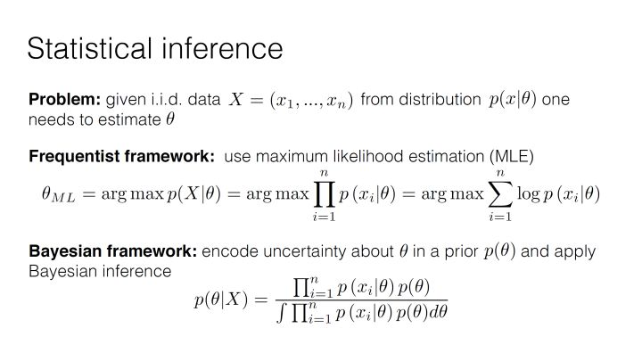
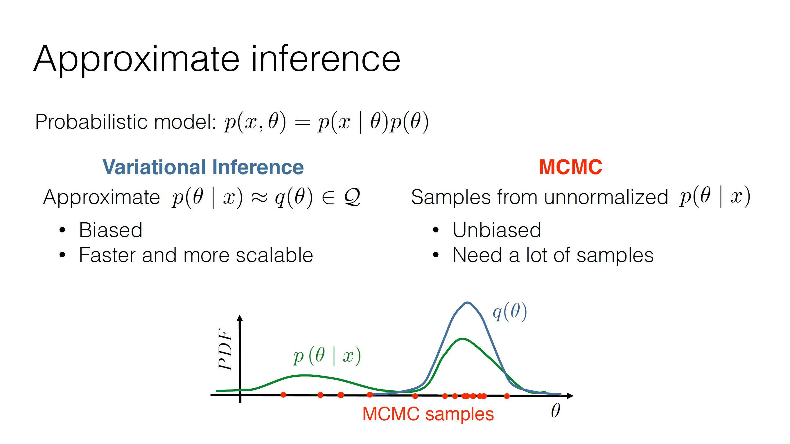

**宁伪作不知不为，不伪作假知妄为。静不露机，云雷屯也。**

**本笔记仅为自己学习记录所用，参考的其他作者的内容见文中链接。如有不便，可以私信删除。**

# 第三部分 近似推断
### 参考内容
https://blog.csdn.net/cengjing12/article/details/106753147  
https://zhuanlan.zhihu.com/p/355019238  
Variational Inference: A Review for Statisticians  

## 2.1 回顾
回顾一下上一个部分的内容，依然把公式道放在最开始的地方。
$$
p(\theta | D) = \frac{p(\theta, D)}{p(D)} = \frac{p(D | \theta) p(\theta)}{p(D)} \qquad \text{ (公式道) }
$$
两种不同的统计推断方法，频率学派和贝叶斯学派

贝叶斯框架下模型的训练过程，

上一部分我们留下了一个铺垫，也就是说完整的贝叶斯推断过程中，需要求两个积分，但是这两个积分通常是没有封闭解又或者计算复杂度太高。那么在这种情况下，我们处理的方式有两种，第一种就是用最大后验概率（MAP）来近似。第二种就是用近似推断（Approximate Inference），而近似推断主要有两种方法，一个是马尔科夫蒙特卡洛（MCMC）这个之后再补充。另一个就是我们这个部分主要总结的变分推断（Variational Inference）。

## 2.2 从贝叶斯统计到变分推断
首先要说明，这一部分要介绍的是一种数学的方法，所以我们对公式道的变量名称稍作修改，看起来更有广泛的意义。
$$
\begin{aligned}
p(\theta | x) &= \frac{p(\theta, x)}{p(x)} = \frac{p(x | \theta) p(\theta)}{p(x)} \qquad \text{ (公式道) } \\
Posterior &= \frac{Likelihood \times Prior}{Evidence}
\end{aligned}
$$
把原来的表示数据样本的 $D$ 换成了 $x$ ，这里 $x$ 表示任何观测到的量，而不再局限于数据集样本。同样 $\theta$ 也有更广泛的意义，表示所有我们感兴趣的未知量，也称隐变量（latent random variables），它可以包括模型的参数，模型中间的未知结果等等。
而推断要完成的就是在给定观测变量下，求解隐变量的后验分布，即求 $p(\theta | x)$ 。

### 2.2.1 近似推断
在一些情况下我们需要得到后验分布，但是在求解后验分布的时候，根据公式道，分母部分（也称作Evidence） $p(x) = \int_{\theta}p(x, \theta)d\theta$ 这个积分通常没有封闭解（closed form）或者有指数的计算复杂度。在这种情况下，要进行精确推断不可行或者太复杂，钱我不想给，货我又想要怎么办？答案就是近似推断。
怎么近似，两种比较常用的方法，第一种马尔科夫蒙特卡洛方法（Markov Chain Monte Carlo，MCMC）这种方法的理论依据依然是大数定律，通过大量的采样来进行逼近。另一种就是变分推断（Variational Inference，VI）。

## 2.3 变分推断
变分推断的思想其实在日常的生活中经常用到。正版的书太贵了，我们可以用高仿的盗版书就好了（似乎在助长盗版/doge，不过想要没有盗版，首先要人民都能买得起正版）。同样的道理，既然我们不能精确推断后验分布 $p(\theta | x)$ ，那就利用近似推断，找到一个高仿的分布 $q(\theta)$ 来替代就好了。
**于是问题来了，如何去找到一个足够高仿的分布呢？
这个问题可以分解为两个问题：
（1）我们的“盗版”分布 $q(\theta)$ 要从哪去选？
（2）如何去衡量两个分布的相似性，也就是说足够的高仿？**

### 2.3.1 如何衡量两个分布的相似性？
先看相对简单的第二个问题，上一个部分介绍过，KL散度可以衡量两个分布的相似性。于是，假设我们已经有一个 $q(\theta)$ 的候选分布集合 $Q$ ，通过计算 $q(\theta)$ 和 $p(\theta | x)$ 之间的KL散度，找到 $Q$ 中最高仿的分布，于是这就变成了一个优化问题。
优化目标：
$$
\begin{aligned}
q^*(\theta) &= \underset{q(\theta) \in Q}{\operatorname{argmin}} D_{KL}[q(\theta) || p(\theta | x)] \\
&= \underset{q(\theta) \in Q}{\operatorname{argmin}} \lbrace E_{\theta \thicksim q(\theta)}[log(q(\theta))] - E_{\theta \thicksim q(\theta)}[log(p(\theta | x))] \rbrace \\
&= \underset{q(\theta) \in Q}{\operatorname{argmin}} \lbrace E_{\theta \thicksim q(\theta)}[log(q(\theta))] - E_{\theta \thicksim q(\theta)}[log(p(\theta, x))] + E_{\theta \thicksim q(\theta)}[log(p(x))] \rbrace \\
&= \underset{q(\theta) \in Q}{\operatorname{argmin}} \lbrace E_{\theta \thicksim q(\theta)}[log(q(\theta))] - E_{\theta \thicksim q(\theta)}[log(p(\theta, x))] + log(p(x)) \rbrace \\
&= \underset{q(\theta) \in Q}{\operatorname{argmin}} \lbrace E_{\theta \thicksim q(\theta)}[log(q(\theta))] - E_{\theta \thicksim q(\theta)}[log(p(\theta, x))] \rbrace
\end{aligned}
$$
在求 $\underset{q(\theta) \in Q}{\operatorname{argmin}}$ 的情况下，可以把 $log(p(x))$ 视作是一个常数而省略。
 
根据KL散度的性质， $D_{KL}[q(\theta) || p(\theta | x)] \ge 0$ ，于是可以得到
$$
D_{KL}[q(\theta) || p(\theta | x)] = E_{\theta \thicksim q(\theta)}[log(q(\theta))] - E_{\theta \thicksim q(\theta)}[log(p(\theta, x))] + log(p(x)) \ge 0 \\
log(p(x)) \ge  E_{\theta \thicksim q(\theta)}[log(p(\theta, x))] - E_{\theta \thicksim q(\theta)}[log(q(\theta))]
$$
在公式道里边，分母的 $p(x)$ 被称作Evidence，而 $E_{\theta \thicksim q(\theta)}[log(p(\theta, x))] - E_{\theta \thicksim q(\theta)}[log(q(\theta))]$ 是Evidence的下界，故而也称其为Evidence Lower Bound（ELBO），也就是我们经常见到的变分下界。于是我们的优化目标就是最小化 $-ELBO(q)$ ，或者最大化 $ELBO(q)$ 。

### 2.3.2  $q(\theta)$ 要从哪去选？
继续回到第一个问题，优化的范围。要缩小优化的范围，就需要对 $q(\theta)$ 加入假设条件。
这里有两种假设条件来缩小范围。
#### 1. Mean Field Approximation
这种方法假设 $\theta = \lbrace \theta_1, \theta_2,..., \theta_m \rbrace$ ，其中 $\theta_1, \theta_2,..., \theta_m$ 之间相互独立。则
$$
q(\theta) = \prod_{i=1}^m q_j(\theta_j)
$$
详细内容，之后再补。

#### 2. Parametric Approximation
这种方法假设 $\theta$ 由另一组参数 $\lambda$ 决定。
$$
q(\theta) = q(\theta | \lambda)
$$
详细内容，之后再补。

那么变分推断的理论基本如此，理论的目的是指导实践，于是我们怎么应用变分推断呢？之后就要着眼于如何在生成模型中使用变分推断了。

### 2.3.3 利用变分推断消除积分
变分推断可以消除积分，那么是如何做的呢？
$$
\begin{aligned}
p(x) &= \int p(x, \theta)d\theta \\
&= \int p(x | \theta)p(\theta)d\theta \\
log(p(x)) &= log\Big(\int p(x | \theta) p(\theta)d\theta \Big) \\
&= log\Big( \int \frac{q(\theta)}{q(\theta)}p(x | \theta)p(\theta)d\theta \Big) \\
&= log\Big( E_{\theta \thicksim q(\theta)}[\frac{p(x | \theta)p(\theta)}{q(\theta)}] \Big) \\
&\ge E_{\theta \thicksim q(\theta)} log \Big( \frac{p(x | \theta)p(\theta)}{q(\theta)} \Big) \\
&= E_{\theta \thicksim q(\theta)}[log(p(\theta, x))] - E_{\theta \thicksim q(\theta)}[log(q(\theta))]
\end{aligned}
$$
可以看到得到的结果依然是变分下界。其实用变分推断消除积分就是用优化问题去取代求积分。
