**人一能之己百之，人十能之己千之。果能此道矣。虽愚必明，虽柔必强。**

**本笔记仅为自己学习记录所用，参考的其他作者的内容见文中链接。如有不便，可以私信删除。**

## 2.4 Markov Chain Monte Carlo（MCMC）和 Gibbs Sampling
### 参考内容
https://cosx.org/2013/01/lda-math-mcmc-and-gibbs-sampling  

**这个部分可以直接参考以上链接，这里只是链接内容的剪报做的记录。**

### 2.4.1 随机模拟
随机模拟（统计模拟）又称作蒙特卡罗方法。蒙特卡洛是摩纳哥公国的一个城市，以赌博而闻名。蒙特卡罗方法的发展始于 20 世纪 40 年代，和原子弹制造的曼哈顿计划密切相关，当时的几个大牛，包括乌拉姆、冯. 诺依曼、费米、费曼、Nicholas Metropolis，在美国洛斯阿拉莫斯国家实验室研究裂变物质的中子连锁反应的时候，开始使用统计模拟的方法, 并在最早的计算机上进行编程实现。

现代的统计模拟方法最早由数学家乌拉姆提出，被 Metropolis 命名为蒙特卡罗方法。说起蒙特卡罗方法的源头，可以追溯到 18 世纪，布丰当年用于计算π的著名的投针实验就是蒙特卡罗模拟实验。

统计模拟中一个重要的问题就是给定一个分布 $p(x)$ ，如何在计算机中生成它的样本。一般而言均匀分布 $Uniform(0,1)$ 的样本比较容易生成。通过线性同余发生器可以生成 $[0,1]$ 的伪随机数。

常见的概率分布，无论连续还是离散的分布，都可以基于 $Uniform(0,1)$ 的样本生成。比如正态分布可以通过Box-Muller变换得到：

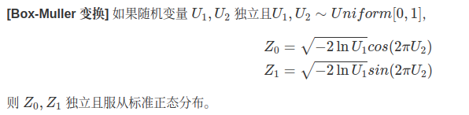

其它几个著名的连续分布，包括指数分布，Gamma分布，T分布，F分布，Beta分布等，也都可以通过类似的数学变换得到。

当 $p(x)$ 的形式很复杂或者是高维的分布的时候，生成样本就会很困难。比如：
*  $p(x) = \frac{\tilde{p}(x)}{\int \tilde{p}(x)dx}$ ，这个形式就像之前见过的贝叶斯公式一样。积分无法显式计算。
*  $p(x,y)$ 是一个二维的分布函数，这个函数本身计算很困难，但是条件分布计算相对简单。

此时就需要使用更加复杂的随机模拟方法来生成样本。比如MCMC和Gibbs Sampling。要了解这两个算法，需要对Markov Chain的平稳分布的性质有基本的认识。

### 2.4.2 Markov Chain及其平稳分布
Markov Chain之前已经出现很多次了,定义比较简单：
$$
P(X_{t+1}=x|X_t, X_{t-1},...) = P(X_{t+1}=x | X_t)
$$
也就是状态转移的概率只依赖于前一个状态。

下面看一个Markov Chain的具体的例子：
社会学家经常把人按其经济状况分成 3 类：下层 (lower-class)、中层 (middle-class)、上层 (upper-class)，我们用 1、2、3 分别代表这三个阶层。如果一个人的收入属于下层类别，那么他的孩子属于下层收入的概率是 0.65，属于中层收入的概率是 0.28，属于上层收入的概率是 0.07。从父代到子代，收入阶层的变化的转移概率如下。

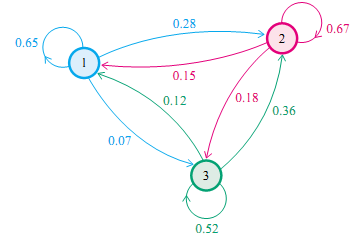

用矩阵表示如下：
$$
P =
\begin{bmatrix}
0.65 & 0.28 & 0.07 \\
0.15 & 0.67 & 0.18 \\
0.12 & 0.36 & 0.52 \\
\end{bmatrix}
$$
可以看出矩阵每一行的和为1

假设当前一代人处在三种阶层的比例是概率分布向量 $\pi_0 = [\pi_0(1), \pi_0(2), \pi_0(3)]$ ，那么他们的子代的分布比例将是 $\pi_1 = \pi_0P$ ，第n代子孙的收入分布比例将是 $\pi_n = \pi_{n-1}P = \pi_0P^n$

随机取初始概率分布 $\pi_0 = [0.21, 0.68, 0.11]$ ，计算n代子孙收入比例：

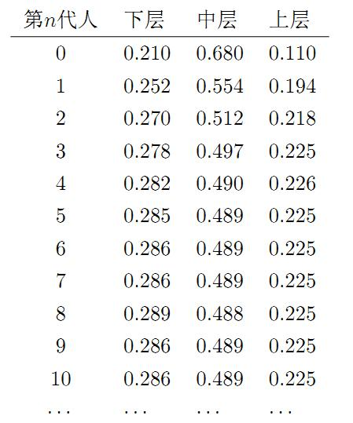

换成另外一组初始概率分布 $\pi_0 = [0.75, 0.15, 0.1]$

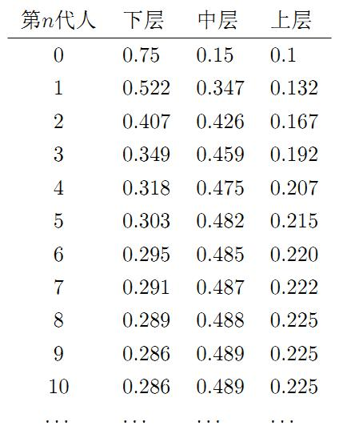

可以看出，不同的初始概率分布，最后会收敛到同样的分布上。也就是说收敛的行为与初始概率无关。那么收敛行为主要是由概率转移矩阵P决定的。

当n足够大时，这个矩阵的每一行都是稳定的收敛到 $\pi = [0.286,0.489,0.225]$ 。这个收敛现象并非是这个特例独有的，而是绝大多数Markov Chain的共同行为。

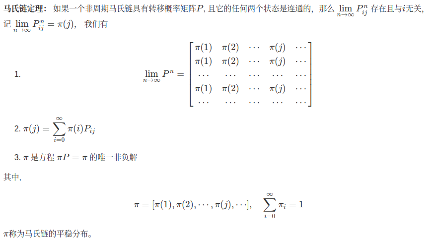

这个Markov Chain收敛定理是所有的MCMC方法的理论基础。

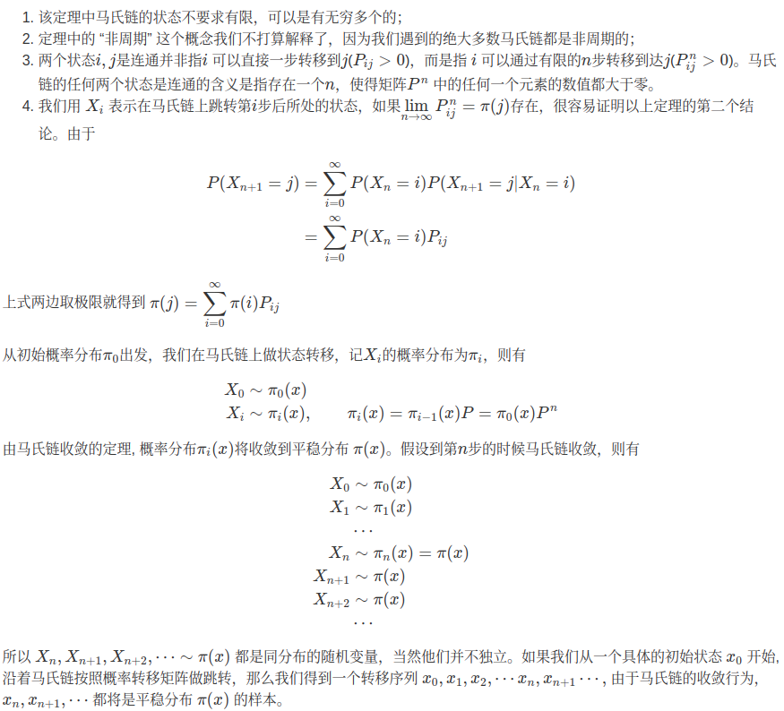

### 2.4.3 MCMC
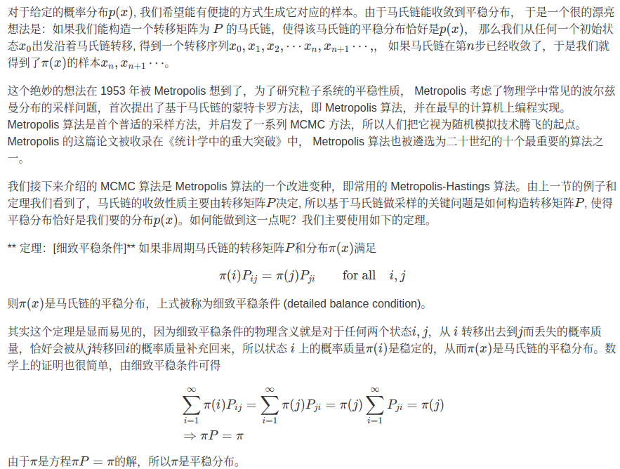
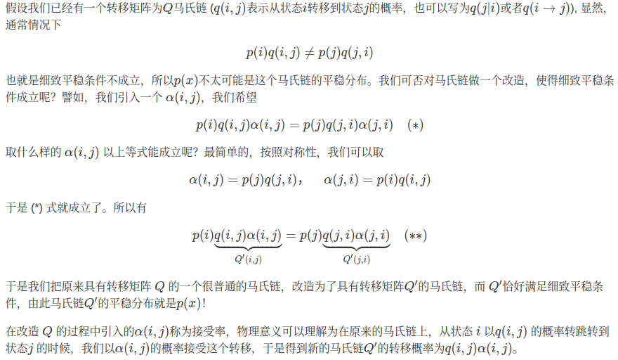
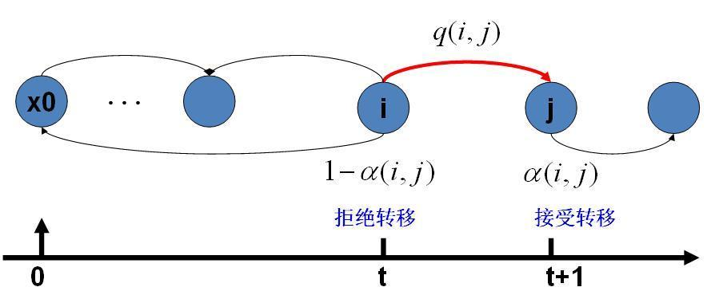
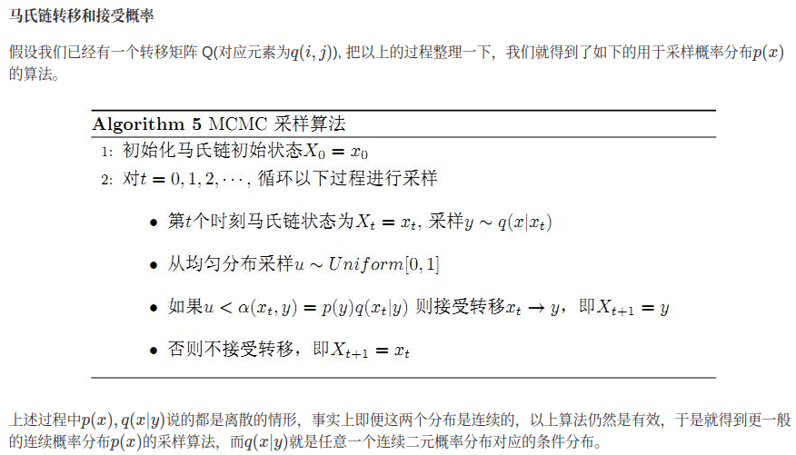
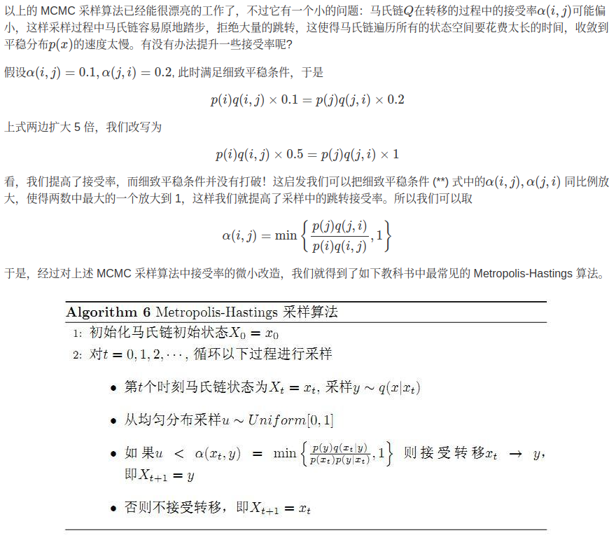
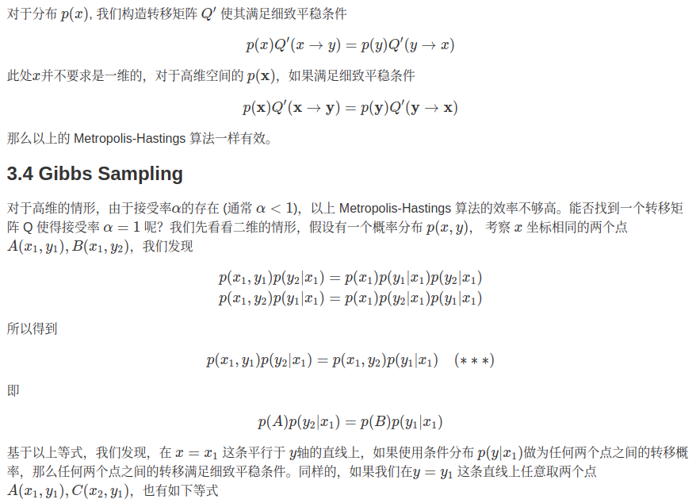
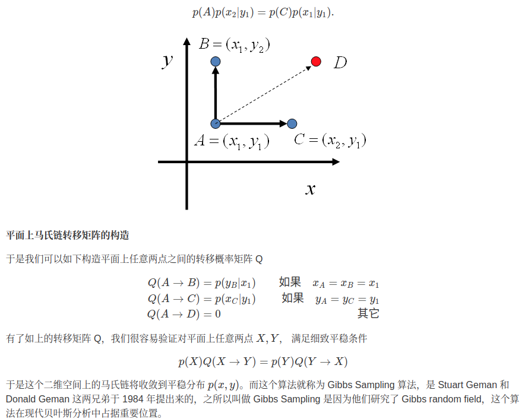
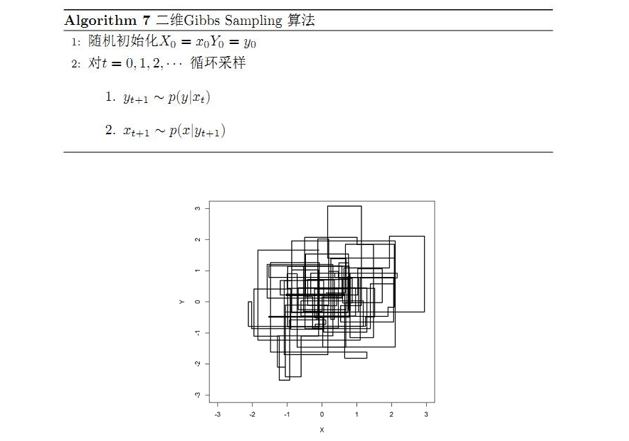
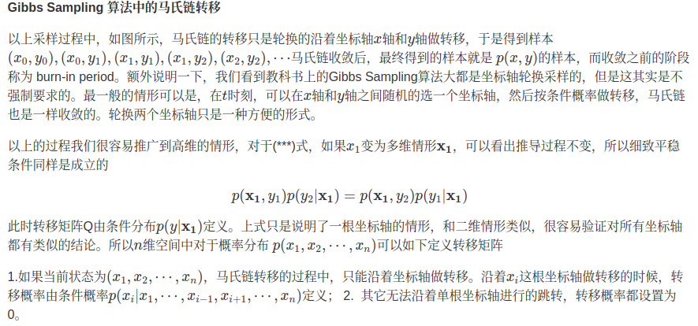
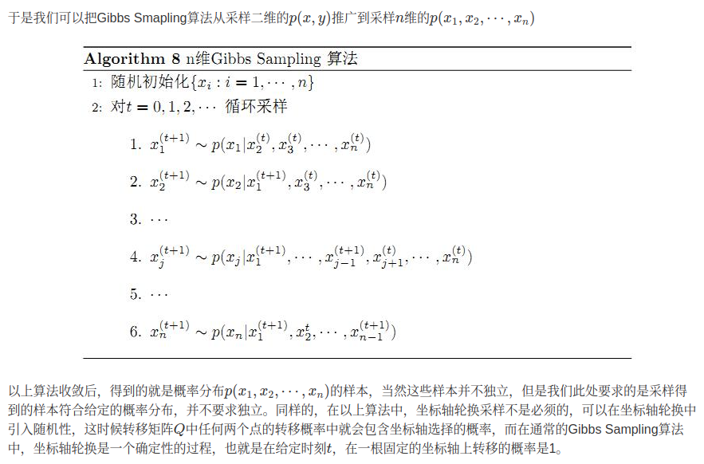
