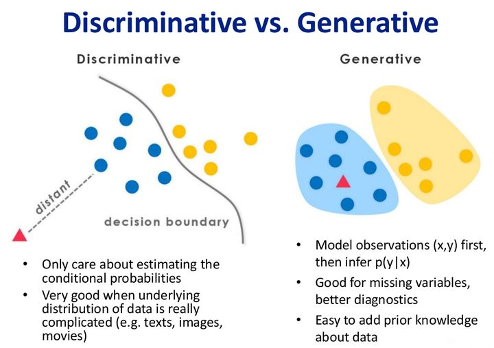

**莫见乎隐，莫显乎微，故君子慎其独也。**

**本笔记仅为自己学习记录所用，参考的其他作者的内容见文中链接。如有不便，可以私信删除。**

# 第五部分 生成模型和判别模型
#### 参考内容
https://zhuanlan.zhihu.com/p/32655097  
https://www.zhihu.com/question/20446337  
Deep Learning（花书第五章）

## 3.1 机器学习分类
机器学习算法按照有无监督信息可以大致分类为**无监督（unsupervised）学习和监督（supervised）学习，以及半监督（semi-supervised）学习**  
**无监督学习算法**（unsupervised learning algorithm） 训练含有很多特征的数据集，然后学习出这个数据集上有用的结构性质。在深度学习中，我们通常要学习生成数据集的整个概率分布，显式地，比如密度估计，或是隐式地，比如合成或去噪，还有一些其他类型的无监督学习任务，例如聚类，将数据集分成相似样本的集合。
**监督学习算法**（supervised learning algorithm）训练含有很多特征的数据集，不过数据集中的样本都有一个标签（label）或目标（target）。
**半监督学习**（semi-supervised learning algorithm）训练的数据集中，部分数据有标签（label），其他数据无标签。

机器学习算法按照建模的分布可以分类为**生成模型（Generative Model）和判别模型（Discriminative Model）**
在监督学习领域，生成模型和判别模型都有应用，而在无监督学习领域，更多的用的是生成模型。二者的区别可以从监督学习领域的生成模型和判别模型看出来。

监督学习的任务可以宏观的看作给定特征（feature） $X$ ，然后预测标签（label） $Y$ ，即求条件概率 $P(Y | X)$ 。比如：对于分类任务，就是在求 $P(class | image)$ 。
看到这个式子，我们立即就能想到公式道。
$$
P(Y | X) = \frac{P(X, Y)}{P(X)} = \frac{P(X | Y)P(Y)}{P(X)}
$$
那么**判别模型是直接建模条件概率分布`$P(Y | X)$`,而生成模型则是建模联合分布`$P(X, Y)$`，然后利用联合分布求出条件分布**。那么这两者有什么区别呢？
一个可能不太恰当但是比较形象的小例子，假设我们需要训练一个模型来对马和驴的图片进行分类，现在给模型输入一张兔子的图片，判别模型发现图片中有长耳朵，于是给出判断图片大概率是驴。但是生成模型会对图片整体理解，发现这张图片既不是马，也不是驴，结果将会很不确定。所以，判别模型学到的是马和驴之间的区别耳朵长短，但是生成模型学到的是什么是马，什么是驴。

## 3.2 生成模型与判别模型的比较
这个部分可以在看完之后的内容之后，再回过头来理解。
### 判别模型：
#### 优点：
1. 判别模型直接建模条件分布，仅需要有限的样本，节省计算资源，需要的样本数量少于生成模型。
2. 能清晰的分辨出多类或某一类与其他类之间的差异特征，准确率往往高于生成模型。
3. 由于直接学习条件分布，而不需要求解类别条件概率，所以允许我们对输入进行抽象，从而能够简化学习问题。

#### 缺点：
1. 不能反映训练数据本身的特性，能力有限。可以告诉你是1还是2，但是没有办法把整个场景描述出来。
2. 没有生成模型的优点。
3. 黑盒操作：变量间的关系不清楚，不可视。

#### 典型的判别模型：
支持向量机（SVM），逻辑回归（LR）

### 生成模型：
#### 优点：
1. 生成模型得到的是联合分布 $P(X, Y)$ ，不仅能够由联合分布计算条件分布 $P(Y | X)$ ，还可以给出其他信息。比如可以利用联合分布来计算边缘分布。
2. 生成模型收敛速度比较快，即当样本数量较多时，生成模型能更快地收敛于真实模型。
3. 生成模型能够应付存在隐变量的情况，
4. 研究单类问题比判别模型灵活性强。

#### 缺点：
1. 联合分布能够提供更多的信息，但也需要更多的样本和更多计算，尤其为了准确估计类别条件分布，需要增加样本的数目，而且类别条件概率的许多信息是我们做分类用不到，因而如果只是做分类任务，就浪费了计算资源。
2. 判别模型效果会比生成模型要好。

#### 典型的生成模型：
朴素贝叶斯，HMM

## 3.3 判别模型
接下来详细总结一下判别模型的推导过程。
定义训练数据为 $(X, Y)$ ，其中 $X = {x_1, x_2, ..., x_n}$ 为 $n$ 个训练样本的feature， $Y = {y_1, y_2, ..., y_n}$ 为 $n$ 个训练样本的label。定义测试数据为 $(\hat{X}, \hat{Y})$ ， $\hat{X}$ 为测试数据的feature， $\hat{Y}$ 为测试数据的label。 $\theta$ 为模型的参数。
那么我们训练模型的目标就是利用判别模型来直接得到条件分布 $P(\hat{Y} | \hat{X})$ ，当然，我们是在已知训练数据的基础上，通过模型得到测试数据的条件分布，所以我们可以写出 $P(\hat{Y} | \hat{X}) = P(\hat{Y} | \hat{X}, X, Y)$ 。

### 3.3.1 精确推断条件分布
那么我们先来看怎么得到精确推断。
$$
\begin{aligned}
P(\hat{Y} | \hat{X}) = P(\hat{Y} | \hat{X}, X, Y) &= \int P(\hat{Y}, \theta | \hat{X}, X, Y) d\theta \\
&= \int P(\hat{Y} | \hat{X}, \theta) \cdot P(\theta | X, Y) d\theta \qquad \text{（2）}
\end{aligned}
$$
这个式子可以从宏观上理解为，由训练数据 $X, Y$ 确定参数 $\theta$ ，再由 $\theta$ 和 $\hat{X}$ 确定 $\hat{Y}$ ，当然也可以推导出来。

#### 式子（2）的推导过程：
这里需要先有两个前提：
1. 所有的训练数据和测试数据都是独立同分布的。即 $\hat{X}, \hat{Y}$ 与 $X, Y$ 相互独立。且 $\hat{X}, \theta$ ,即测试数据与模型参数也相互独立。
2.  $\hat{Y}$ 与 $X, Y$ 在给定 $\hat{X}, \theta$ 的条件下独立。
$$
\begin{aligned}
P(\hat{Y}, \theta | \hat{X}, X, Y) &= \frac{P(\hat{Y}, \theta, \hat{X}, X, Y)}{P(\theta, \hat{X}, X, Y)} \cdot \frac{P(\theta, \hat{X}, X, Y)}{P(\hat{X}, X, Y)}\\
&= P(\hat{Y} | \theta, \hat{X}, X, Y) \cdot P(\theta | \hat{X}, X, Y)
\end{aligned}
$$
根据前提一可知
$$
\begin{aligned}
\frac{P(\theta, \hat{X}, X, Y)}{P(\hat{X}, X, Y)} &= \frac{P(\theta, X, Y) \cdot P(\hat{X})}{P(X, Y) \cdot P(\hat{X})} \\
&= \frac{P(\theta, X, Y)}{P(X, Y)} \\
&= P(\theta | X, Y)
\end{aligned}
$$
根据前提二可知
$$
\begin{aligned}
P(\hat{Y}, X, Y | \theta, \hat{X}) &= P(X, Y | \theta, \hat{X}) \cdot P(\hat{Y} | \theta, \hat{X}) \\
\frac{P(\hat{X}, \hat{Y}, X, Y, \theta)}{P(\theta, \hat{X})} &= \frac{P(\hat{X}, X, Y, \theta)}{P(\theta, \hat{X})} \cdot \frac{P(\hat{X}, \hat{Y}, \theta)}{P(\theta, \hat{X})} \\
P(\hat{Y} | \hat{X}, X, Y, \theta) &= P(\hat{Y} | \hat{X}, \theta)
\end{aligned}
$$
 

我们继续看公式（2）的后半部分 $P(\theta | X, Y)$ ，似曾相识。这正是公式道的内容，想要准确推断，需要用贝叶斯统计的内容，于是可以得到
$$
\begin{aligned}
P(\hat{Y} | \hat{X}) &= P(\hat{Y} | \hat{X}, X, Y) \\
&= \int P(\hat{Y} | \hat{X}, \theta) \cdot \frac{P(Y | X, \theta) \cdot P(\theta | X)}{\int P(Y | X, \theta) \cdot P(\theta | X)d\theta}d\theta
\end{aligned}
$$
至此整个推导过程基本结束，可以看到想要得到 $P(\hat{Y} | \hat{X})$ 的精确推断，需要计算两层的积分，是否有封闭解姑且不论，计算的复杂度已经很高了，那么该怎么办呢？

### 3.3.2 近似推断条件分布
在无法直接计算精确推断的时候，我们可以用近似推断。既然 $P(\hat{Y} | \hat{X}, X, Y)$ 不能直接计算，想要去除外部的积分，用参数 $\theta$ 的最大后验分布 $\theta_{map}$ 来对 $\theta$ 进行点估计。
$$
P(\hat{Y} | \hat{X}) = P(\hat{Y} | \hat{X}, X, Y) = P(\hat{Y} | \hat{X}, \theta_{map})
$$
这样就去掉了外层的积分。其实这里用到的也是变分推断的思想，只是优化的过程即最小化 $P(\hat{Y} | \hat{X}, X, Y)$ 和 $P(\hat{Y} | \hat{X}, \theta_{map})$ 之间的距离是我们人为的通过不断地调整模型的结构或者超参数等方式来实现的。
剩下的就是求最大后验概率 $P(\theta | X, Y)$ ，求最大后验分布的过程之前已经总结过了，不再赘述。这样内层的积分也不用求了。
于是就是我们常见的模型训练测试过程，先在训练集上求最大后验概率，然后在测试集或者验证集上测试结果。
