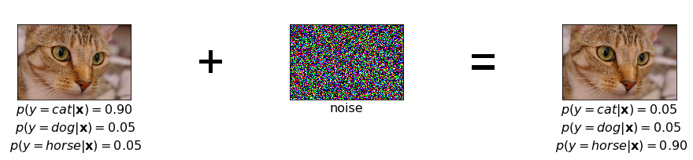
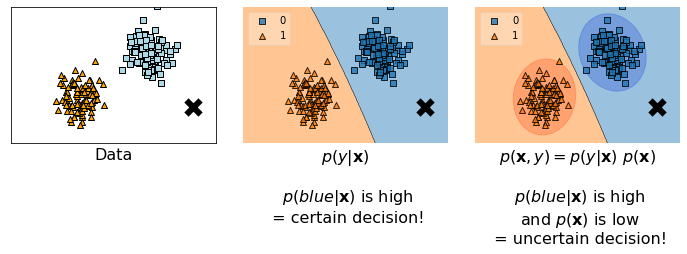
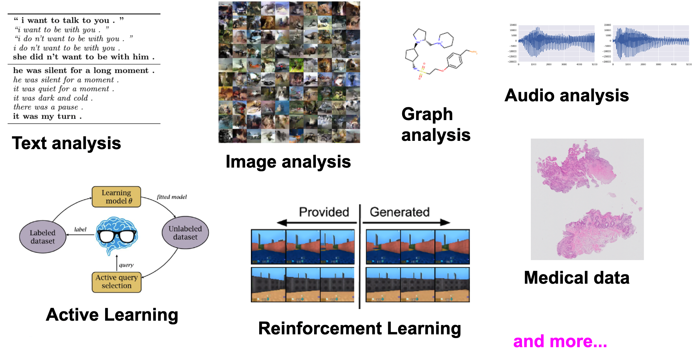
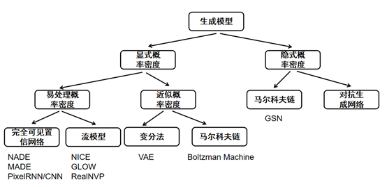
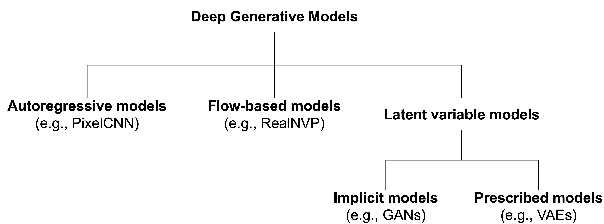

**尽人事以听天，吾唯日日谨慎而已。**

**本笔记仅为自己学习记录所用，参考的其他作者的内容见文中链接。如有不便，可以私信删除。**

# 第六部分 生成模型
从这部分开始，正式进入生成模型的总结。之前的内容也都是在看生成模型的过程中了解到的或是一些思考。
### 参考内容
https://jmtomczak.github.io/blog/1/1_introduction.html  
https://zhuanlan.zhihu.com/p/273245785  

## 4.1 为什么需要生成模型？
上一部分已经有所了解，在监督学习中，判别模型建模的是条件分布 $P(Y | X)$ ，对于分类问题，模型直接学到的是不同类别之间的不同之处；而生成模型建模的是联合分布 $P(X, Y)$ ，对于无监督学习来说，生成模型则是直接建模 $P(X)$ ，对于分类问题，生成模型可以学到每个类别是什么。那么，相比之下判别模型有什么缺陷呢？在上一部分已经提到过一些，这里再来看一看。
#### 判别模型的缺陷
如图所示，判别模型的第一个缺陷是如果对判别模型的输入加入噪声的话，会对结果产生很大的影响。这是因为判别模型建模 $P(Y | X)$ 缺少了对图像的语义信息的理解。

另一个缺陷如图，就像之前我们举过的判别马和驴的例子，对于一个训练好的判别模型，只是学出了马和驴之间的差别，比如耳朵长短，让它真的去“画一张马或者驴”，判别模型是办不到的。对于一个训练好的生成模型，则是学出了马和驴是什么，它可以自己“画出一张马或者驴来”。那么对于离群的点来说，比如输入一张长耳朵兔子的图片，判别模型会认为这是驴，但是生成模型发现图片中的东西似乎像是驴，但是既不符合马的分布，也不符合驴的分布，所以结果不能确定。

#### 为什么需要生成模型
从生成的角度来看，无论是监督学习建模 $P(X,Y)$ 还是无监督学习建模 $P(X)$ 都有重要的意义：
* it could be used to assess whether a given object has been observed in the past or not;
* it could help to properly weight the decision;
* it could be used to assess uncertainty about the environment;
* it could be used to actively learn by interacting with the environment (e.g., by asking for labeling objects with low  p(x) );
* and, eventually, it could be used to generate new objects.

## 4.2 哪些地方需要生成模型？

一言以蔽之，应用场景很广泛。

## 4.3 生成模型分类
比较详细的分类如下，

之后我们主要着眼于其中的几种

