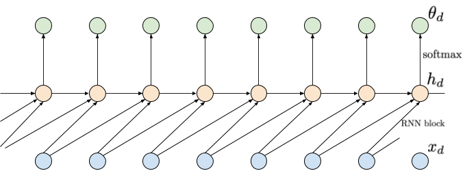
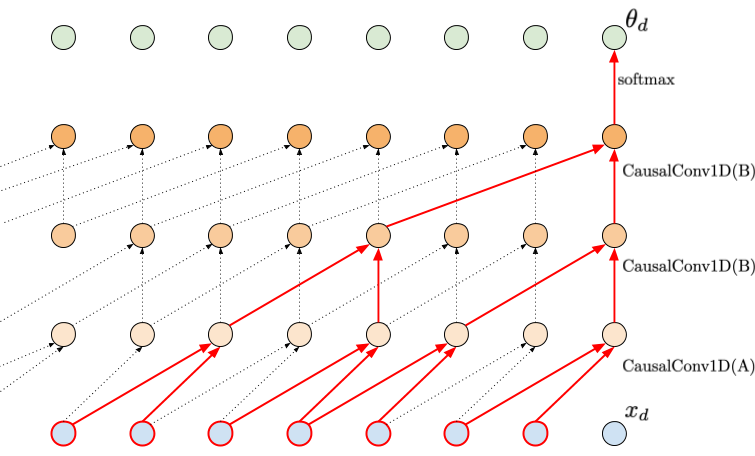
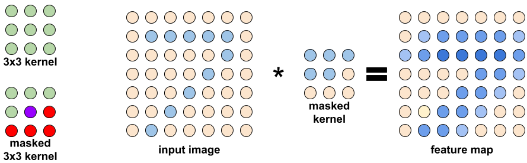
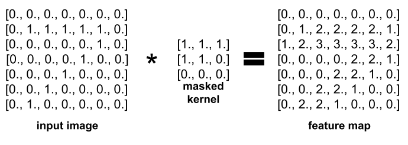
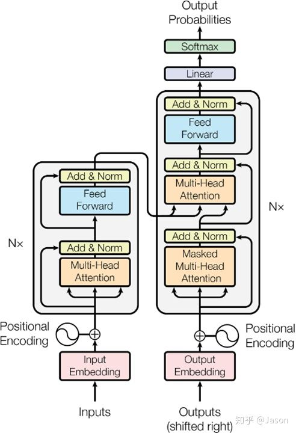

**有鸟止南方之阜，三年不翅，不飞不鸣，嘿然无声，此为何名？**
# 第七部分 深度自回归模型（Deep Autoregressive Model， DARM）
#### 参考内容
https://jmtomczak.github.io/blog/2/2_ARM.html
Attention is all you need（Transformer原始文章）

## 5.1 概率基础
有条件的生成模型需要建模分布 $P(X, Y)$ ，无条件的生成模型需要建模分布 $P(X)$ 。之后的内容都考虑是无条件的生成模型的情况。那么如何去求 $P(X)$ ？
先从概率的角度来看如何求得 $P(X)$ 。设 $\pmb{x} \in \pmb{\chi^D}$ 为一个 $D$ 维随机向量，这样， $P(\pmb{x})$ 可以看作是所有维度的联合分布 $P(x_1, x_2, ..., x_D)$ 。那么根据概率的乘法法则可以得到：
$$
P(\pmb{x}) = P(x_1, x_2, ..., x_D) = P(x_1)\prod_{d=2}^DP(x_d | \pmb{x}_{<d})  \qquad \text{(1)}
$$
通过这个乘法法则，我们可以得到 $P(\pmb{x})$ ，但是如果用模型来实现这个式子的话，会是什么情况呢？我们需要对乘法法则的每个条件分布全都要建立模型，所以就需要 $D$ 个独立的模型。能不能用一个模型呢？能但是很难，每个模型输入数量不一样，越往后的模型输入的条件信息越多，相应的模型也就更复杂。不过这给了我们一个很好的思路，能不能加入一些限制，能够用一个模型来实现。

## 5.2 深度自回归神经网络
通过对式子(1)加入一些限制条件，可以用一个共享的模型来表示所有的条件分布。
### 5.2.1 Finite memory
第一种最简单的思路就是，既然问题在于每个条件分布条件信息数量不同，那就加入限制，让条件数量相同就好了，这样每个模型输入数量也就一样，就能共享模型了。比如，限制每个维度的变量只与前两步的有关，而与更之前的独立。（如果限制成只与前一个有关，那就是著名的马尔科夫链（Markov Chain））
$$
p(\pmb{x}) = p(x_1)p(x_2 | x_1)\prod_{d=3}^Dp(x_d | x_{d-1}, x_{d-2})
$$

图中蓝色的节点表示输入信息，黄色的点为中间表示，绿色的点为输出的概率分布。

通过这种假设，可以用一个共享的模型来实现，但是也带来了一个很大的缺陷，当前的节点只能看到有限长度之前的信息，也就是 Limited memory 的问题。可是这种实现思路确实是可取的，能不能再次基础上加上更长的记忆信息？

### 5.2.2 RNN
RNN的方式就是在 Finite memory 的基础上加入 long range memory。做法就是把之前的所有memory进行统一的操作，得到固定形式的量 $h$，然后用来计算下一步的结果。这样，既可以固定模型输入形式一致，又可以得到long range memory。
$$
P(x_d | \pmb{x}_{<d}) = P(x_d | RNN(x_{d-1}, h_{d-1})
$$
其中 $h_d = RNN(x_{d-1}, h_{d-1})$，其中 $h_d$ 作为隐藏内容，就相当于是记忆存储的单元，来存储long-range dependencies。

通过RNN可以得到 long range memory。但是RNN也有其缺陷：
1. 显而易见，RNN只能是串行的处理的，所以速度很慢，这也是RNN饱受诟病的地方，也是改进的重要方向。
2. 同样因为是串行处理的，很容易出现梯度爆炸或者梯度消失的情况，所以模型不好训练。这也同样限制了RNN去获取 long range memory。

### 5.2.3 Causal Convolution
另一种能让模型得到 long range memory 的方法是Causal Convolution。这种卷积操作通过堆叠多层的卷积，而自下而上每层卷积的步长逐渐增大，来达到获得long range memory的效果。

#### 一维 Causal Convolution
一维的 Causal Convolution 如下图所示。

#### 二维 Causal Convolution
同样的对于二维数据，也有 Causal Convolution。也就是将二维数据，比如图像看做从上到下，从左到右的序列，然后给卷积核加入mask。

Causal Convolution 在学习 long-range dependencies 上比RNN要好，而且可以并行的训练，不会由于串行导致梯度爆炸或者消失的问题。在很多应用上， Causal Convolution 的表现也比 RNN 要好。但是，Causal Convolution 也有其弊端。虽然在训练的时候可以并行的训练，但是在用其生成新的样本的时候，序列还是要一个一个的串行的生成的，这也是自回归模型的一个通病，也是由式子（1）所决定的。不过这也是一个重要的改进的方向。

### 5.2.4 GPT（Transformer Decoder）
（**这个部分写的比较简略，如果对Transformer不了解可以先看看Transformer相关的内容就一目了然了** 。这里只是看Transformer Decoder部分，因为GPT就是在Transformer Decoder的基础上实现的。现在很多把Tranformer的encoder和decoder分开来实现不同的应用的成果。）
另一种更加直接更加暴力的方法，直接的实现了式子（1），那就是Transformer Decoder及其用到的Masked Multi-head self-attention。Transformer在机器翻译上效果拔群，但是不可否认的是，其需要大量的数据，而且处理的序列长度也是有限的，正是因为直接计算式子（1），越靠后的，需要计算的条件信息越多，计算量也就越大。
Multi-head self-attention 的操作如下：
$$
\begin{aligned}
Attention(q, k, v) &= softmax(\frac{qk^T}{\sqrt{d}})v \\
MultiHeadAttention(Q, K, V) &= Concat(head_1, head_2, ..., head_h)W^O \\
\text{其中} \qquad head_i &= Attention(QW_i^Q, KW_i^K, VW_i^V)
\end{aligned}
$$
Transformer结构如下

而Masked Multi-head self-attention中的mask与之前的二维的Causal Attention的mask功能一样，就是为了实现并行的训练，而加入mask使得当前位置之后的序列内容不参与当前内容的计算。

## 5.3 DARM的优化目标
设数据集 $\mathscr{D} = \lbrace \pmb{x_1}, \pmb{x_2}, ..., \pmb{x_N} \rbrace$ ，其中 $\pmb{x_n} = \lbrace x_{n,1}, x_{n, 2}, ..., x_{n,D} \rbrace \in \pmb{\chi^D}$ 为一个 $D$ 维随机向量，其中 $x_{i,j} \in \chi = \lbrace 1, 2,..., L \rbrace$ ，其中 $L$ 为每个 $x_{i,j}$ 的候选值的个数。模型的参数为 $\theta$ ，模型对序列每个位置的输出为 $\mathscr{O_d} \in \mathrm{O}^L$ ，是一个概率分布， $\sum_{l = 1}^L \mathscr{O_{d,l}} = 1$ 。其中 $\mathscr{O_d} = \theta(x_{<d})$ 且 $\mathscr{O}_{d, x_{n,d}} = P(x_{n,d} | \theta(x_{<d}))$ 。
在最理想的情况下，对于每一个 $\pmb{x_n} = \lbrace x_{n,1}, x_{n, 2}, ..., x_{n,D} \rbrace$ 中的每一个 $x_{n, d}$ 都有，模型的输出
$$
\mathscr{O}_{d, l} = \left\{
\begin{aligned}
1, \qquad l = x_{n, d} \\
0, \qquad l \ne x_{n, d}
\end{aligned}
\right.
$$

那么根据之前的最大后验概率，我们的目标就是：
$$
\begin{aligned}
\underset{\theta}{\operatorname{argmax}} P(\mathscr{D} | \theta) &= \underset{\theta}{\operatorname{argmax}} \sum_{n} log(P(\pmb{x_n} | \theta)) + Regularization \\
\underset{\theta}{\operatorname{argmax}} \sum_n log(P(\pmb{x_n} | \theta)) &= \underset{\theta}{\operatorname{argmax}} \sum_{n} log(\prod_{d} P(x_{n,d} | \theta)) \\
&= \underset{\theta}{\operatorname{argmax}} \sum_n \sum_d log(P(x_{n, d} | \theta)) \\
&= \underset{\theta}{\operatorname{argmax}} \sum_n \sum_d log(\mathscr{O}_{d, x_{n,d}}) \\
&= \underset{\theta}{\operatorname{argmax}} \sum_n \sum_d log(\theta(x_{<d}))
\end{aligned}
$$
一句话，也就是模型输出的序列要与真实序列一样。

## 5.4 总结
深度自回归模型（DARM）也是基于似然的模型（Likelihood-based model），但是DARM对于输入有比较严格的要求，那就是输入必须是以序列的形式，所以DARM天生就适合处理像机器翻译这种问题，但是对于其他问题也可以通过一定的转化，使用DARM解决。
