# Part I: Background

这一部分主要回顾卷积神经网络 （Convolutional Neural Network，CNN），循环神经网络（Recurrent Neural Network，RNN），Transformer三种模型处理序列数据的方式。

## 1.1 卷积神经网络CNN

考虑一维序列数据，卷积神经网络利用一维卷积核对序列进行处理。通过卷积层深度的增加，更深层的特征能够捕捉到更大的输入范围的信息。

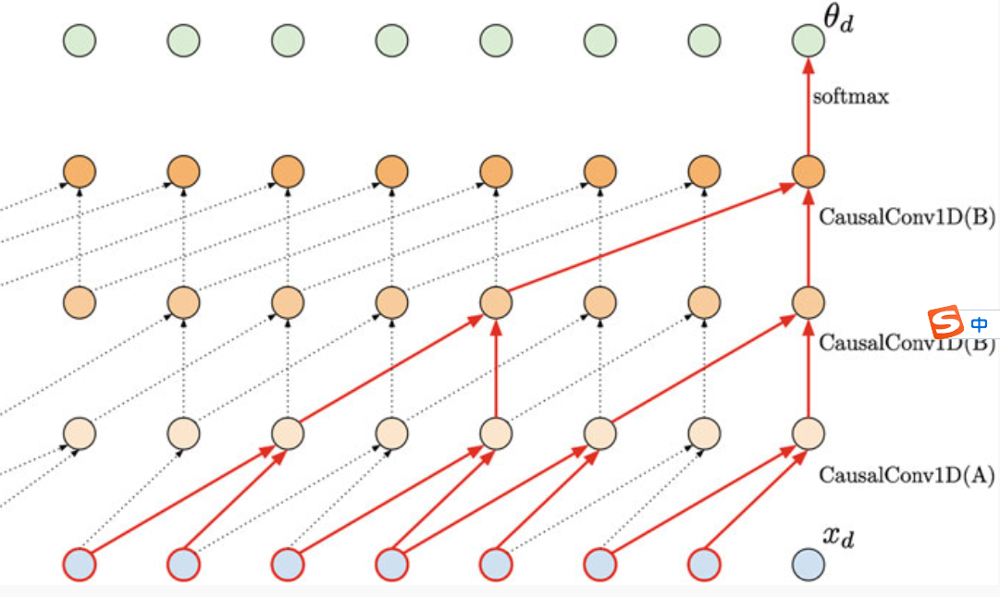

考虑最基本的一层卷积网络，假设其输入序列 $X$ 长度为 $n_x$ 特征维度为 $d_x$ 即 $X$ 为 $n_x \times d_x$ 的二维矩阵。其输出序列 $Y$ 为 $n_y \times d_y$ 的二维矩阵，其中 $n_y$ 为序列长度，$d_y$ 为特征维度。则卷积操作包含了 $d_y$ 个维度为 $ks \times d_x$ 的卷积核，其中 $ks$ 为卷积核大小。参数量为$ks \times d_x \times d_y$,空间复杂度为 $O(ks \times d_x \times d_y)$

相应的执行一次卷积操作的计算复杂度为 $O(ks \times d_x \times d_y)$。这里复杂度与输入序列长度无关的原因是输出长度是给定的。可以看出一次卷积操作的计算复杂度与输入和输出序列的长度无关，而只与输入和输出数据的特征维度有关。

**卷积的优点**：

1. 可以实现并行化高效训练
2. 局部，可解释的特征

**卷积的缺点**：

1. 单次处理序列长度是固定的（fixed context size），导致其在长距离的记忆上能力有限
2. 采样速度缓慢，每次采样都要重新计算输入序列

## 1.2 循环神经网络RNN

### 1.2.1 传统循环神经网络

循环神经网络的单次操作包含两个输入，一个是压缩了之前序列信息的隐状态，一个是序列当前的输入。

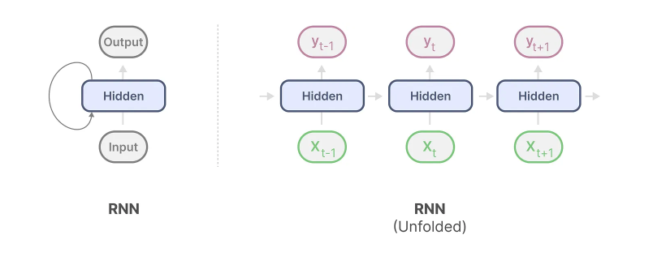

**RNN的优点**：

1. natural inductive bias for sequential data
2. 理论上可以处理无限长度的序列
3. 采样每步的代价较小

**RNN的缺点**：

1. 串行训练，无法并行化，效率比较低
2. 训练时存在梯度消失或爆炸问题
3. 更长距离的记忆能力需要额外的机制来保证

### 1.2.2 Gated RNN

通过截断梯度可以解决传统循环神经网络的梯度爆炸问题，但是无法解决梯度消失问题。而梯度消失往往导致RNN难以捕捉时间序列中时间步距离较大的依赖关系。

Gated RNN的提出即是为了更好地捕捉时间序列中时间步距离较大的依赖关系。其中门控循环单元（Gated Recurrent Unit, GRU）是一种常用的门控循环神经网络。

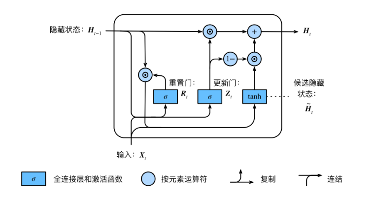

重置门用于控制前一个隐状态在当前时间步骤的计算中保留多少历史信息。重置门的输出接近于0表示较多地忽略前一个隐状态的信息，而接近于1表示较多地保留前一个隐状态的信息。

更新门用于控制当前时间步骤的候选隐状态（candidate hidden state）对最终的隐状态更新的贡献程度。更新门的输出接近于0表示较少地更新当前时间步骤的隐状态，而接近于1表示较多地更新当前时间步骤的隐状态。

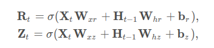

接下来就很容易理解候选隐状态：

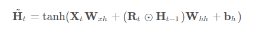

最终的隐状态由旧的隐状态和候选隐状态经更新门组合得到：

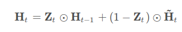

GRU有如下两个显著的特征：

1. 重置门有助于捕获序列中的短期依赖关系
2. 更新门有助于捕获序列中的长期依赖关系

### 1.2.3 LSTM

另一种常用的门控循环神经网络：长短期记忆（long short-term memory， LSTM）

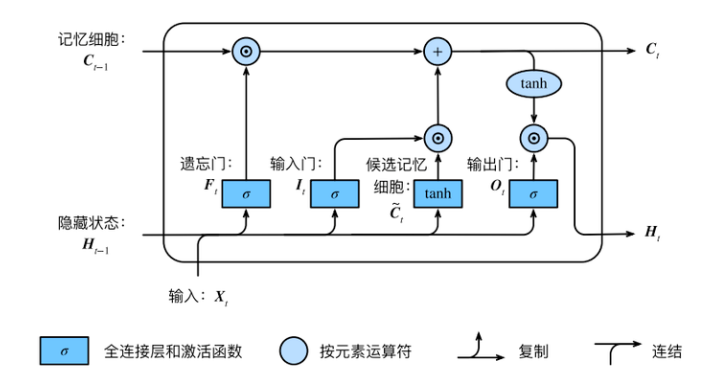

输入门，遗忘门和输出门的计算过程如下：

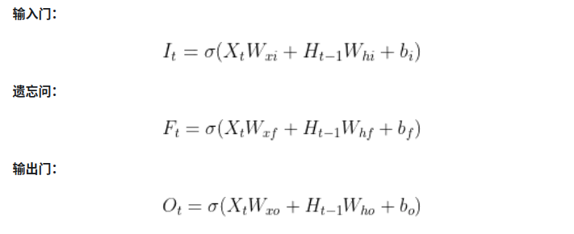

候选记忆细胞：

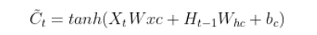

记忆细胞：

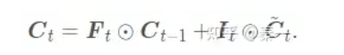

隐藏状态：

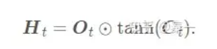

## 1.3 Transformer

Transformer中的基本单元是（masked）self-attention层。

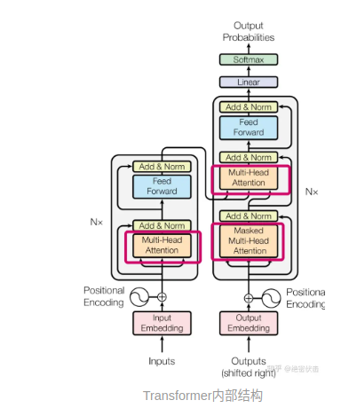

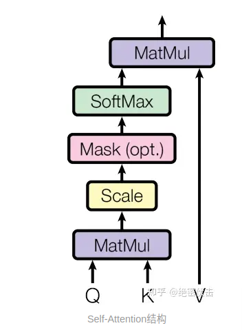

考虑对于一个最基本的自注意力层，假设其输入序列 $X$ 长度为 $n_x$ 特征维度为 $d_x$ 即 $X$ 为 $n_x \times d_x$ 的二维矩阵。自注意力存储三个权重矩阵 $W_Q, W_K, W_V$，并通过矩阵乘法得到Query，Key，Value三个矩阵$Q,K,V$。

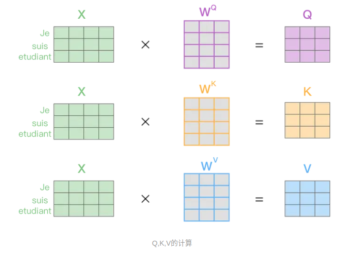

自注意力操作的输出为：

$Softmax(\frac{QK^T}{\sqrt(d)})V$

$Q=XW_Q, K=XW_K, V=XW_V$

假设三个矩阵的特征维度都相同，即$d_q=d_k=d_v=d_x=d$，则$W_Q, W_K, W_V$均为$d \times d$ 的矩阵。因而参数量即为 $3d^2$。$Q,K,V$ 矩阵为 $n_x \times d$的矩阵。$QK^T$为$d \times d$的矩阵。空间复杂度为 $O(3d^2+3n_xd)$，而计算复杂度则为$3n_xd^2+3n_x^2d$。当序列长度远大于特征维度的情况下，可以得到空间复杂度为 $O(n_xd)$，计算复杂度为$O(n_x^2d)$。

最后通过mask机制使得模型能够并行训练。

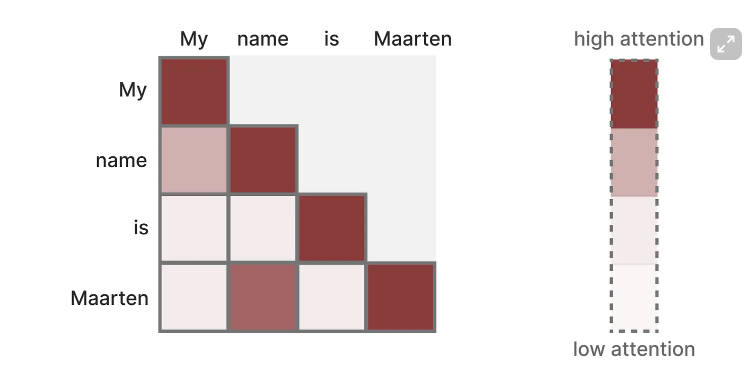

**Transformer的优点**：

1. 利用mask机制实现了并行的高效训练
2. 每次attention都计算了整个历史序列的信息可以兼顾长短期记忆

**Transformer的缺点**：

1. 与序列长度成正比的高昂空间复杂度和二次的时间复杂度，随着序列长度的增加计算代价快速增长。

## 总结

可以看出RNN和Transformer存在着相反的优缺点。

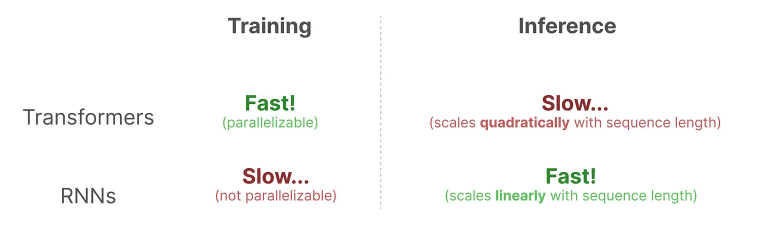

# 参考内容
http://www.scholarpedia.org/article/State_space_model  
https://huggingface.co/blog/lbourdois/get-on-the-ssm-train
https://newsletter.maartengrootendorst.com/p/a-visual-guide-to-mamba-and-state
https://zhuanlan.zhihu.com/p/394426898
https://blog.csdn.net/m0_51507437/article/details/137199890
https://blog.csdn.net/v_JULY_v/article/details/134923301