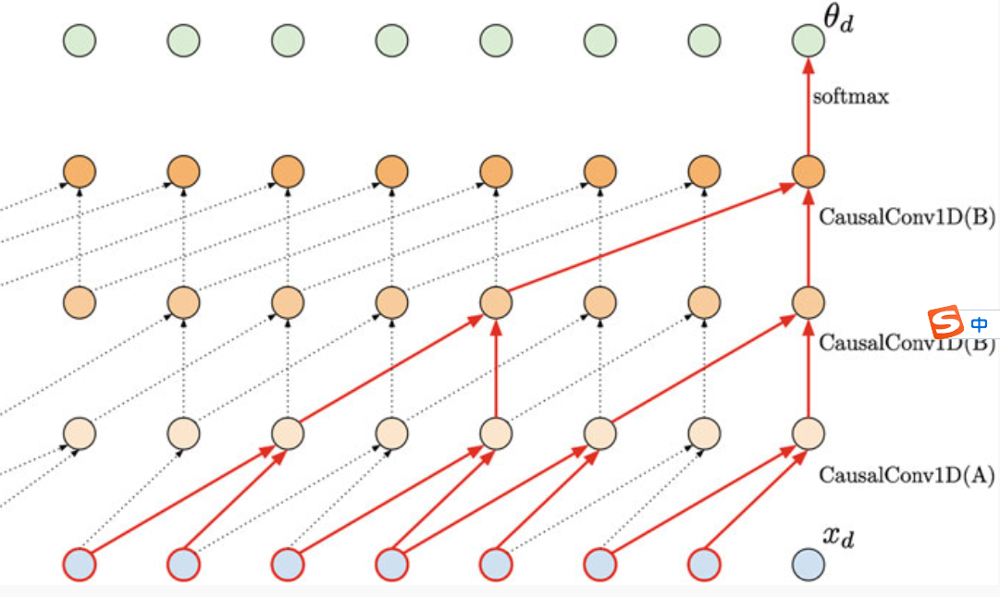

http://www.scholarpedia.org/article/State_space_model  
https://huggingface.co/blog/lbourdois/get-on-the-ssm-train

https://zhuanlan.zhihu.com/p/394426898
https://blog.csdn.net/m0_51507437/article/details/137199890

# Part I: Background

这一部分主要回顾卷积神经网络 （Convolutional Neural Network，CNN），循环神经网络（Recurrent Neural Network，RNN），Transformer三种模型处理序列数据的方式。

## 1.1 卷积神经网络CNN

考虑一维序列数据，卷积神经网络利用一维卷积核对序列进行处理。通过卷积层深度的增加，更深层的特征能够捕捉到更大的输入范围的信息。

考虑最基本的一层卷积网络，假设其输入序列 $X$ 长度为 $n_x$ 特征维度为 $d_x$ 即 $X$ 为 $n_x \times d_x$ 的二维矩阵。其输出序列 $Y$ 为 $n_y \times d_y$ 的二维矩阵，其中 $n_y$ 为序列长度，$d_y$ 为特征维度。则卷积操作包含了 $d_y$ 个维度为 $ks \times d_x$ 的卷积核，其中 $ks$ 为卷积核大小。空间复杂度为 $O(ks \times d_x \times d_y)$

相应的计算复杂度为 $O(ks \times d_x \times d_y \times n_y)$。这里复杂度与输入序列长度无关的原因是输出长度是给定的。

## Theoretical Basis
  

### 1. Formalism and theory
The objective of state space modeling is to compute the optimal estimate of the hidden state given the observed data, which can be derived as a recursive form of Bayes’s rule.

