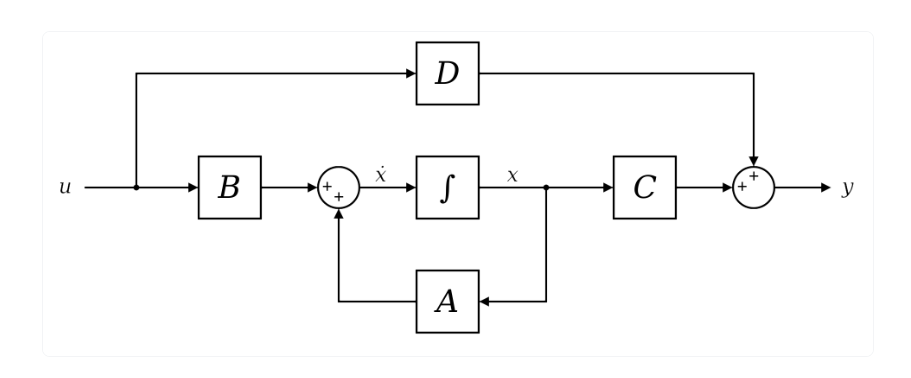
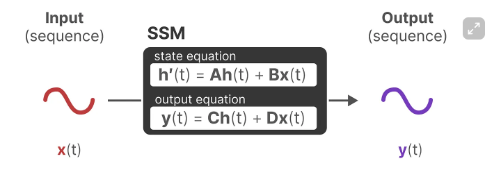
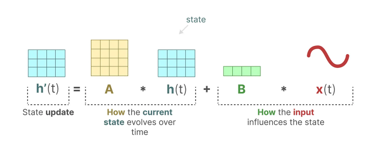
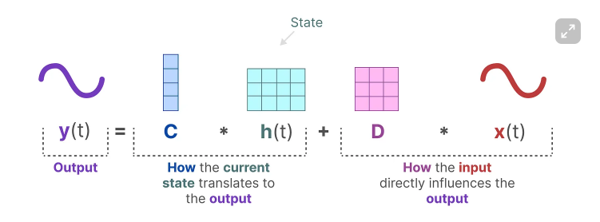
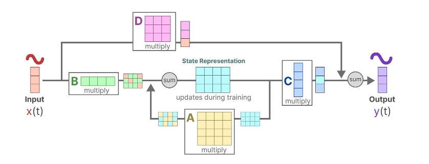
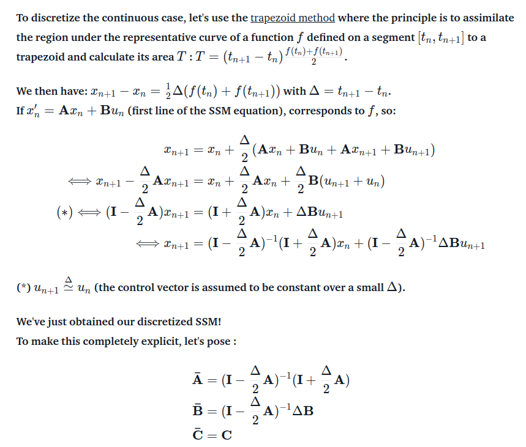
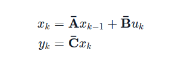
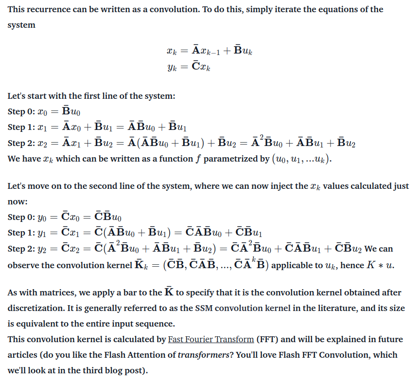

# Part II: State Space Model

这一部分主要介绍从State Space Model（SSM）到Mamba的逐步提出过程。

## 2.1 Linear State Space Model

### 2.1.1 Continuous View of SSM

State Space Model的基本思想与RNN类似，即通过将输入序列信息压缩到一个隐式表示，然后由输入和隐状态共同得到输出每一步的输出序列。

在这两个方程中，矩阵A控制历史隐状态对新的隐状态的影响，而矩阵B则控制输入序列对新的隐状态的影响。

矩阵C控制隐状态对输出的影响，而矩阵D则可视作残差连接。

以上为连续形式的SSM。

### 2.1.2 Recursive View of SSM

接下来对其进行离散化。离散化过程如下：

由此可得类似于循环神经网络的离散形式表示的SSM：

### 2.1.3 Convolutive View of SSM

以上的循环形式进行展开可以得到卷积形式的SSM表示：

### 2.1.4 Training and Inference

SSM的三种不同的形式赋予其不同方法的优点，卷积的形式使其可以并行的训练，而RNN的形式使其可以快速的inference。

LSSM定义的基础模块成为Linear State-Space Layers(LSSL)，

## 2.2 HiPPO

# 参考内容
  
1. [Hippo: Recurrent memory with optimal polynomial projections](https://proceedings.neurips.cc/paper_files/paper/2020/hash/102f0bb6efb3a6128a3c750dd16729be-Abstract.html)  
2. [Combining recurrent, convolutional, and continuous-time models with linear state space layers](https://proceedings.neurips.cc/paper_files/paper/2021/hash/05546b0e38ab9175cd905eebcc6ebb76-Abstract.html)  
3. [Efficiently Modeling Long Sequences with Structured State Spaces](https://arxiv.org/abs/2111.00396)  
4. [Mamba: Linear-Time Sequence Modeling with Selective State Spaces](https://arxiv.org/abs/2312.00752)