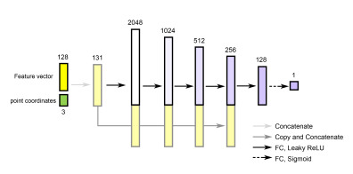
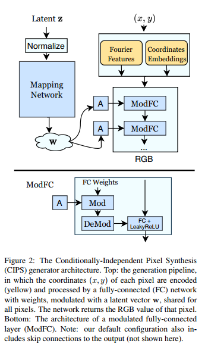
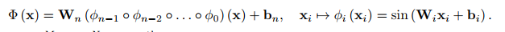

# Implicit Neural Representaion Summary

## 网页链接参考内容  
https://medium.com/@nathaliemariehager/an-introduction-to-neural-implicit-representations-with-use-cases-ad331ca12907  

https://github.com/vsitzmann/awesome-implicit-representations

## 文章参考内容

### 1. Compositional pattern producing networks: A novel abstraction of development

2007.05.30 Springer  
https://link.springer.com/article/10.1007/s10710-007-9028-8  
隐式神经表示最早的思想来源于CPPN这篇文章。

### 2. Learning Implicit Fields for Generative Shape Modeling

2019.09.16 CVPR2019  
https://arxiv.org/abs/1812.02822  
隐式神经表示实现2D和3D shape生成。

### 3. Image Generators with Conditionally-Independent Pixel Synthesis  

2020.11.27  CVPR2021
https://arxiv.org/abs/2011.13775  
神经隐式表示做图像生成,结合了StyleGAN结构。  

### 4. Implicit Neural Representations with Periodic Activation Functions

2020.06.17 NIPS
https://arxiv.org/abs/2006.09661  
SIREN原文。

  

### 