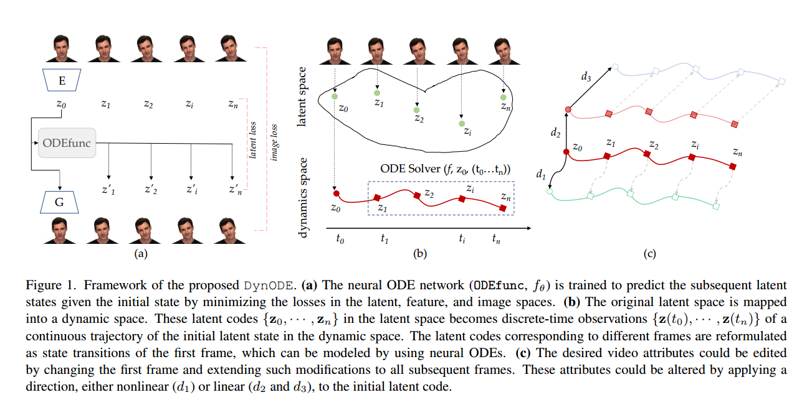
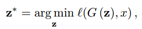
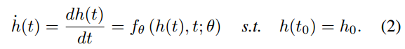
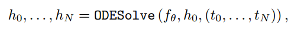
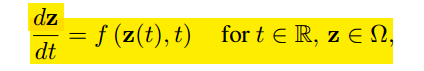
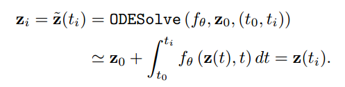
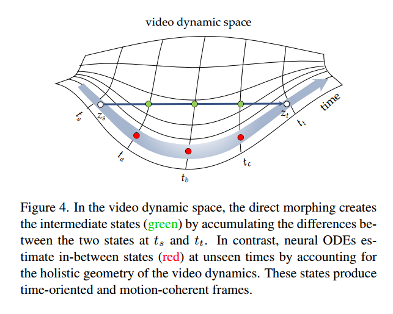
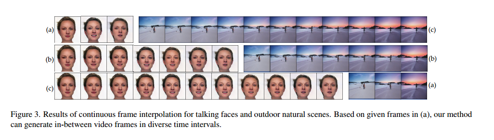
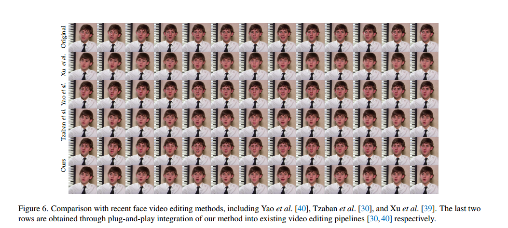

# 016_SSS_ GAN Inversion for Consistent Video Interpolation and Manipulation

本文结合了GAN Inversion和Neural ODE，在GAN的隐空间中实现Neural ODE来实现视频的插帧和编辑。

## 1. Introduction
本文的主要贡献和创新点：

1. 将动态的视频建模为Neural ODE处理的隐式编码序列。
2. 对隐空间用动态的观点来看，视频的帧就可以看作连续的ODE轨迹上离散的点。
3. 作者提出的方法可以实现无限的视频插帧和一致的视频编辑。

## 2. Method
### 2.1 背景知识
#### GAN Inversion
GAN的目的是将隐变量 $z \in \mathcal{Z}$ 通过Generator转换为相应的图像 $x \in \mathcal{X}$. 而GAN Inversion则恰恰相反, 对于一个已经训练好的GAN的生成器 $G$, 和一张给定的图像 $x$, GAN Inversion希望找到最有可能生成图像 $x$ 的隐变量 $z$.

相应的对于两张相似的图像, 通过GAN Inversion之后得到的隐变量也应该相近.

#### Neural ODE
具体的Neural ODE的笔记可以参考[007_SSSSS_ Neural Ordinary Differential Equtions](https://blog.csdn.net/D_Trump/article/details/125857425)

简而言之, 在本文中就是把视频的每一帧图像对应的隐空间表示, 看作是常微分方程的解.

相应的给定常微分方程的初值, 就可以通过求解来得到中间的任何时间的值.

### 2.2 DynODE
有了以上两部分的基础, 那么作者提出的DynODE的思路便一目了然. 首先, 一个视频的隐空间表示可以看做是连续的变化 $z(t)$. 而对于一个视频的离散的帧, 通过GAN Inversion得到一系列的隐式表示 $\lbrace z_0, z_1, ..., z_n \rbrace$, 相当于是对这个连续的变化的观测值. 那么, 为了得到这个连续的变化, 将其用常微分方程表示:

于是在训练网络的时候, 就用完整的视频的每一帧来训练.

训练好之后, 在给定初始帧的表示 $z_0$ 的前提下, 就可以通过求解常微分方程的形式来得到任意时刻的隐式表示.

## 3. Experiments
主要来看本文的两个应用 视频插帧和视频编辑
### 3.1 视频插帧
给定两帧的视频插帧, 可以看作是morphing, 而一种直接的morphing方法, 就是直接对隐变量进行线性的组合. $z^* = z_s + \alpha (z_t - z_s)$, 那么利用ODE的方法与这种直接线性相加的方法有什么区别呢?

作者给出的解释就是, 如图所示, 曲面表示视频的动态表示, 而线性相加的方法得到的视频帧就如同绿色的点, 并不能完全的契合视频的动态流. 而用ODE的方法就像蓝色的箭头, 可以更好的耦合视频, 而红色的点就是用ODE方法得到的视频帧.

实验的结果如图所示.

这里有一个问题: 上面作者用的Neural ODE是给定了初值, 那么在视频插帧的时候能不能保证终值, 或者如何保证终值, 这是个问题. 本文没有公开源码, 还需要再想想这个问题.

### 3.2 视频编辑
对于视频的编辑需要结合GAN Inversion对图像编辑的方法,对于第一帧进行编辑, 然后通过解ODE来得到后续的编辑后的帧的隐变量. 传统的方法则是需要对每一帧都执行编辑的操作, 而本文的方法则只需要对第一帧进行编辑即可.  

## 4. Limitations
本文方法优点一方面是ODE带来的极低的空间复杂地, 另一方面是只需要对第一帧进行操作, 可以很大程度的降低编辑的时间消耗.
首先是视频插帧, 本文提出的方法更适合某些相对简单的特定的视频, 而对于包含很多不同的物体和场景的视频, 本文的方法做的不如现有的方法.
另外, 本文作者用了最简单的方法实现Neural ODE, 来证明其可行性. 作者考虑用ODE的变种, Neural Controlled Differential Equation(CDE) 或者 Neural Stochastic Differential Equation(SDE)
