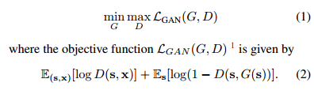
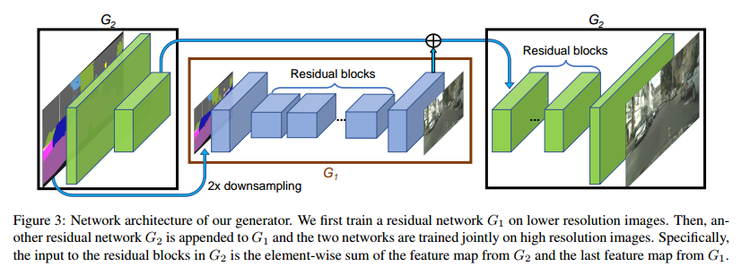
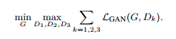
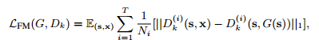
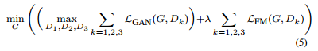
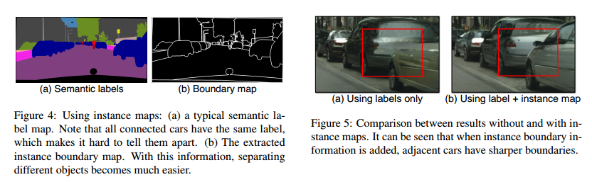
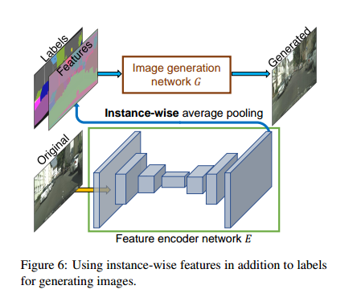
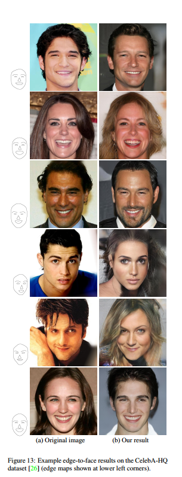

# High-Resolution Image Synthesis and Semantic Manipulation with Conditional GANs(Pix2PixHD)

## 1. Introduction
本文也是GAN的经典文章之一，也称作Pix2PixHD。针对Pix2Pix为代表的的Conditional GAN在语义图像生成上存在的生成结果分辨率和真实度比较低的问题，本文用了一种新的对抗损失，并用多尺度的生成器和判别器结构，从而可以得到高分辨率2048x1024的结果，而且结果也有较高的真实性。  

本文的主要贡献：  
1. 提出了一种新的GAN的对抗损失，和新的多尺度的生成器和判别器结构，从而能够生成高分辨率高真实度的图像。
2. 为了支持交互式的语义编辑，本文做出了两方面的额外扩展。一个是使用instance-level的图像分割信息，从而可以单独的编辑单独的实例，提高了语义编辑的灵活性。比如可以添加或者去除某个物体，或者改变为其他物体。另一个是本文提出了一种可以在给定输入相同的语义图的情况下，生成多样性的结果。

## 2. Method
### 2.1 The Pix2Pix Baseline
本质上本文的方法还是一种Conditional GAN，其基础还是Pix2Pix。

Pix2Pix用到的就是最基础的GAN损失，但是这种方法在Cityscape上只能得到256x256的结果，再提高分辨率的话，会出现训练不稳定的情况，并且得到的结果并不能令人满意。

### 2.2 Improving Photorealism and Resolution
这部分介绍本文如何提高生成结果的真实度和分辨率。

#### 2.2.1 Coarse-to-fine generator

如图所示，一目了然，作者将生成器分成两个部分，生成器G2的前半部分将高分辨率的图像编码为低尺度的特征，然后生成器G1将低分辨率的语义图像转化为真实图像，然后生成器G2的后半部分结合前半部分的信息和G1的输出，得到高分辨率的图像。作者称G1为global generator network，称G2为local enhancer network。

这种结构可以继续扩展，比如在G={G1,G2}两种尺度条件下，可以得到2048x1024的结果，而再扩展一层local enhancer network G3，则可以得到4096x2048的结果。

#### 2.2.2 Multi-Scale discriminator
相应的，生成器可以得到高分辨率的图像，那么判别器也要能处理高分辨率的图像。如果只用一个判别器网络，那就需要堆叠大量的卷积层，从而使得网络有更大的感受野来更好的分辨图像的，但是这样会使得判别器网络规模过大。

于是作者提出了一种多尺度的discriminator。作者用了三个判别器网络，这三个判别器网络结构相同，而且比较简单，但是输入分别是不同尺度的图像。这三个不同尺度的图像分别是高分辨率图像及其降采样2倍和4倍的图像。

于是GAN的损失就需要是一个多任务学习的损失：

#### 2.2.3 Improved adversarial loss
为了提升生成结果的真实度，作者加入了特征匹配的损失。具体做法就是，利用多尺度的Discriminator中间层的结果作为特征，将生成器生成的结果与ground truth的图像经过discriminator第k层时的特征之间的差别作为损失。

与上一部分的多任务的GAN损失结合，可以得到整体的损失表示：

### 2.3 Using Instance Map
这部分介绍作者如何加入实例层的信息。

一般情况下，语义图（semantic/label map）中每个类别的物体会有一个单独的颜色来表示，但是同一类的不同物体则没有表示出来。比如在cityscape数据集中，人都是用红色来表示的，但是这个人的性别是男是女则不能通过语义图得到。另外一些语义图给每一个物体一个单独的ID，但是这样的语义图很复杂。

于是本文的作者用了一种相对高效而又比较简单的方法。对于一张输入的图像，作者先计算其对应的边界图（boundary map）。也就是说语义图中某一点的像素值跟它的四个相邻的点像素值不同的话，那么其对应的边界图中点的值为1，否则为0。得到边界图后，与语义图concat起来一起作为生成器的输入。而判别器的输入则是语义图，边界图,和生成结果或是ground truth进行concat。

### 2.4 Learning an Instance-level Feature Embedding
这个部分介绍作者如何实现同样的语义图生成多种不同的结果。

为了得到多样的结果，作者在训练的时候加入了一个编码器网络E用来得到每个instance对应的低维的特征编码。而在训练的时候，这个网络的输出作为生成器输入的一部分，也就是说生成器的输入除了条件图像外还有低维的特征编码G(s, E(x))。

在训练结束后，将所有的instance对应的低维编码进行K-means聚类。

这样在采样阶段对于每个instance，从其对应的K-means中随机取出一个出来，这样同一个instance就有可能出现不同的低维特征编码，从而有不同的属性。比如对于一个气球的instance，可以出现不同的颜色。那么一张图中多个instance就会出现不同的组合。生成的结果也就有了多样性。

## 3. Experiments
实验部分作者分别在Cityscapes，NYU Indoor RGBD，ADE20K，Helen Face四个数据集上测试了模型的性能。
并且进行了一些Ablation Study来证明本文的改进的有效性。
具体实验结果参考原文。

