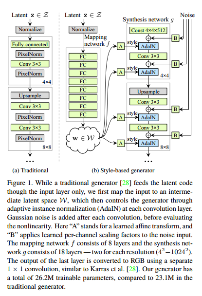
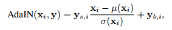
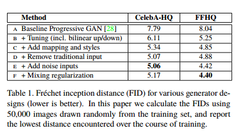
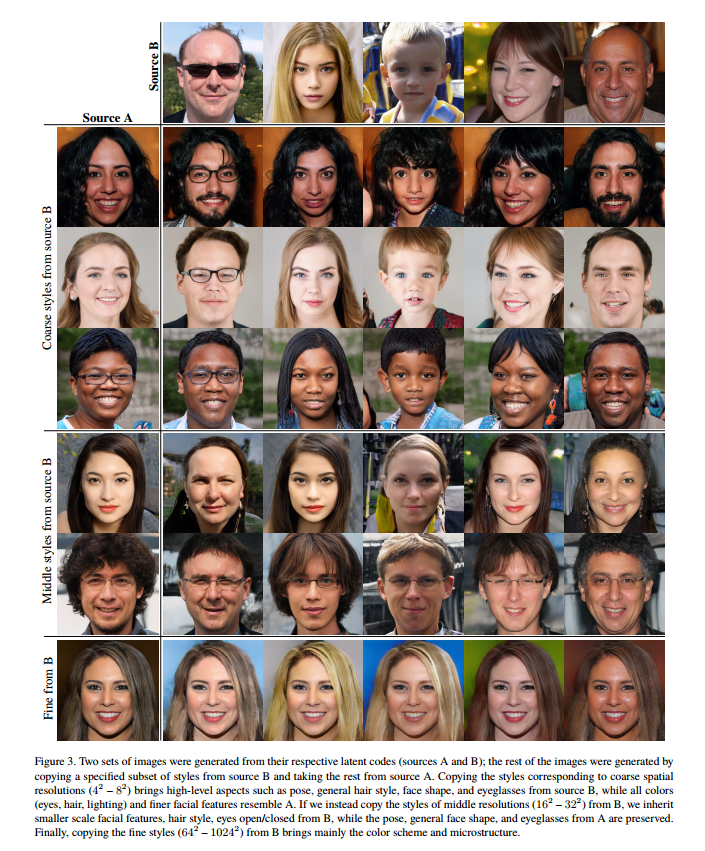
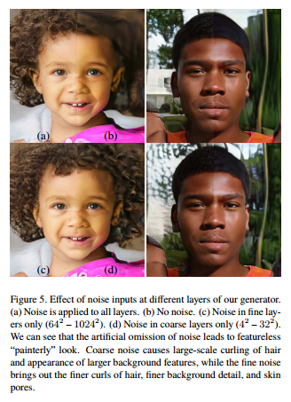
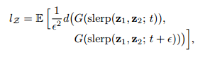
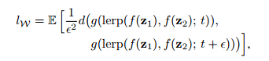

# A Style-Based Generator Architecture for Generative Adversarial Networks(StyleGAN)
## 1. Introduction
本文在借鉴style-transfer结构的基础上提出了一种新的GAN的生成器的网络架构。这种新的生成器架构可以无监督的学习到高层的属性信息并且随机的改变生成结果。并且本文提出的新架构与之前的对于GAN loss的优化，不同的正则化方法，以及超参设计这些优化GAN的方法是正交的，也就是说可以同时使用。

## 2. Style-based generator
传统的GAN的生成器的输入为标准的高斯噪声z，然后经过Generator网络得到生成的结果。

StyleGAN则不同，StyleGAN生成器的输入包含三个部分。
1. 第一部分一个固定的值，这个值是可学习得到的，也就是说这个值需要与网络一同训练。即图中所示的Const。

2. 第二部分是用于控制风格的部分。这个部分接受一个标准的高斯噪声z作为输入，这个高斯噪声经过8层的MLP得到隐变量w,称作mapping network。之后w经过可学习的仿射变换，称作affine transformation，得到用于控制AdaIN的均值和方差，即通过w得到风格信息 $y=[y_s, y_b]$ 。利用这些得到的风格信息，控制Generator中间过程的归一化过程。

3. 第三部分是为了增加图像生成内容的随机性加入的噪声，即图中右边的noise。这个noise先经过广播与Generator每层输入的有同样的维度，然后通过一个可学习的放缩参数进行放缩，然后与Generator每层的输入加起来。

## 3. Experiments
### 3.1 Quality of generated images
首先作者在CelebA-HQ和FFHQ数据集上的实验证明了本文提出的新的生成器架构不会造成GAN的生成结果质量降低，而且事实上还可以提高生成的质量。

并且证实了本文的三部分结构的有效性。

### 3.2 Properties of the style-based generator
在StyleGAN中，mapping network和affine transformation部分可以看做是给定噪声z的情况下，从风格分布中挑出一个风格，而synthesis network则在挑选的风格的基础上得到生成的图像。

#### 3.2.1 Style Mixing
这个部分作者在固定网络其他部分的情况下，采样出两个不同的高斯噪声$z_1, z_2$作为mapping network的输入，相应其中间结果分别为$w_1, w_2$，最终生成的图像分别为A和B。Style Mixing则是分别取两个噪声得到的中间结果$w_1, w_2$来进行组合。也就是说，synthesis network是从低分辨率逐渐生成到高分辨率的过程。那么在不同的分辨率采用不同的噪声得到的AdaIN参数。作者分别在$4^2-8^2$采用$w_2$，在剩余的分辨率采用$w_1$，称作coarse styles from source B。依次类推在$16^2-32^2$采用$w_2$，剩余采用$w_1$，称作Middle Styles from source B。最后是在$64^2-1024^2$采用$w_2$，剩余采用$w_1$，称作Fine from source B。

实验结果表明，低分辨率的AdaIN参数控制了低层的生成内容，比如人物的identity，gender等，而高分辨率的AdaIN参数控制了生成的高层的属性，比如肤色，头发的颜色等更细致的属性。

#### 3.2.2 Stochastic variation
作者提到在人的肖像画中很多地方可以被认为是Stochastic variation， 比如头发的位置，肤色等等。为了能够达到这中Stochastic variation的效果，作者加入了额外的Noise。与StyleMixing类似，作者尝试在不同的分辨率上加入Noise，可以看出其对Stochastic variation的影响。

### 3.3 Disentanglement studies
解耦学习的目的是希望学习到的特征空间线性可分，这个线性空间可以由多个线性子空间构成，每个线性子空间控制变化的一个方面。

为了比较解耦效果，本文介绍了两种度量方式：

#### 3.3.1 Perceptual Path length
解耦效果好坏如何区别。假设$z_1,z_2$分别是隐空间的两个隐变量，分别对应生成两张图片，如果对这两个隐变量进行线性插值，插值之后的隐变量$z = \alpha z_1 + (1-\alpha)z_2$ 生成的图像与之前两张图像有很大差异，则表明隐特征空间是耦合的，属性变化的因素没有合适拆分。

为了量化这种影响，通过测量插值后图像的变化差异来衡量。一种基本的方法就是感知路径，通过测试两张图片特征之间的加权插值来衡量，权重是通过拟合人的感知而获得的。而衡量隐特征空间的解耦合程度，是将特征空间拆分成多个子空间，累加子空间感知路径，求其极限作为特征空间感知路径。

直接求比较困难，于是作者进行了简化，通过按比例t取插值，再按$t + \epsilon$取插值，然后求由这两个插值生成图像的感知路径的期望。

其中slerp为球面插值。而中间隐特征空间w，是经过network mapping映射得到的，因此衡量中间层隐特征空间的解耦程度，就不能使用球面插值，只能采用线性插值

#### 3.3.2 Linear Seperability
隐特征空间线性可分，则可以找到一个线性超平面可以将隐空间分成两个部分，分属两侧对应图像的二值属性。使用CelebA-HQ属性数据集训练属性分类器，比如性别分类。随机取z生成20000张图片，然后用训练好的属性分类器对生成的图片进行属性预测，选择性别置信度最高的一般样本，训练一个SVM。设X为属性分类器预测的属性类别X，Y是SVM预测的属性类别Y，定义条件熵H(X|Y)。该条件熵说明，在知道当前样本位于SVM超平面哪一侧的情况下，还需要多少额外条件，才能确定当前样本真实类别。
