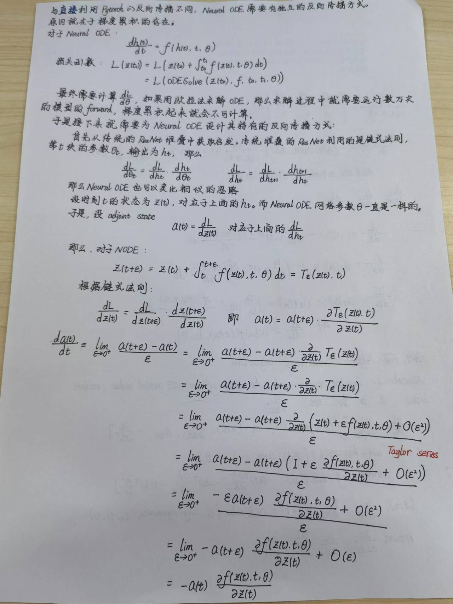
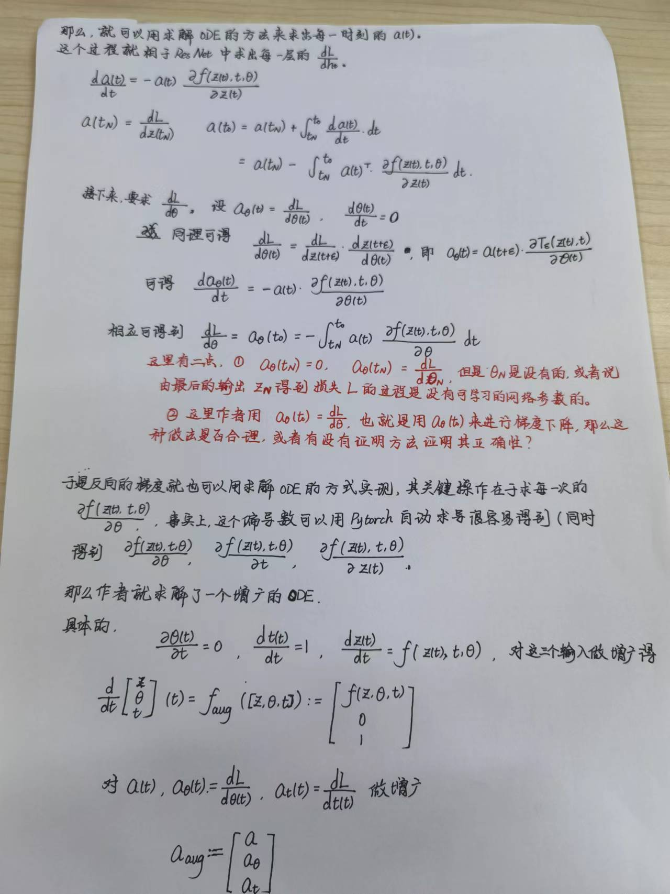
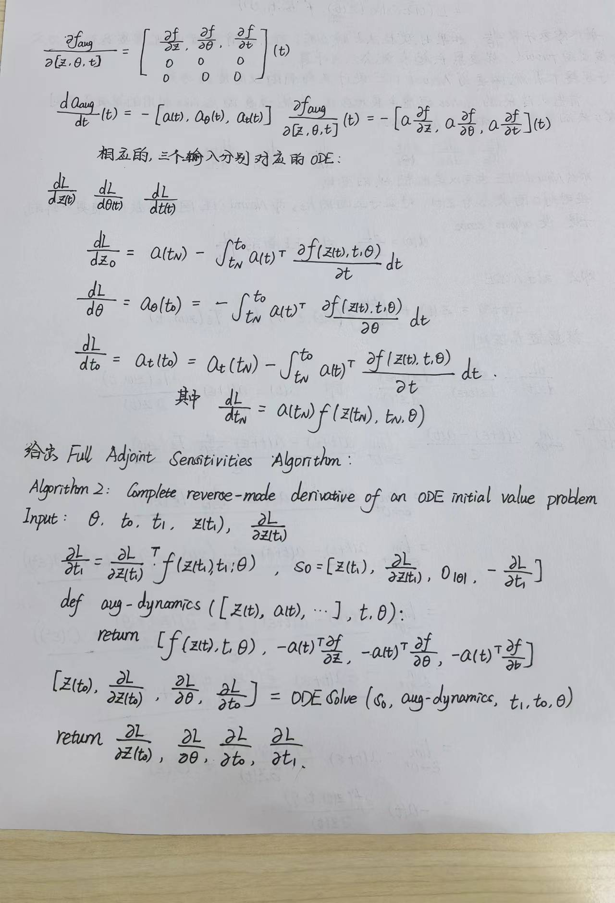

# 一、Pytorch反向传播

首先是第一个小例子，训练模型拟合 y = true_w * x + true_b，模型的参数为 param_w, param_b
```python
import torch

true_w = torch.Tensor([[2.0, 3.0], [4.0, 5.0]])  # 初始化真实的参数
true_b = torch.Tensor([[1.0, 2.0], [3.0, 4.0]])  # 默认情况下，创建的Tensor requires_grad=False

x = torch.ones(2, 2, requires_grad=False)  # 默认情况下, requires_grad=False, 创建出来的Tensor不会自动计算梯度
param_w = torch.ones(2, 2, requires_grad=True)  # 设置网络要训练的参数 w, b，初始值都为全1
param_b = torch.ones(2, 2, requires_grad=True)

true_y = true_w * x + true_b  # 计算真实应得到的y
predict_y = param_w * x + param_b  # 计算模型预测的y

loss = (true_y - predict_y).mean()  # L1损失

# 这里在backward之前，param_w param_b的grad都是空的，只有在backward之后grad才有值
loss.backward()
# 在backward之后，param_w param_b的grad输出为
# tensor([[-0.2500, -0.2500],
#         [-0.2500, -0.2500]])
# 具体的计算过程就是，这里loss求了平均，而矩阵中有四个数，也就是0.25
# 于是 param_w.grad = 0.25 * x
# 而 param_b.grad 虽然和 param_w.grad 相等，但是计算的过程不同
# param_b.grad = 0.25 * 1 同时要广播到与 param_b 同样的维度


# 如果要更新参数，通常用的是optimizer，里边的最基本的操作便是把要优化的参数减去梯度乘上损失率
loss_rate = 0.01
param_w = param_w - loss_rate * param_w.grad
param_b = param_b - loss_rate * param_b.grad
```

上面的代码就是一次反向传播并更新参数的过程。这个过程存在一个问题，之后再说。
关于pytorch的反向传播与自动求导，pytorch会对每个操作，存储其反向传播的方式，  
比如 对于上面的loss，输出之后是
```
tensor(4., grad_fn=<MeanBackward0>)
```
其中的MeanBackward就是指loss是计算的平均值，相应的要用平均值的反向传播方式与求导方式，也就是MeanBackward。

同样的道理，对于中间的predict_y其对应的反向传播和求导方式就是AddBackward。至于计算图这些内容不再赘述，很多文章讲的很详细。  

那么以上的代码存在什么问题呢？对于只更新一次的做法没有任何问题， 但是要训练多次的情况，比如在后边再复制几行

```
true_y = true_w * x + true_b  # 计算真实应得到的y
predict_y = param_w * x + param_b  # 计算模型预测的y
loss = (true_y - predict_y).mean()  # L1损失
loss.backward()
```
这个时候再输出param_w.grad和param_b.grad会得到：
```
tensor([[-0.5000, -0.5000],
        [-0.5000, -0.5000]])
```
相当于两次梯度值的累加，这就会导致之后的梯度值会越来越大，于是需要在第二次loss.backward()之前将梯度清空

用optimizer清空梯度直接用zero_grad，用手动更新的方法就需要手动设置

```
param_w.grad.data.zero_()
param_b.grad.data.zero_()
```

# 二、Neural ODE的反向传播






