# Diffusion Models Already Have a Semantic Latent Space

## 1. Introduction

本文指出，现有的Diffusion模型可以在不同的领域有出色的表现，但是缺少可以控制其生成过程的语义隐空间（Semantic Latent Sapce）。本文提出了非对称的反向过程（Asymmetric reverse process，Asyrp），拥有可以控制的隐式语义空间，称作h-sapce。并且本文提出了一种新方法，可以达到versatile editing和quality boosting。

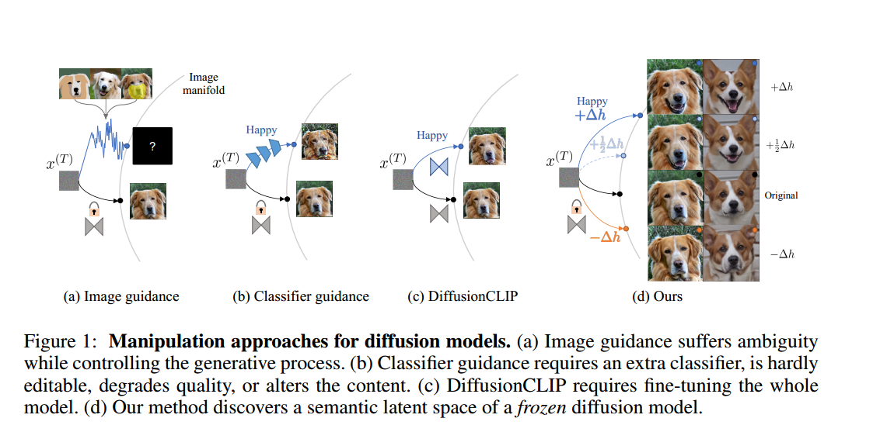

首先来看一下现有的diffusion图像编辑方法及其缺陷。图中（a）部分利用图像引导生成过程，但是这种方法很容易导致生成没有意义的结果。（b）部分利用额外引入的分类器来实现引导图像的生成，但是这种方法需要额外训练一个分类网络，而且通常会降低生成的质量，而且会改变生成的内容。（c）部分的DiffusionCLIP则需要对整个diffusion模型进行微调，代价比较大。（d）部分是本文的方法，可以在不改变训练好的Diffusion的基础上实现语义的编辑。

本文的主要贡献：  
（1）提出了Asyrp，非对称的反向过程，可以对训练好的Diffusion模型的隐空间进行语义编辑。  
（2）在这个隐式的语义空间h-space中，对不同的图像的隐变量做相同的shift可以达到相同语义的编辑效果。  
（3）实验证明本文的方法在现有的DDPM++，IDDPM，ADM等Diffusion模型和不同的数据集上都可以达到需要的效果。  

## 2. Methodology
首先来回顾一下DDIM的设计：

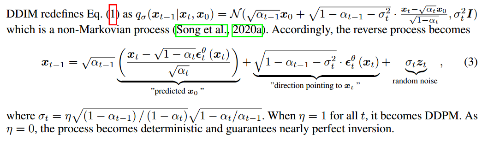

作者对这个式子的表示做了一些简化，用 $P_t(\epsilon^{\theta}_t (x_t))$ 来表示对于 $x_0$ 预测的部分predict，用 $D_t(\epsilon^{\theta}_t (x_t))$ 来表示对于 $x_0$ 的方向进行修正的部分。

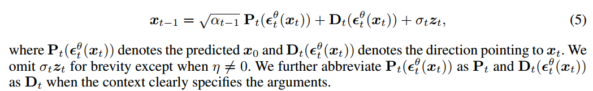

由于Diffusion利用网络输出的结果是每一步的噪声 $\epsilon^{\theta}_t$ 这个噪声也可以看作是一种从 $x_t$ 到 $x_0$ 的方向信息。那么一种很直观的思路就是直接对Diffusion模型中利用神经网络输出的 $\epsilon^{\theta}_t$ 进行修正。

但是直接把这种修正的思路用在反向过程中，并不能达到很好的效果。因为 $P_t$ 和 $D_t$ 两部分中 $\epsilon^{\theta}_t$ 的改变会相互抵消。作者用一个Theorem来描述这种情况。

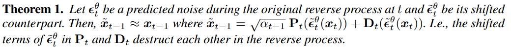

证明过程如下：
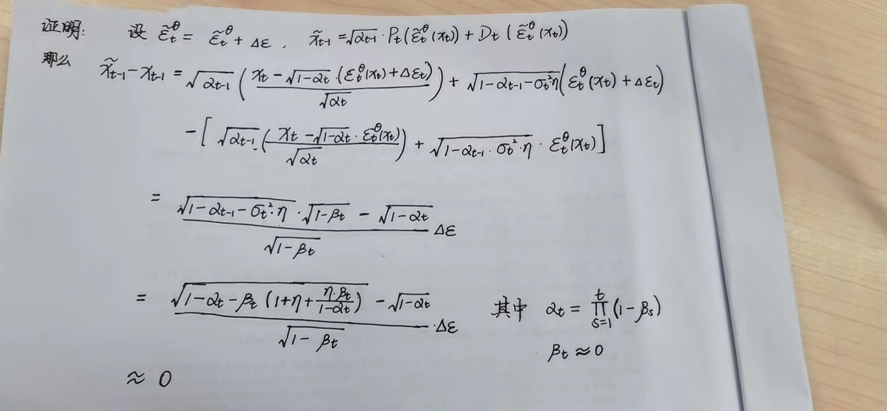

以1000步的DDPM为例，$\beta$线性的从0.0001增大到0.02，分别取DDIM的 $\eta = 0$ 和 $\eta = 1.0$。当 $\eta = 1.0$ 也就对应于DDPM的采样过程。把 $\triangle \epsilon$ 前的参数输出可视化：

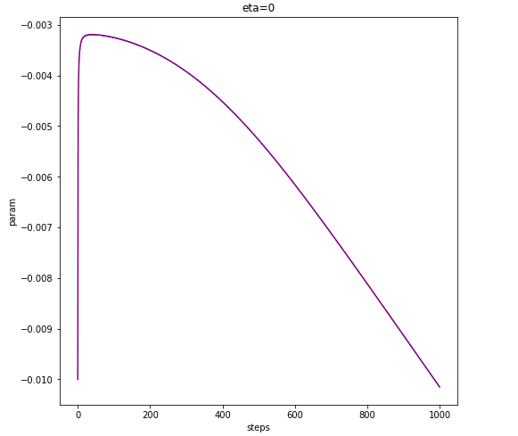

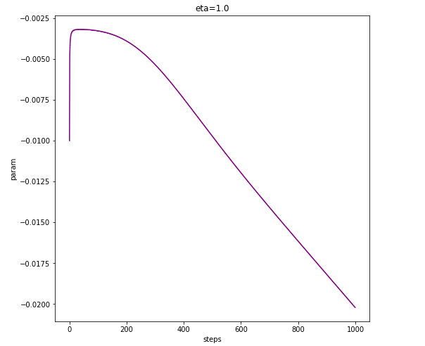

从图中可以看出，这个参数基本上是 $10^{-2} \sim 10^{-3}$ 数量级的。作者额外补充了实验证明这一点， 如图所示，（a）中的是利用原始DDIM采样得到的结果，而（b）中则是对 $P_t$ 和 $D_t$ 中的 $\epsilon^{\theta}_t$ 同时加上一个随机的扰动 $z$，即 $\tilde{\epsilon}^{\theta}_t = \epsilon^{\theta}_t + z$ 采样得到的结果，可以看出二者几乎一样。

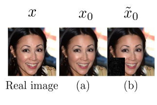

### 2.1 Asymmetric Reverse Process
为了解决上面提到的两相抵消的问题，作者提出了非对称的反向过程，也就是只在 $P_t$ 部分加入对 $\epsilon^{\theta}_t$ 的调整信息 $\triangle \epsilon$ 。$\tilde{\epsilon}^{\theta}_t = \epsilon^{\theta}_t + \triangle \epsilon$

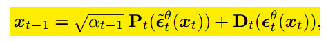

同时，为了达到编辑图像的效果，作者用CLIP loss来约束额外加入的调整信息 $\triangle \epsilon$ 。

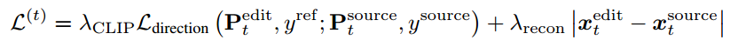

其中 $P_t^{edit}$ 表示加入了 $\triangle \epsilon$ 预测得到的 $x_0$, 而 $P_t^{source}$ 表示未加入 $\triangle \epsilon$ （也即按照原始DDIM）得到的预测的 $x_0$。相应的CLIP loss就是在约束这二者的差别要和文本 $y^{ref}, y^{source}$ 对应的差别要一致。同时，为了避免图像在想要编辑的内容之外有太大的变动，在CLIP loss之外加入了对于图像内容保持的损失。

### 2.2 h-space
考虑到现有的几乎所有的Diffusion模型都用了UNet的结构，为了降低输入的规模，提高效率，同时在提高编辑的质量。作者不在 $\epsilon^{\theta}_t$ 的原始空间做语义的编辑，而是在UNet的bottle-neck，也就是最深层的特征 $h_t$ 来进行编辑。这个空间称作 h-space

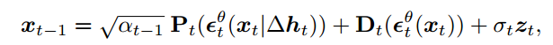

这样的设计有如下优点：

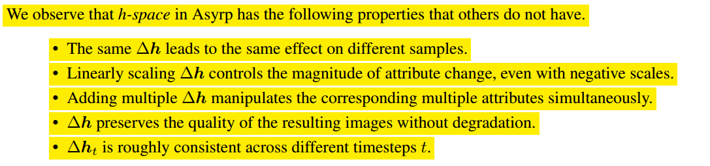

### 2.3 Implicit Neural Directions
这个部分很简单，也就是说，作者用一个简单的网络 $f_t$ 接受bottle-neck feature $h_t$ 和 时间步 $t$ 作为输入，得到每一步需要的 $\triangle h_t$。于是 $P_t^{edit} = P_t (\epsilon_t^{\theta}(x_t | f_t))$

这个简单的网络可以不在所有的时间步上进行训练，而是在DDIM挑好的简化的步数上进行训练，从而降低训练时间。

## 3. Generative Process Design
这个部分将上一部分作者提出的编辑方法如何在实际的Diffusion模型中应用做了系统的描述。本文的方法主要是针对预训练好的Diffusion模型的反向采样过程进行改动，现有的Diffusion模型反向采样过程可以再early stage得到high-level context而在later stage得到fine details。因此作者将其分成三个阶段：  
（1）在第一个阶段 $[T, t_{edit}]$ 利用Asyrp进行编辑；  
（2）第二阶段 $[t_{edit}, t_{boost}]$ 则是用DDIM的采样方法，但是 $\eta = 0$ ，这样可以保持图像的内容尽可能保持不变；  
（3）第三阶段 $[t_{boost}， 0]$ 则是用DDIM的采样方法，但是 $\eta = 1$ ，这样可以提高得到的最终结果的质量；

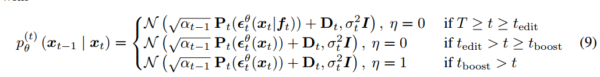

那么现在的问题就是如何确定两个分界点 $t_{edit}, t_{boost}$

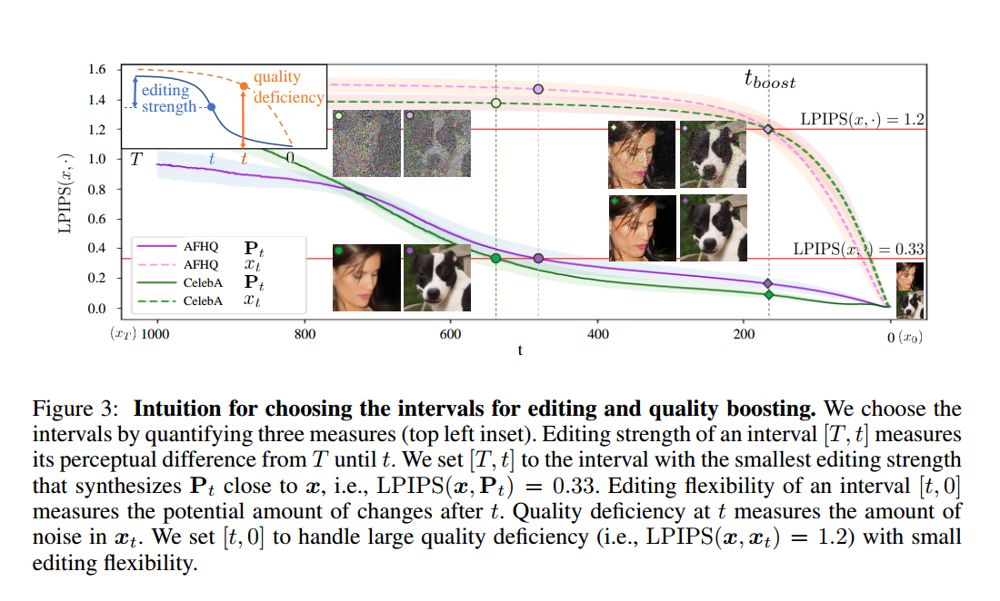

作者利用LPIPS来衡量editing strength和quality deficiency，从而达到既能够达到很好的编辑效果，又不会导致图像质量下降太多。

对于 $t_{edit}$，作者设计 $t_{edit}$ 能够使得 $LPIPS(x, P_{t_{edit}}) = 0.33$， 这样可以有最小的editing interval，同时有足够强的editing strength。同时为了使得这个 $t_{edit}$ 可以适用于多种地方，作者加入了基于CLIP的cosine距离项，$LPIPS(x, P_{t_{edit}}) = 0.33 - \delta$ 其中 $\delta = 0.33 d(E_T(y_{source}), E_T(y_{target}))$，$d$就表示两者的cosine距离。

对于 $t_{boost}$，作者设计 $LPIPS(x, x_t) = 1.2$ 即为 $t_{boost}$。

## 4. Experiments
图像编辑效果
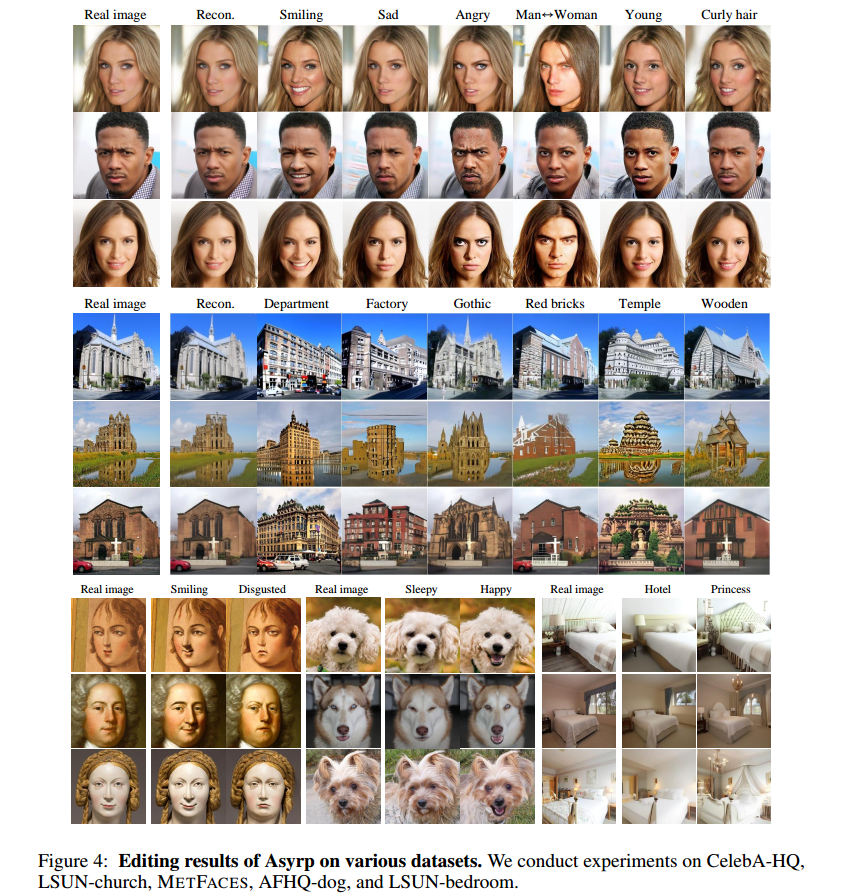

h-space的线性性质
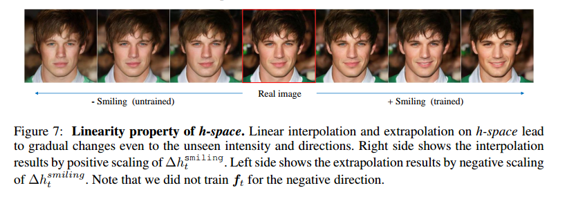

更多实验结果见原文。
