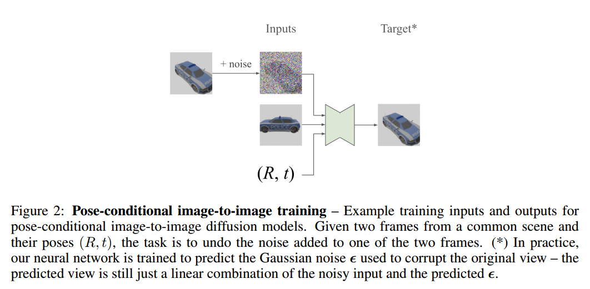
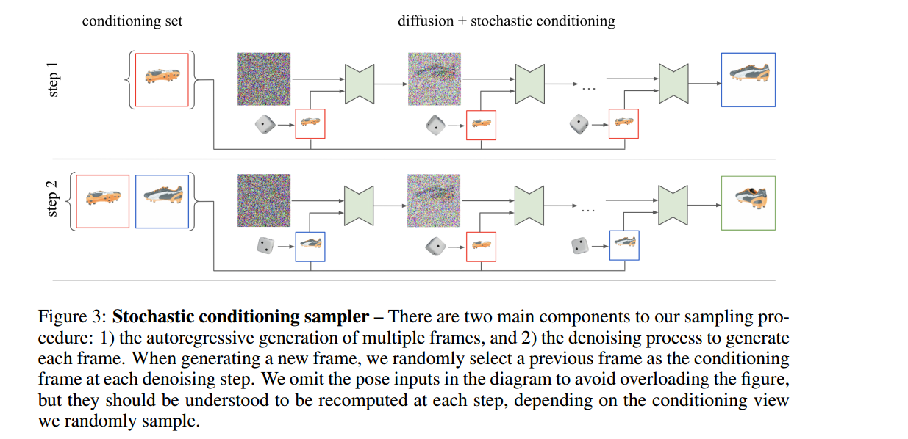
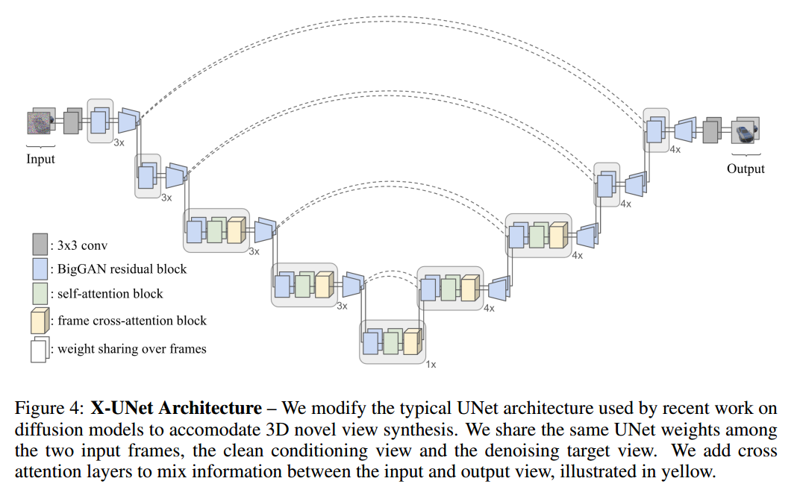

# Novel View Synthesis with Diffusion Models

## 1. Introduction
本文利用diffusion模型，在给定参考图的条件下，生成指定pose的图像，作者称为3DiM。并且可以在给定一张特定视角的图的条件下，生成其他所有视角的图。

本文的主要贡献：
1. 提出了3DiM模型，利用diffusion实现novel view synthesis。
2. 提出了stochastic conditioning
3. 提出了X-UNet，一种新的UNet架构
4. 提出了一种新的evaluation scheme，称作3D consistency scoring。

## 2. Methodology

### 2.1 Pose Conditional Diffusion Models
如图所示，只是把给定的pose和参考图像作为条件输入。一目了然，不再赘述。

### 2.2 Stochastic Conditioning Sampler
如图所示，Stochastic Conditioning Sampler就是指，在Diffusion的采样过程中，每一步从给定的条件图像中随机选出一张作为条件输入。

如果要实现在给定一张图的条件下生成其他所有视角的图，那么在step1的时候只有一张条件图，但是在之后的生成过程中，从step2开始，就可以利用已经生成好的图作为条件，作者指出选取两张条件图作为随机选择可以达到最好的效果。

### 2.3 X-UNet
如图所示，一目了然。

### 2.4 3D consistency scoring
这部分，作者提出了一种新的evaluation scheme。

刚接触3D，需要先补充一些基础知识。
