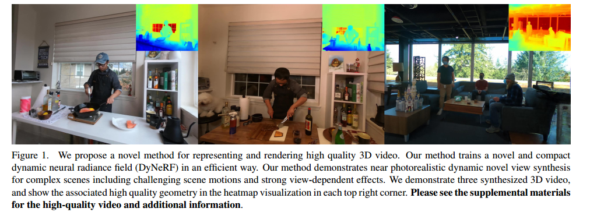
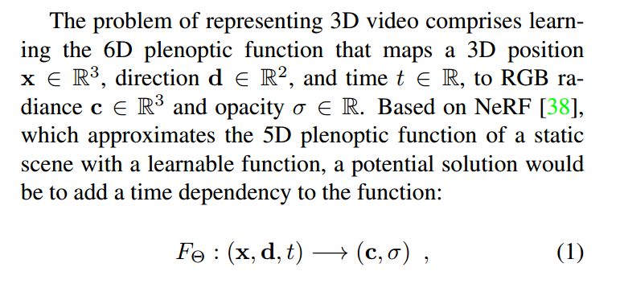
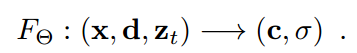
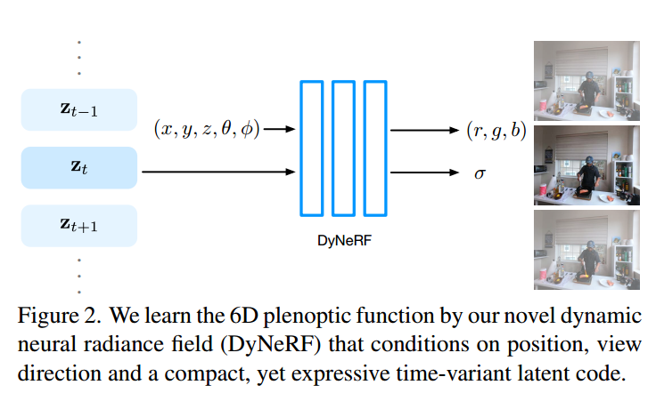
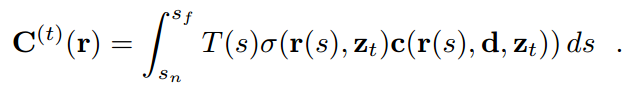
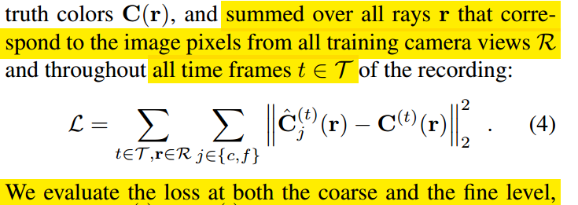
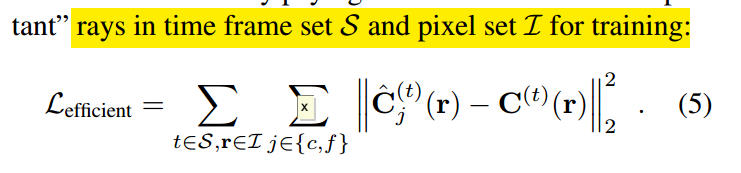
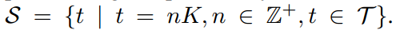
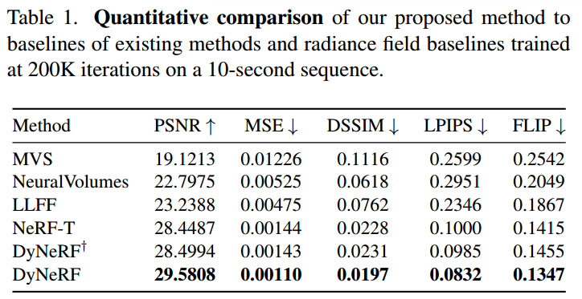
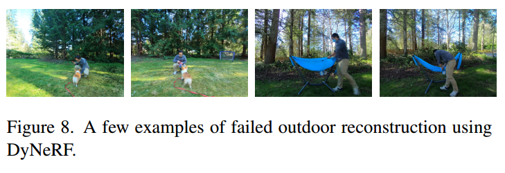

# Neural 3D Video Synthesis from Multi-view Video(CVPR2022)
本文提出了一种新的3D视频生成方法，这种方法能够以紧凑但富有表现力的表示形式表示动态真实世界场景的多视图视频记录，从而实现高质量的视图合成和运动插值。

## 1. Introduction

本文的主要贡献：
1. 本文提出了一种基于时间隐式编码的新型动态神经辐射场，可实现复杂动态现实世界场景的高质量 3D 视频合成。
2. 本文提出了基于时空域中的分层训练和重要性采样的新颖训练策略，这显著提高了训练速度并为更长的序列带来了更高质量的结果。
3. 本文提供了时间同步和校准的多视图视频数据集，涵盖用于研究目的的具有挑战性的 4D 场景

## 2. Methodology
NeRF是针对一个静态场景的辐射场，本文的方法基于NeRF，称作dynamic neural radiance field（CyNeRF）它直接根据用多个摄像机捕获的输入视频进行优化。

### 2.1 Representation
一种直观的思路来建立动态NeRF的表示就是直接在输入中加入时间维度 $t$

但是作者指出，根据经验发现，对于这种设计来说，很难捕捉复杂的动态 3D 场景以及具有复杂的拓扑变化和随时间变化的体积效应，例如火焰。

#### Dynamic Neural Radiance Fields
于是作者并没有直接用时间 $t$ 作为输入，而是用一系列与时间相关的隐变量 $z_t \in R^D$。这些隐变量提供了特定时间动态场景状态的紧凑表示，可以处理各种复杂的场景动态，包括变形、拓扑和辐射变化。（注意这里的 $z_t$ 是离散的取的，那么怎么达到拟合连续的场景的效果，后边会提到。）

#### Rendering
渲染的过程与NeRF一样用的是体渲染

#### Loss Function
损失函数用的是渲染出的图像与真实图像的L2损失。损失需要对给定的训练数据中所有的相机视角的所有视频帧进行计算。同时作者在coarse和fine两种不同的等级计算loss。

### 2.2 Efficient Training
本文的训练数据集的形式是对于同一个场景有18个相机拍摄的10s 30FPS，1MP的视频。那么如果用传统的NeRF训练方法对于每个视角的每个帧的每个像素进行ray sample，那么一个epoch就要74亿次的ray sample。这样的代价太大。

然而，对于自然视频，大部分动态场景要么是时不变的，要么在整个观察到的视频中的特定时间戳处仅包含小的时变辐射变化。因此，均匀采样光线会导致时不变观测值和时变观测值之间的不平衡。

于是作者提出了加速训练过程的策略：
1. 通过从粗到细的帧选择训练的视频帧的分层训练
2. 优先选择随时间变动比较大的区域周围光线的重要性采样

于是训练的范围就不再是针对所有的相机视角的所有视频帧，而是重要的帧中的重要的区域的像素点。具体的做法：

#### Hierarchical Training
通过从粗到细的帧选择训练的视频帧的分层训练coarse-to-fine。而coarse的帧是按照固定的时间步 $K$ 采样出对应时间的帧，称作关键帧Keyframe。

接下来就要回答隐变量如何应用到连续的场景的问题。在第一阶段coarse层级训练的时候，对这些关键帧训练的时候，隐变量 $z_t$ 是随机的取离散的值，然后隐变量也参与训练。在第二阶段的fine层级的训练的时候，则是对所有的帧进行训练，而在两个关键帧之间的隐变量不再是随机选取的，而是两个关键帧对应隐变量的线性插值。

这种分层的训练方式的好处在于，粗略的关键帧模型已经捕获了视频中时间不变信息的近似值。因此，精细的全帧训练只需要学习每帧的时变信息。从而可以提高训练效率。

#### Ray Importance Sampling
如何选择随时间变动比较大的区域的光线 $\mathbf{r}$。作者对 $t$ 时刻观测到的每一个计算一个权重矩阵 $w^{(t)}(\mathbf{r})$，在训练时候的每一个iteration，$t$ 时刻所有输入的视图中的光线权重进行归一化，然后采用inverse transform sampling来根据这些权重选择光线。

权重矩阵的计算方式，作者尝试了三种方式：
1. Global-Median（DyNeRF-ISG）根据每条光线的颜色与其全局中值随时间的残差来计算每条光线的权重。这种方式可以在训练时用一个比较大的学习率，从而可以快速恢复动态细节，但会导致一些时间上的抖动。
2. Temporal-Difference（DyNeRF-IST）根据两个连续帧中的色差计算每条光线的权重。这种方式可以在训练时用一个较小的学习率，从而产生平滑的时间序列，但是结果会比较模糊。
3. Combined Method（DyNeRF-IS*）是以上两者的结合。这种方式先用ISG得到sharp details，再用IST得到平滑的结果。

## 3. Experiments
本文给出了一个新的数据集Plenoptic Video Dataset，同时也在Immersive Video Dataset上进行实验。
比较的方法包括Multi-View Stereo (MVS)，Local Light Field Fusion (LLFF)，NeuralVolumes (NV)，NeRF-T。测试的指标包括PSNR，MSE，DSSIM，LPIPS，FLIP，JOD

作者通过实验证明在达到同样的真实度的情况下，相同的设备条件下，逐帧的训练NeRF的时间是15K GPU hours，而DyNeRF只需要1.3K GPU hours，本文的方法可以大大缩短训练时间。

## 4. Limitations
1. 在运动幅度比较大而且比较快的高动态场景中，本文的方法会导致运动区域模糊。

2. 训练的时间虽然比baseline要快很多，但还是不够快，而且需要的训练资源也比较多。

3. 超出训练视图边界的视点外推具有挑战性，可能会导致渲染图像中出现伪影

4. 本文的重要性采样策略是针对静态的相机的，如果相机是移动的情况，本文的策略不一定有效。
