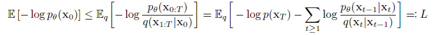
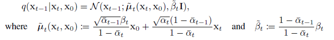
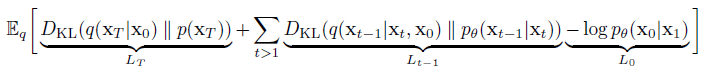
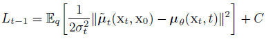
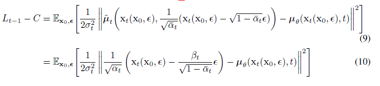
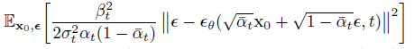
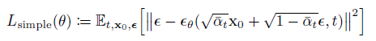
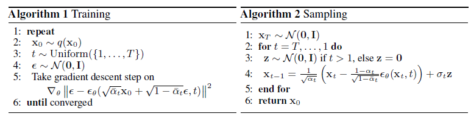
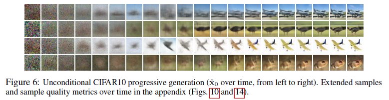

# Denoising Diffusion Probabilistic Models(DDPM)
## 1.隐变量模型
生成模型需要建模数据的分布 $p(x)$ , 自回归模型和Flow模型都是直接建模分布 $p(x)$ , 隐变量模型则通过引入隐变量z,间接建模分布$p(x)$.
$$
\begin{aligned}
  p(x) &= \int p(x, z)dz \\
       &= \int p(x|z)p(z)dz \\
  log p(x) &= log \int p(x|z)p(z)dz \\
           &= log \int \frac{q(z)}{q(z)}p(x|z)p(z)dz \\
           &\ge E_{z \sim q(z)} [log p(x|z)] - E_{z \sim q(z)}[log q(z) - log p(z)]
\end{aligned}
$$
上式用到了变分推断和Jensen不等式. 最后的不等式项也就是变分下界. 那么 $q(z)$ 如何得到?在生成模型中, 通常用 $q(z|x)$ 来代替 $q(z)$ . 于是就有了如下形式:
$$
\begin{aligned}
  log p(x) &= log \int p(x|z)p(z)dz \\
           &= log \int \frac{q(z|x)}{q(z|x)}p(x|z)p(z)dz \\
           &\ge E_{z \sim q(z|x)} [log p(x|z)] - E_{z \sim q(z|x)}[log q(z|x) - log p(z)]
\end{aligned}
$$
上式如何直观的理解呢? 考虑变分自编码器(VAE)生成图像的过程, 在VAE中, 先从数据集中从随机取出一张图像 $x$ , VAE先将 $x$ 通过Encoder编码到隐变量 $z$ , 也就是 $q(z|x)$ 表示的过程. 也就是说对于变分自编码器，隐变量 $z$ 是由输入的图像编码而得到的. 之后VAE将 $z$ 通过Decoder重建出图像 $x$ , 这个过程对应的也就是 $p(x|z)$ 。相应的优化目标需要约束 $z$ 的分布服从标准正态分布, 也就是变分下界中第二项内容. 变分下界的第一项对应的也就是重建损失.
一句话,隐变量模型可以看作两个部分,第一部分前向过程就是先从训练数据的得到中间隐变量 $z$ , 第二部分反向过程就是由隐变量重建出训练数据,其中隐变量需要约束其服从先验的分布.

## 2. Diffusion Model
在看DDPM之前,先来看一下其前身Diffusion Model. 宏观上来看Diffusion Model也是属于隐变量模型,但是特别的地方在于Diffusion的隐变量不是一个,而是其中间过程马尔科夫链长度有多长,隐变量就有多少个.
为了与原文一致且表示方便,用 $x_0$ 表示训练数据,用 $x_{1:T}$ 表示Diffusion Model的隐变量,也就对应上边的 $z$ .其中最后一个隐变量 $x_T \sim N(x_T; 0, I)$ 服从先验的标准正态分布.

### 2.1 Diffusion Model前向过程
Diffusion Model得到隐变量的前向过程(也称作Diffusion Process)被建模为Markov Chain. 原始的训练数据被逐渐添加指定的一系列方差 $\beta_1, ..., \beta_T$ 的高斯噪声.
$$
  q(x_{1:T} | x_0) = \prod_{t=1}^T q(x_t | x_{t-1}) \\
  q(x_t | x_{t-1}) = N(x_t; \sqrt{1-\beta_t}x_{t-1}, \beta_t I)
$$

### 2.2 Diffusion Model反向过程
Diffusion Model反向过程,也就是从隐变量重建训练数据的过程,同样是一个Markov Chain. 与前向不同的是,反向过程的均值和方差则是需要通过网络学习得到,并约束学到的内容与前向过程的先验的均值和方差相一致.
$$
  p_{\theta}(x_{0:T})=p(x_T)\prod_{t=1}^T p_{\theta}(x_{t-1} | x_t) \\
  p_{\theta}(x_{t-1} | x_t) = N(x_{t-1}; \mu_{\theta}(x_t, t), \sum_{\theta}(x_t, t))
$$

### 2.3 Diffusion Model的训练目标
同样,Diffusion Model要优化的目标依然是变分下界,将前向过程和反向过程代入变分下界的表示中就可以得到如下的训练目标:

## 3. DDPM
从上式可以看出Diffusion Model要训练其反向过程网络输出的均值和方差和前向过程固定的均值和方差相同. 前向过程想要得到中间第 $t$ 步的隐变量,就需要先得到之前所有的隐变量 $x_0,...,x_{t-1}$ . 同样,反向过程要得到第 $t$ 步的隐变量则要先得到 $x_T,...,x_{t+1}$ 那么想要实现这种Diffusion Model可以有两种思路,第一种是像ResNet的堆叠一样,有多少步,就堆叠多少层的模型. 但是受限于GPU的性能,注定了这种实现方式每一层的模型不能太大,而且堆叠的层数也不能太多. 第二种方式是只用一个网络,网络的输入包含了当前步骤 $t$ 和隐变量 $x_{t+1}$ , 输出的则是 $x_t$, 但是这种实现方式需要面临另外的问题,也就是串行训练的问题,在训练 $t$ 的时候,需要先运行模型 $T-t$ 次. 那么训练的时间代价就太大了. 那么如何解决串行训练的问题呢?

### 3.1 DDPM前向过程
虽然前向过程的分布是固定的,不需要训练模型,但是想要得到 $x_t$ 仍然需要一步步从 $x_0$ 先得到 $x_1,...,x_{t-1}$ . 那么有没有办法跳过这种串行呢?
$$
  q(x_t | x_{t-1}) = N(x_t; \sqrt{1-\beta_t}x_{t-1}, \beta_t I) \\
  x_t = \sqrt{1-\beta_t}x_{t-1} + \sqrt{\beta_t}\epsilon_t \\
  x_{t-1} = \sqrt{1-\beta_{t-1}}x_{t-2} + \sqrt{\beta_{t-1}}\epsilon_{t-1}
$$
其中 $\epsilon_t, \epsilon_{t-1}$ 都服从标准正态分布,且相互独立. 那么可以得到:
$$
  x_t = \sqrt{1-\beta_t}\sqrt{1-\beta_{t-1}}x_{t-2} + \sqrt{\beta_t}\epsilon_t + \sqrt{1-\beta_t}\sqrt{\beta_{t-1}}\epsilon_{t-1}
$$
那么令 $\alpha_t = 1 - \beta_t , \bar{\alpha}_t = \prod_{s=1}^t \alpha_s$ 根据递推关系就可以得到:
$$
  x_t = \sqrt{\bar{\alpha}_t} x_0 + \sqrt{(1-\bar{\alpha}_t)} \epsilon, \epsilon \sim N(0, I) \\
  q(x_t | x_0) = N(x_t; \sqrt{\bar{\alpha}_t} x_0, (1-\bar{\alpha}_t )I)
$$
这样就可以通过 $x_0$ 直接得到前向任意一步的隐变量 $x_t$
那么这样就可以通过 $x_0$ 直接得到 $x_t, x_{t-1}$ , 然后将 $x_t$ 作为网络的输入, 训练网络得到的 $\hat{x}_{t-1}$ 与 $x_{t-1}$ 的分布一致. 要约束两个分布一致最直接的就是优化两个分布的KL散度足够的小. 那么如何优化这个KL散度呢?

### 3.2 DDPM反向过程
为了得到更简单的优化目标,DDPM对Diffusion Model的反向过程的约束也进行了改进.
Diffusion Model需要约束前向过程的分布 $q(x_t | x_{t-1})$ 与反向过程的分布 $p(x_{t} | x_{t+1})$ 要一致. DDPM对这一形式做出了一些变化.
利用Markov Chain条件独立的性质:
$$
\begin{aligned}
  q(x_t, x_0 | x_{t-1}) &= q(x_t | x_{t-1})q(x_0 | x_{t-1}) \\
  q(x_t | x_{t-1}) &= \frac{q(x_t, x_0, x_{t-1})}{q(x_0, x_{t-1})} \\
  &= q(x_{t-1} | x_t, x_0) \cdot \frac{q(x_t | x_0)}{q(x_{t-1} | x_0)}
\end{aligned}
$$
那么可以显式地得到:

这样代入到Diffusion Model的优化目标中就能得到DDPM的优化目标:

### 3.3 DDPM的优化目标
上边已经给出了DDPM优化目标的形式,依然是变分下界的变体. 具体来看DDPM优化目标的每一项内容.

#### 3.3.1 $L_T$
$L_T$ 约束的是前向过程的 $x_T$ 分布 $q(x_T | x_0)$ 与先验的分布 $p(x_T)$ 要尽可能的接近. 而这个条件在先验取标准正态分布的情况下只需要 $\bar{\alpha}_T$ 与 0 尽可能接近即可. 这也就是前向过程的 $\beta_t$ 选取的时候需要满足的条件. 在给定 $\bar{\alpha}_T$ 的条件下,这一项可以看作是个常数, 对于求最优化的问题时可以忽略.

#### 3.3.2 $L_{1:T-1}$
这一项内容也是DDPM比较重要的部分, 这里DDPM使用了一种重参数化的方法.
对于反向过程 $p_{\theta}(x_{t-1} | x_t) = N(x_{t-1}; \mu_{\theta}(x_t, t), \sum_{\theta}(x_t, t))$ 和前向过程 $q(x_{t-1} | x_t, x_0) = N(x_{t-1}; \tilde{\mu}_t(x_t, x_0), \tilde{\beta}_t I)$ 要约束两个分布之间的KL散度, 只需要约束两个分布的均值和方差.
首先来看方差一项,前向过程的方差都是固定的值,因此反向过程也可以取为固定的值,即 $\sum_{\theta}(x_t, t) = \sigma^2_t I$, 作者通过实验得到 $\sigma^2_t = \beta_t$ 与 $\sigma^2_t = \tilde{\beta}_t$ 得到的结果基本一样.那么优化目标就只需要约束均值项.

接下来看均值一项,根据 $x_t(x_0,\epsilon) = \sqrt{1-\beta_t}x_{t-1} + \sqrt{\beta_t}\epsilon_t$ 可以推导出如下结果:

其中 $x_t$ 项是已知的,那么就只需要通过网络学习到加入的噪声 $\epsilon$ 项即可.

简化之后就可得到:

简而言之,DDPM训练的过程就是,随机抽取一步 $t$ ,利用前向过程直接得到 $x_t = \sqrt{1-\beta_t}x_{t-1} + \sqrt{\beta_t}\epsilon_t$ 然后将 $x_t$ 和 $t$ 作为网络的输入, 训练网络重建出前向加入的高斯噪声 $\epsilon$

这里DDPM训练的目标是重建高斯噪声 $\epsilon$ , 最终目的是利用 $x_t$ 得到 $x_{t-1}$ 的分布的均值, 那么也可以训练网络去得到 $x_0$ 之所以不这么做的原因是重建一个高斯噪声要比重建一张图像要相对容易一些.
DDPM的训练和采样过程如图所示:

注意这里DDPM反向也要加入一个服从标准正态分布的噪声 $z$ , 这个噪声是反向Markov Chain需要加入的噪声,要与前向Markov Chain,也就是网络需要重建的前向噪声 $\epsilon$ 相区别.

#### 3.3.3 $L_0$
$L_0$ 项是要从 $x_1$ 重建出 $x_0$ 那么重建出加入的前向噪声可以达到效果,同时最后一项需要得到没有噪声的结果,所以最后一步DDPM是直接不再加入上图中的反向噪声 $z$ .

## 4. DDPM实验结果
首先是 $\beta_t$ 的设置. DDPM设置线性增长的序列, $\beta_1 = 10^{-4}, \beta_T = 0.02$, 这样得到的 $x_T$ 的分布与标准正态分布的KL散度约为 $10^{-5}$

### 4.1 DDPM 采样质量
在CIFAR10数据集上, DDPM可以达到3.17的FID,具体实验结果直接看原文

### 4.2 DDPM反向过程的一些讨论
1. 首先是反向过程的方差,如果采用网络学习方差,而不是固定的值,那么训练过程会不稳定而且采样质量会下降.
2. 反向过程如果直接学习均值,在训练目标是原始的变分下界的时候可以与学习 $\epsilon$ 有相似的结果,但是如果用简化的目标则会差一点.
3. 为了显示反向Markov Chain的噪声 $z$ 的作用,作者分别固定1000之前的噪声,750步之前的噪声,发现1000步之前噪声固定,也就是只固定 $x_T$ 采样的最初的噪声,生成的结果相差很大. 但是,固定750步之前的噪声,生成的结果的很多属性都会大致相同,比如人的头发颜色,性别等.
