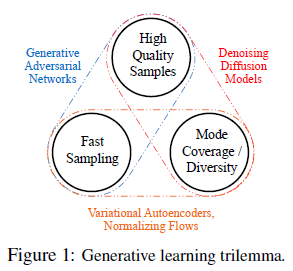
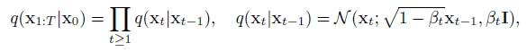
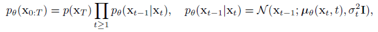
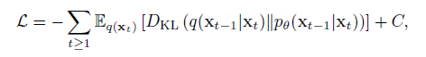
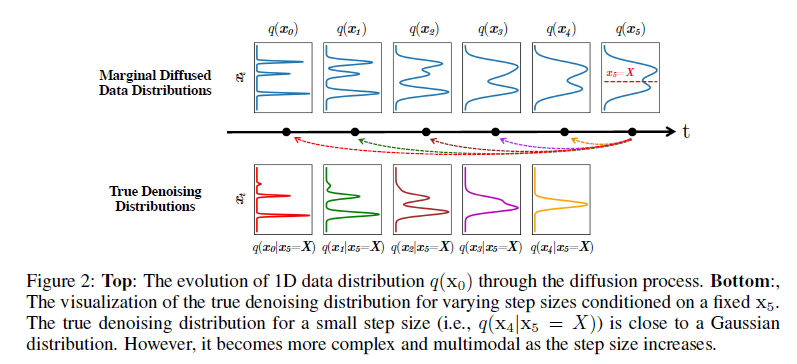
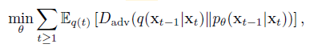
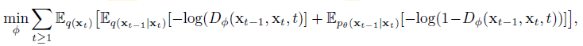
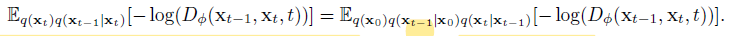
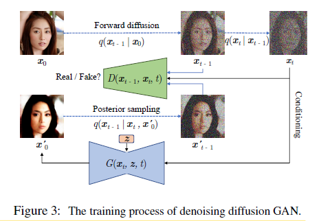
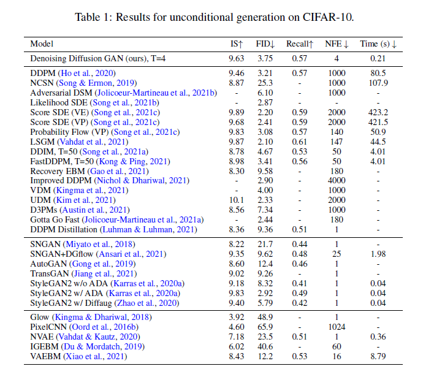

# Tackling the Generative Learning Trilemma with Denoising Diffusion GANs

本文提出了一种结合Diffusion和GAN的生成模型, 在CIFAR-10数据集上能够比DDPM快2000倍, 同时与传统的GAN相比, 又可以生成质量相近有具有多样性的结果. 作者指出DiffusionGAN是第一个可以把Diffusion采样步骤降低到可以被应用到实际当中的模型.  

## 1. Introduction
本文提出了一种比较贴切的说法叫做:生成学习的三元悖论(The Generative Learning Trilemma). 现有的各种各样的生成模型都需要满足三个方面的需求:
1. 生成的样本的质量要高 high-quality sampling;
2. 模态覆盖率要高/多样性 mode coverage/diversity;
3. 快速高效的采样 fast and computational inexpensive sampling;  

如图所示, 可以直观的看出, 现有的四大类的生成模型:
1. GAN可以生成高质量的结果, 同时可以快速采样, 但是生成结果缺乏多样性, 而且GAN网络训练不稳定和模式坍塌也是臭名昭著.  
2. VAE和Normalizing Flows可以快速采样, 而且生成的结果也有良好的多样性, 但是生成的质量却比较差.  
3. Diffusion生成的结果质量比较高, 甚至可以超过GAN, 而且结果也有良好的多样性, 但是Diffusion需要几百甚至几千步的采样, 十分缓慢.  

## 2. Background
Diffusion模型, 包括DDPM模型, 都包含了前向过程和反向过程. 而且前向过程和反向过程中间数据的分布都被建模为了高斯分布.  
前向过程:  
  
反向过程:  
  
那么, Diffusion模型优化的目标本质上是将前向的真实的去噪过程的数据分布(true denoising distribution)与反向过程参数化之后去噪过程的数据分布(parameterized denoising distribution)对齐:  
  
注意到这里的形式与之前在介绍DDPM的笔记里边的两种形式都不太一样, 主要区别在于q的分布的表示形式. 由于 $q(x_t | x_{t-1}) = \frac{q(x_{t-1} | x_t)q(x_t)}{q(x_{t-1})}$ , 这三种形式是等价的, 而相比之下, 本文这种表示形式更能体现Diffusion模型的本质. 也就是反向的去噪过程是在模拟前向过程所对应的真实的去噪过程.    
Diffusion模型基于两个重要的假设:
1. 去噪过程的分布(denoising distribution) $p_{\theta}(x_{t-1} | x_t)$ 是高斯分布.  
2. 去噪过程的步数T是数百或数千这个数量级的.  
那么自然有如下两个问题:
1. 去噪过程的真实分布是高斯分布吗?或者在什么条件下是高斯分布?  
2. 去噪过程步数多是否与这个高斯分布的假设有关?  

## 3. Denoising Diffusion GANs
### 3.1 去噪过程的分布
首先来看什么时候真实的去噪过程的分布 $q(x_{t-1} | x_t)$ 是高斯分布. 根据贝叶斯法则, $q(x_{t-1} | x_t) \varpropto q(x_t | x_{t-1})q(x_{t-1})$ 其中前向过程的分布 $q(x_t | x_{t-1})$ 服从高斯分布. 那么可以证明在如下两种情形下, 真实的去噪过程的分布服从高斯分布的形式:  
1. 当步长 $\beta_t$ 无限小的时候, 这时候贝叶斯法则中前向过程的分布  $q(x_t | x_{t-1})$  占主导地位, 而不论边缘分布 $q(x_t)$ 是什么形式, 真实的去噪过程的分布与前向过程的形式相同也是高斯分布的形式. 这也就解释了Diffusion需要大量的采样步的原因.  
2. 当数据的边缘分布 $q(x_t)$ 是高斯分布时, 那么真实的去噪分布自然也是高斯分布的形式. 于是一种直观的思路就是先将数据通过VAE编码到高斯分布, 再来利用Diffusion模型.
但是, 当这两个条件都不满足的情况下, 会是什么样呢? 作者指出当两个条件都不满足时, 真实的去噪过程的分布会更加复杂和多模态. 并用一维数据的分布举了个例子:

### 3.2 Diffusion GANs
为了能在数据的边缘分布不是高斯分布的情况下, 也能减少采样的步数, 这种情况下既然真实的去噪过程的分布 $q(x_{t-1} | x_t)$ 不再服从高斯分布的形式, 那么将反向过程的分布 $p_{\theta}(x_{t-1} | x_t)$ 也不再建模为高斯分布的形式, 而是通过Conditional GAN来使得两个分布对齐, 而不是显式地去学习高斯分布的均值和方差. 这也就是本文的基本思路.  
相应的, 优化的目标也就变成了:  
   

那么GAN包括两个部分, 生成器generator $G$ 和判别器 discriminator $D$ . 那么对于生成器就是 $x_{t-1} = G(x_t, z, t)$ 其中引入的噪声 z 是为了模型的结果能有良好的多样性.   
相应的, GAN的Discriminator也应该与步骤 $t$ 有关, 其输入除了数据 $x_t$ 外, 还要包括 $t$ .  
  
但是判别器还需要真实的去噪分布的数据, 这个数据怎么得到? 作者在这里进行了简单的转换.  
  

简单的来表述就是, DDPM为代表的Diffusion模型, 反向过程是在其去噪的分布是高斯分布的前提下,利用 $x_t$ 来得到 $t-1$ 的均值和方差, 再来计算得到 $x_{t-1}$ , 而本文的DiffusionGAN则不再有去噪的分布是高斯分布的假设, 利用 $x_t$ 直接通过生成器 $G(x_t, z, t)$ 得到 $x_{t-1}$ .  

### 3.3 一些讨论
一个自然而然的问题就是, 为什么不用一步的GAN而要这样用多步的GAN呢? 这样做相比一步直接得到结果的GAN有什么好处呢? 作者给出了如下解释:  
1. 传统的一步到位的GAN, 训练不稳定而且容易模式坍塌, GAN的判别器也容易过拟合, 而且直接从高斯分布的噪声一步得到复杂的数据分布本身就是很困难的.  
2. 相比之下, 将生成的过程拆分成多步的, 每一步对于模型来说相对简单, 因为每一步的生成是在上一步结果 $x_t$ 的条件下生成的. 而且diffusion process中, 数据的分布更平滑, 因为其中加入了不同程度的噪声, 这样可以让判别器不容易过拟合. 这样可以让模型训练起来更稳定, 并且可以得到多样性的结果.  
归结起来就是一句话, 多步的GAN比一步的GAN训练更稳定, 而且模态覆盖更充分, 结果多样性更好.  

## 4. 实验部分
作者的一个主要的实验就是在CIFAR-10数据集上比较了不同模型的采样质量(FID和IS); 采样多样性(Recall Score); 采样的时间(NFE和Clock Time)  
  
其他的实验结果可以直接参考原文.  
