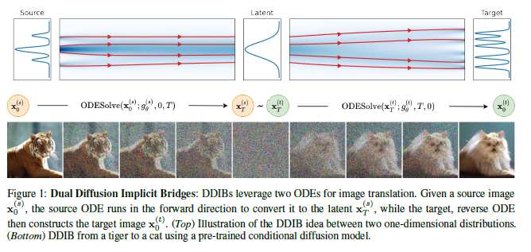
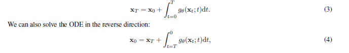
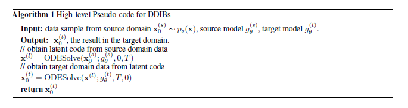
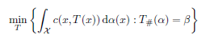
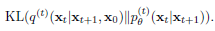
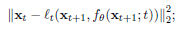
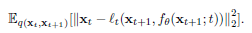
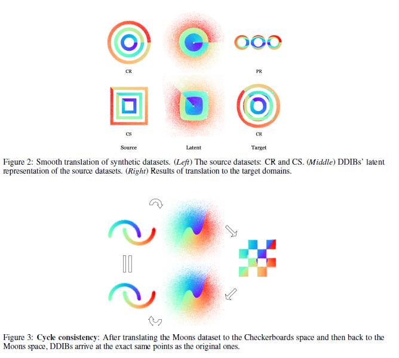
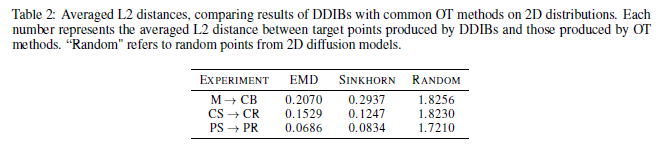
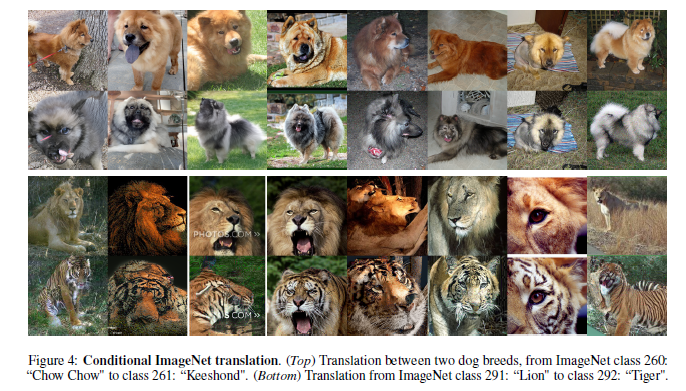

# Dual Diffusion Implicit Bridges for Image-to-Image Translation(DDIB)

本文提出了一种新的域之间的Image-to-Image Translation的方法DDIB, 这种方法只需要在source域和target域上分别训练好两个DDIM模型(DDIM模型可以参考之前的Denoising Diffusion Implicit Model这篇文章的笔记), 然后将source域对应的latent直接传给target域. 这种方法不需要成对的训练数据, 而且source域和target域的训练可以相互独立, 从而保证了数据的安全性.  

## 1.Introduction
通常的Image-to-Image Translation需要成对的训练数据, 但是有些时候没有成对的数据, 这些情况下就需要直接实现两个域的转换. 现有的这种直接跨域转换的unpaired image Translation的方法都是基于GAN, 比如cycleGAN, DualGAN,还有一些方法基于normalizing Flow.  

但是现有的这些跨域转换的方法尽管可以生成高质量的结果, 但是一个重大的缺陷是缺乏adaptability. 也就是说, 一个训练好的模型只能实现单方向的两个域之间的转换, 要实现 $n$ 个域的相互转换就需要 $n^2$ 个模型. 那么作者提出的DDIB, 只需要在每个域上独立的训练一个DDIM模型, 也就是只需要 $n$ 个模型, 就可以实现 $n$ 个域之间的互相转换. 

另外作者还提出, 在一些应用情形下, 两个domain的数据为了安全起见不能共享, 那么对于很多需要两个domain的训练数据的传统模型就无用武之地, 而DDIB需要的只是在不同的域上单独训练出来的DDIM模型, 所以就可以满足这种安全性要求.  

## 2.DDIB
首先回顾一下DDIM将Diffusion与ODE联系在一起, 也就是说前向过程和反向过程都可以用ODE来表示, 而且这两个过程互为逆过程.  

  

简单用一句话, 对于一个训练好的DDIM模型, 任意一张图像 $x_0$ 可以通过前向的ODE得到唯一的一个 $x_T$, 而这个唯一的 $x_T$ 又可以通过反向的ODE得到 $x_0$.这是一个很好地性质, 有了这个基础再来看DDIB的方法就是一目了然.    

DDIB的伪代码如下所示:

  

方法其实简单明了, 也就是用source域的DDIM前向的ODE将source域的图像 $x_0^{(s)}$ 转换到其隐空间的表示 $x^{(l)}$ , 然后直接将这个  $x^{(l)}$ 作为target域的DDIM反向的ODE的输入, 就可以得到对应的target域的输出 $x_0^{(t)}$ .

方法似乎看起来很简单, 但是为什么这个隐空间的表示能够直接用, 难道不需要其他的操作吗? 换句话说, 这种方法可行的原理是什么? 抱着这个问题接着往后看.  

## 3.与最优传输的联系
作者首先介绍了DDIM训练的目标与最有传输问题的联系.    

蒙日最优传输(Monge Optimal Transport)是指寻找从一个数据分布到另一个数据分布的最小的代价.  

用数学的方式表示, 假设有两个概率测度 $\alpha, \beta$ 分别对应两个空间 $X, Y$, 代价函数为 $c(x, y)$ , 那么蒙日最优传输可以看作如下的优化问题:

  

那么接下来看DDPM与DDIM的优化目标(不熟悉优化目标可以参考之前DDPM和DDIM的笔记):  

  

用 $l_t$ 来表示一种线性组合的形式, 那么可以有:  

  

由于DDIM训练过程中,优化目标的 $x_t$ 可以直接由 $x_0$ 得到, 于是这个优化目标又可以表示成如下的形式:  

  

用数学期望的形式来表示这个目标可以得到:  

  

优化这个目标与优化蒙日最有传输的目标是异曲同工的.  

可是讲了这么一大堆, 只是说明了在同一个域内训练DDIM的目标与最优传输的联系. 于是DDIB就可以看作是先从source域最优传输到latent域, 再从latent域最优传输到target域. 但是还是没有解释清除为什么中间的隐变量不需要任何处理能直接在两个域之间使用.于是作者指出, 尽管这种直接用隐变量的方式, 并不能严格的算是从source域到target域的最优传输, 但是通过实验可以看出这种方式与最优传输之间很接近.  

于是作者在一些二维的分布上做了一些小实验来证明这一点:  

  

并且作者将DDIB的方法与直接用其他最优传输方法的结果进行了比较:

  

总之, 作者并没有从理论上给出DDIB可行的解释, 而只是从实验层面给出了一些佐证. 这难免有些缺憾.  

## 4. 实验结果
其他的一些实验结果可以直接参考原文.  
  
