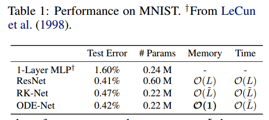
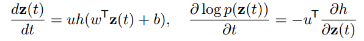

# Neural Ordinary Differential Equtions

本文是NeurIPS 2018 最佳文章, 作者的想法可以用《赤壁赋》中的一句话来微妙的体现：盖将自其变者而观之，则天地曾不能以一瞬, 自其不变者而观之, 则物与我皆无尽也。  

作者提出了一种新的深度神经网络模型, 主要的思路是:原来的神经网络通常需要依靠若干多个残差网络堆叠起来, 而本文提出的NeuralODE可以仅用一个与之前残差块类似的网络来达到若干多个残差块堆叠的效果, 从而大大降低了网络的参数量和并且可以看作只需要常数的存储空间.  

## 1. Introduction
NeuralODE的想法归根结底来自于传统的神经网络。在传统的的残差网络(Residual Networks), 循环神经网络(Recurrent Neural Network), 标准化流(Normalizing Flow)等经典的网络中, 数据都可以用一个式子来表示:
$$
  h_{t+1} = h_t + f(h_t, \theta_t)
$$
其中 $h_t \in R^D$, $t \in \lbrace 0,1,...T \rbrace$. 这些堆叠起来的网络块可以看做是连续变换的欧拉离散化. 于是上式其实还可以看成:  
$$
  h_{t+1} = h_t + f(h_t, \theta_t) dt
$$
只是这里的 $dt = 1$. 这两种看法, 第一种是将网络输出看作是变化量, 而后一种则是看作变化率, 形式上相近, 但是意义却有很大的不同.    

那么当 $T$ 无限大, 即 $dt$ 无线小,  也就是说有无穷多的网络块连接的时候, 上式就可以看成是一种由神经网络决定的常微分方程的形式:  
$$  
  \frac{dh(t)}{dt} = f(h(t), t, \theta)
$$
这个式子也就是本文的根源. 这样有了初始的状态 $h(0)$, 就可以通过求解常微分方程(Ordinary Differential Equation, ODE)来求解出任意时刻的输出 $h(T)$, 如果中间求解过程用的是欧拉离散化求解的话, 那么离散化的步骤有多少步, 其实就可以看作是多少个块的堆叠.    

简单一句话, 虽然并不全面, 但是可以帮助理解, NeuralODE就是残差网络的连续化.  

作者的主要贡献包括:  
1. 提出了新的深度神经网络模型NeuralODE, 拥有 $O(1)$ 的空间复杂度. 而且作者给出了NeuralODE反向传播更新参数的方法.  
2. 作者将NeuralODE用在了Normalizing Flow中, 提出了一种连续的流模型(Continuous Normalizing Flow).  
3. 作者将NeuralODE用在了时间序列模型中.  

## 2. NeuralODE反向传播
现在的神经网络基本都需要完成两个内容, 首先是前向传播得到结果, 然后通过得到的结果反向传播来更新网络参数. 那么NeuralODE作为一种新的网络结构, 也需要具备这两个基本的功能.  

NeuralODE的前向过程已经很明了, 就是求解上面已经给出的常微分方程, 求解的方法可以用现有的求解器ODE Solver, 目前已经有多种ODE Solver可以直接使用. 最简单的就是欧拉离散化来求解, 也就是每次取很小的 $dt$ 然后不断的累加即可.  

但是NeuralODE如何进行反向传播?  

首先来考虑优化通过损失函数 $L()$ 得到的损失向量, 损失函数的输入便是从初始的输入 $z(t_0)$ 通过前向过程的ODE Solver得到的输出结果 $z(t_1)$:

那么为了优化参数, 就需要求出损失 $L$ 关于参数 $\theta$ 的梯度, 也就是 $\frac{dL}{d\theta}$.  

这里再强调一下, 传统的残差网络, 每个残差块有自己的参数, 这些残差块串行的连接在一起, 前向的时候每个残差块只运行了一次, 所以反向传播的时候, 可以直接串行的计算出损失 $L$ 关于中间任意的第 $t$ 层输出结果 $h(t)$ 的梯度 $dL/dh(t)$ , 然后根据这个梯度来计算损失关于第 $t$ 层的参数 $\theta_t$ 的梯度 $dL / d\theta_t$. 也就是最简单的链式法则.   

但是NeuralODE只有一个类似于残差网络中的一个残差块的网络, 而NeuralODE的这一个块在前向的ODE Solver中被运行了多少次是未知的, 这个值通常很大, 那么用传统的链式法则求梯度显然是不可行的, 于是就需要通过其他方法来求梯度.  

 (这个部分原文里边用 $z(t)$ 来表示连续情况下中间的结果, 用 $h(t)$ 表示离散情况下的中间结果, 意义是一样的, 为方便理解可以将两个符号互换来看.)

直接用链式法则不可行, 但是链式法则的这种思路是可以借鉴的. 也就是求出损失关于中间结果的梯度, 作者用式子来表示 $a(t) = dL / dz(t)$ 称其为adjoint. 那么这个adjoint也满足一个ODE:

推导过程如下(也可以直接参考原文附录), 也是利用了链式法则:

再利用一次链式法则, 就可以得到:

推导过程如下(也可以直接参考原文附录)

如果对推导过程不感兴趣, 可以直接记住结论, 也就是反向传播的过程也需要求解一个ODE. 而这个ODE需要和伴随状态一块求.

简单的小结一下, NeuralODE的前向过程是用ODE从初始时刻输入求解终止时刻的输出, 反向过程求解一个反向的ODE, 从终止时刻开始到初始时刻.而且从以上内容可以看出, NeuralODE的网络输入和输出的维度必须是固定的, 所以就不能像残差网络一样可以在残差块之间加入上下采样, 这也是NeuralODE的一个缺点.    

## 3. 用NeuralODE代替残差网络
作者做了用NeuralODE代替残差网络的实验, 当然NeuralODE的维度必须是固定的, 所以用NeuralODE替换的是原来的残差网络中上下采样之后的块.

作者在MNIST数据集上进行了简单的实验:

## 4. 连续标准化流Continuous Normalizing Flow
有一类称作planar normalizing flow的流模型, 其表示形如:

这种表示与之前看到的残差表示相似, 于是也可以转换成ODE的形式,

这里本人对流模型了解并不多, 详细内容请参考作者原文.  

## 5. 时间序列模型time-series model
作者还提出了一种时间序列模型, 基本的思想就是: 给定已经观测到的时间点 $t_0, t_1, ..., t_N$, 以及初始状态 $z_{t_0}$ , 那么可以用ODE来预测 $N$ 之后的时间的状态.  

而初始的状态 $z_{t_0}$ 则需要利用一个RNN encoder来得到.  

## 6. 小结
总结一下, 本文作者的三个贡献, 其中最重要也是本文核心的就是NeuralODE及其反向传播的过程, 不过一个弊端就是Neural ODE的输入和输出维度是固定的, 这在一些场合显得不太灵活. 之后作者又提出了连续流和基于ODE的时序模型, 都可以看做是NeuralODE在不同模型上的变种, 其本质还是相同的. NeuralODE最大的优点是 $O(1)$ 的空间复杂度, 这样可以将这一个块设计的比传统残差块更复杂, 从而有更好的效果, 但是相应的NeuralODE可以看做是拿时间来换空间, 利用ODE Slover求解的时间代价比传统残差网络要高.    
