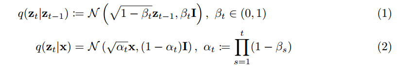
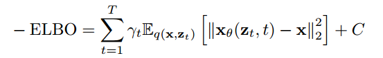
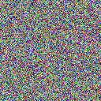
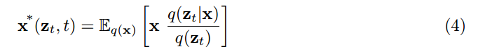
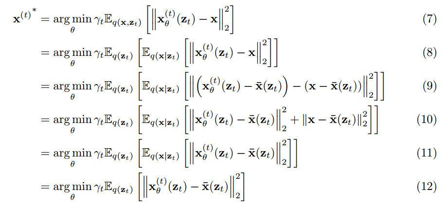
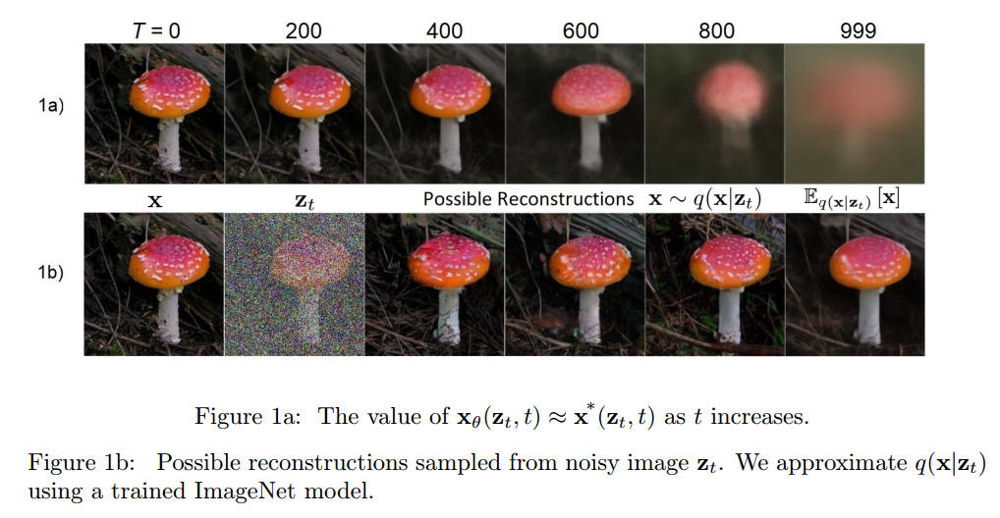
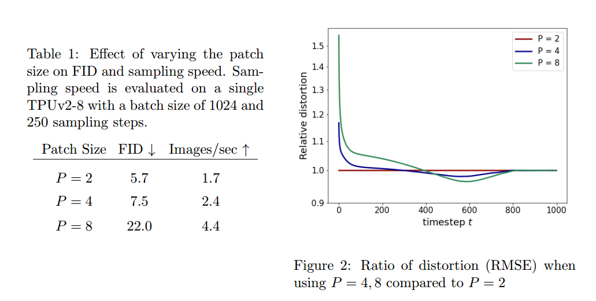
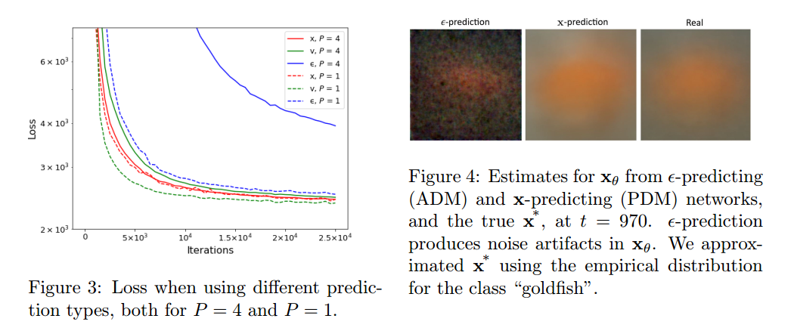
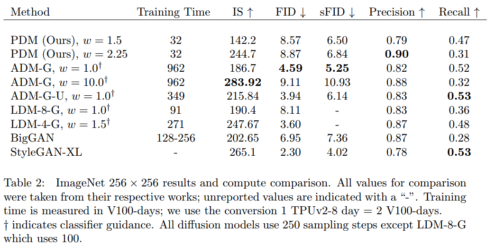

本文主要是在思路上比较具有创新性. Diffusion需要成百上千的采样步, 这是Diffusion采样速度慢的重要原因. 因此, 很多加速Diffusion的方法关注于如何降低采样步数. 本文的作者则提出了另一种思路, 也就是通过将图像划分patch降低Diffusion模型每一步的采样效率和内存占用量.

## 1. Introduction
对于图像数据, 降级计算成本的一种很高效的方法就是处理图像数据的低维表示, 这种低维表示可以通过降采样或者编码器得到, 但是这两种方式还需要将低维的数据上采样或是解码器解码出来, 需要更多的网络. 本文采用了一种更方便的做法, 也就是将图像划分成patch然后直接concatenate起来.

本文作者的主要贡献:
1. 对Diffusion训练目标进行深入分析, 表明在很多的采样步中, 高分辨率的卷积层是冗余的.
2. 提出了一种Patched Diffusion Model(PDM), 而且证明可以明显降低采样的代价. 而且这种方法可以与现有的降低采样步的方法同时使用.
3. 作者对不同训练目标的Diffusion效果进行比较, 发现不论是否有patch, 通过预测数据的方法比预测噪声的方法模型更鲁棒.
4. 作者提出了一种将PDM用于更复杂,分辨率更高的数据的方法, 也就是将一个网络分为多个部分, 然后在256x256的ImageNet上可以得到高质量的结果.

## 2. Patch Diffusion Model
Diffusion模型的原理不再赘述, 只是这里作者用的标记与DDPM不太一样, 放张图一目了然.

训练的目标, 也就是重建出x

这里的 $\gamma_t$ 是常数. 但是训练的时候如果目标加入了 $\gamma_t$ 反而会导致采样的质量下降, 因为会 overemphasize 高频的信息. 所以作者在文中设置 $\gamma_t = \sqrt{\frac{\alpha_t}{1-\alpha_t}}$, 来兼顾低频的信息.

Diffusion的训练过程, 也就是将 x 进行 perturb 得到 $z_t$, 然后训练网络 $x_{\theta}$ 通过 $z_t$ 重建出 x, 也就是上面图中训练目标.  

### 2.1 Diffusion模型架构中的冗余
作者指出, 对于任意一个隐变量 $z_t$, 可能是很多的不同的 $x$ 加入不同的噪声得到的. 但是这些 $x$ 都能对应于这个 $z_t$, 只是概率不同. 这种情况在 t 比较大, 也就是噪声比较大的时候更明显. 怎么理解呢?

如图三个苹果颜色不同形状完全相同, 那么通过上边的隐实验结果分析：变量(也就是近似于噪声的图像)预测得到的 x 可能是这三个苹果中的任何一个. 在这种情况下, 模型优化后会得到的最优的结果是什么呢?

作者指出, 通过上面训练目标进行优化得到的最优的结果可以表示为:

推导的过程如下:

简而言之, 也就是说模型每一步收敛到最优的时候, 预测得到的 $x^*$ 是输入的 $z_t$ 对应的所有的所有 $x$ 的期望, 或者也可以看作是均值. 代入刚才的苹果例子里边, 模型预测的苹果会是三种颜色的一种平均.  这其实和众多用L2损失进行优化的情况相似, 也就是模型最终学到的是所有可能情况的均值, 从而会丧失diversity. 不仅体现在着色模型会倾向于将结果预测成灰色, 还体现在Diffusion模型可能会在预测时高频的信息会很模糊, 因为取的是平均值.

但是作者并没有说怎么解决模糊的问题, 而是基于这种模糊的事实, 指出既然在噪声比较大的时候直接预测的 x 是模糊的, 也就是高频信息并不能很好的得到, 那么就不需要那么高的计算代价, 反正都是模糊的. 于是就不需要在高分辨率上去做卷积.

### 2.2 Patched Diffusion Models(PDM)
首先来说作者怎么分Patch操作, 对于(H, W, C)的图像, 作者将其按照 P 的大小分成不重叠的Patch, 然后concatenate起来, 于是就将图像转变为 $(H/P, W/P, C \times P^2)$ 的数据, 这个作为Unet的输入.

作者尝试了不同的patch大小2,4,8. 发现patch=4的时候, 既能有比较好的采样质量, 又能提高速度. 并且作者通过比较不同patch的RMSE证实了在噪声比较大时, 高分辨率做卷积是没多大用的.  

之后作者尝试了不同的训练目标, 也就是重建 $\epsilon$, $x$, $\sqrt{\alpha_t} \epsilon - \sqrt{1-\alpha_t} x$三种不同的目标对质量的影响. 结论是重建 $x$, $\sqrt{\alpha_t} \epsilon - \sqrt{1-\alpha_t} x$ 比重建 $\epsilon$ 更鲁棒.

### 2.3 Scaling to more complex datasets
这个部分很简单, 就是用了两个Unet, 一个不分patch用在前半部分模糊的阶段, 另一个用在后半部分.

更多实验结果参考原文. 
