# 1. 最优传输（Optimal Transport， OT）

没有什么不是一个例子解决不了的，理论来自于实际而高于实际。

那么考虑生活中的例子，京东快递仓库分别在辽宁，北京，江西，分别需要送若干货物到西藏，新疆，内蒙古，运输的成本与距离和运输方式以及天气等诸多状况有关。

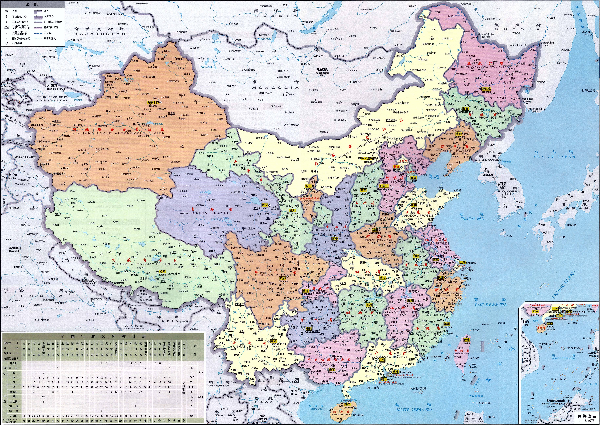

## 1.1 蒙日问题（Monge Problem）
考虑最简单的情况，每个仓库只有一份货物，每个用户需要一份货物。运输的成本可以用一个矩阵表示，那么问题就变成了寻找最优排列的问题。

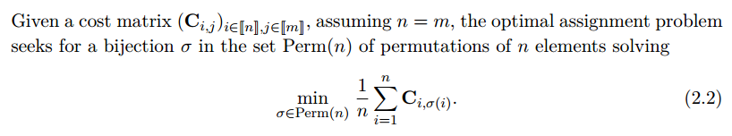

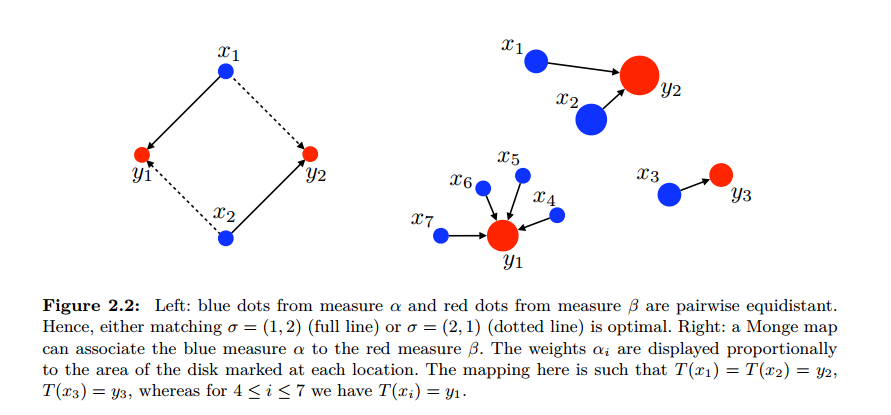

现在扩展到更一般的情况，仓库和货物都用概率空间来表示。

#### 补充内容：概率空间
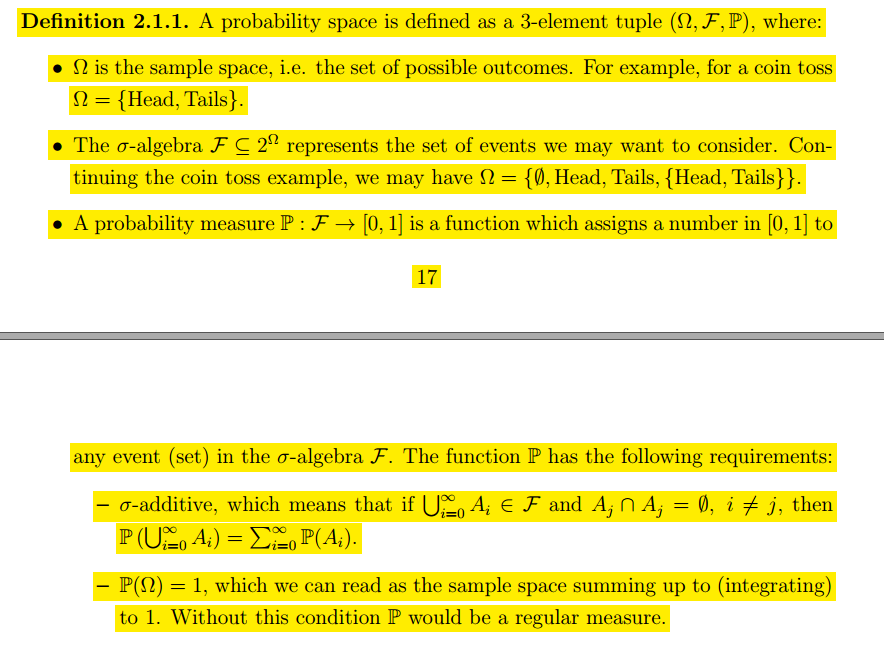

那么就可以得到离散情况下的Monge问题的表示

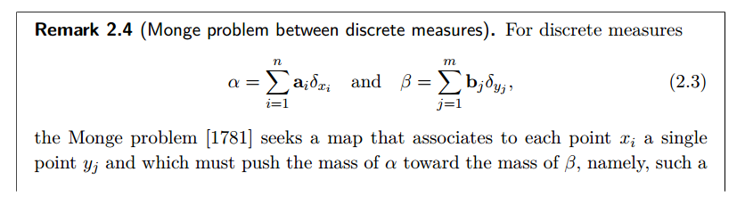

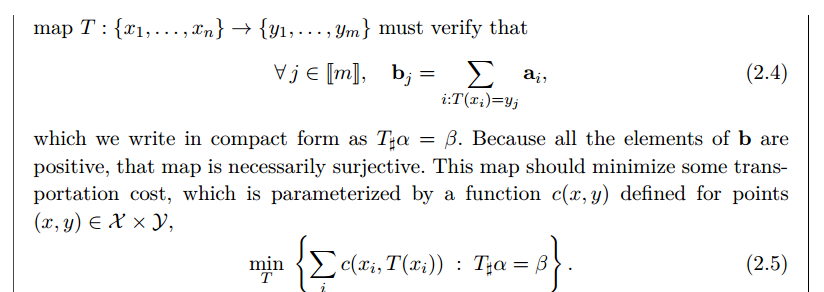

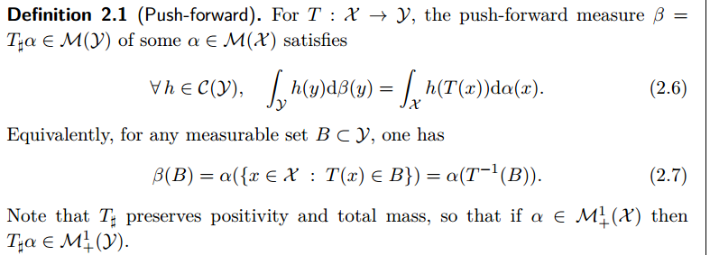

更进一步扩展到任意的测度空间：

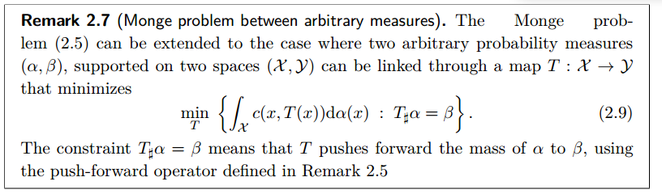

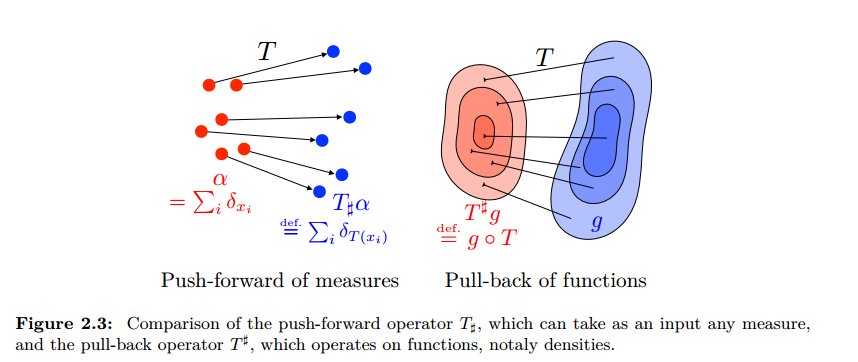

### 蒙日最优传输的特点（问题）：
1. 每个x对应一个y，放到实际的例子中就是每个仓库的所有货物只能运送到一个目的地。
2. 可行域一般不是凸集，最优解也可能不止一个

## 1.2 Kantorovich Relaxation
针对蒙日最优传输的问题，Kantorovich对蒙日问题做了松弛。其实就是每个x可以对应多个y，这样也更符合实际的情况。也就是说一个仓库的货物可以运送到多个目的地。那么相应的就要引入一个分配矩阵。

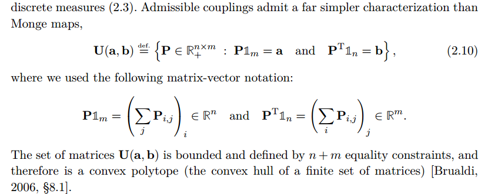

于是就可以得到Kantorovich Optimal Transport Problem

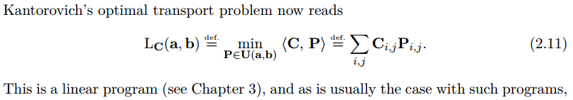

那么所有的蒙日问题都可以包含在Kantorovich问题中。

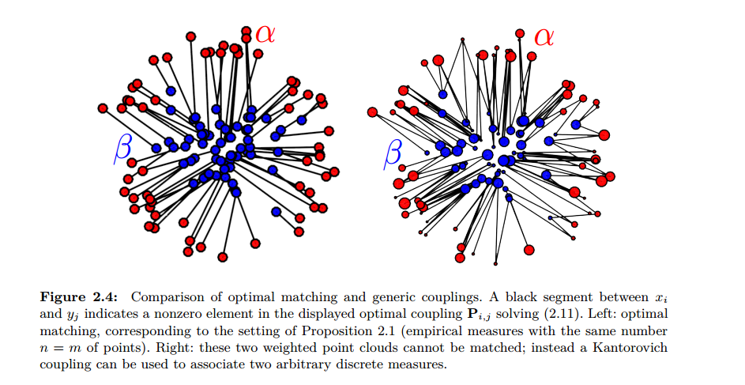

相应的对离散的情形进行扩展，可以得到任意测度情况下的Kantorovich问题：

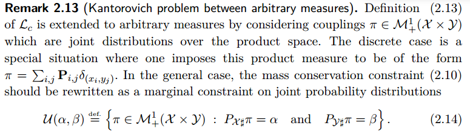

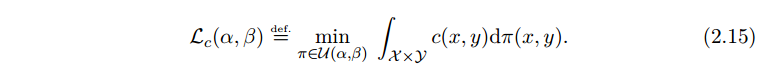

## 1.3 Kantorovich的对偶问题
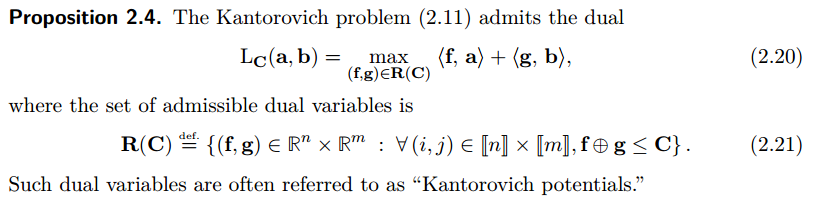

如何理解Kantorovich的对偶问题。上边的所有的蒙日和Kantorovich问题都可以理解为站在仓库管理者的角度，希望在运输公司给的最小的运输费用的前提上找到代价最小的运输方案。而其对偶问题则可以看作是站在运输公司的角度上，希望在运输公司给定的最大可接受的运输代价的前提下，找到收益最大的运输方案。

## 1.4 Brenier定理与蒙日-安培方程（Monge-Ampere Equation）
Brenier定理给出了Kantorovich问题有解的条件。

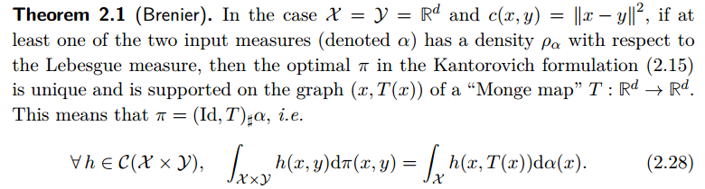

而Brenier定理进一步展开就可以得到蒙日-安培方程，相应的求解最优传输问题就归结为了求解蒙日-安培方程问题。

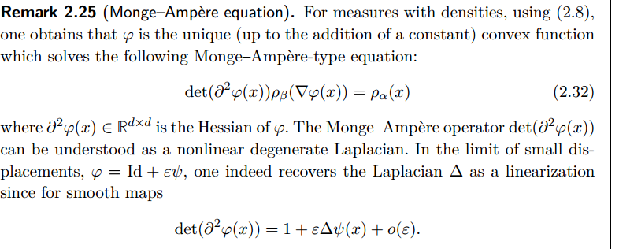

## 1.5 OT的应用
直方图均衡化增强对比度

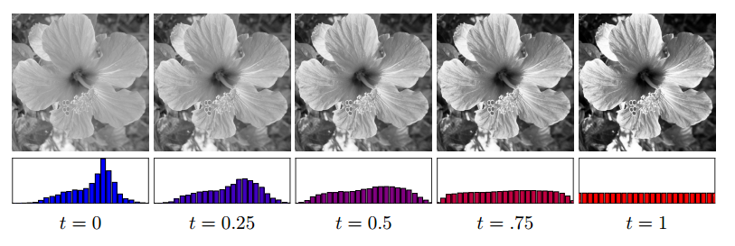

蒙皮

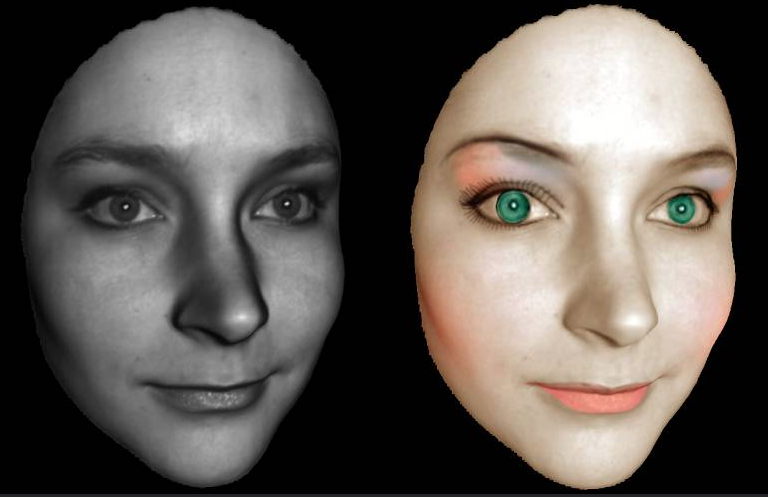

# 2. The Schrodinger Bridge Problem
薛定谔桥问题可以看作是OT问题的一种特殊情况。OT问题是在找最优的push-forward，但是只要是可行的push-forward都在考虑范围之内。而薛定谔桥则是进一步缩小了这个可行域。对于两个分布，薛定谔桥问题考虑的可行域则是满足两端的边缘分布为给定分布的一系列随机演化过程，称作（Path Measure）。而其优化的目标则是寻找与给定的先验的Brownian-motion prior之间的KL距离。就像比武，之前的比武十八般兵刃随便挑，现在则是固定只能用青龙偃月刀。

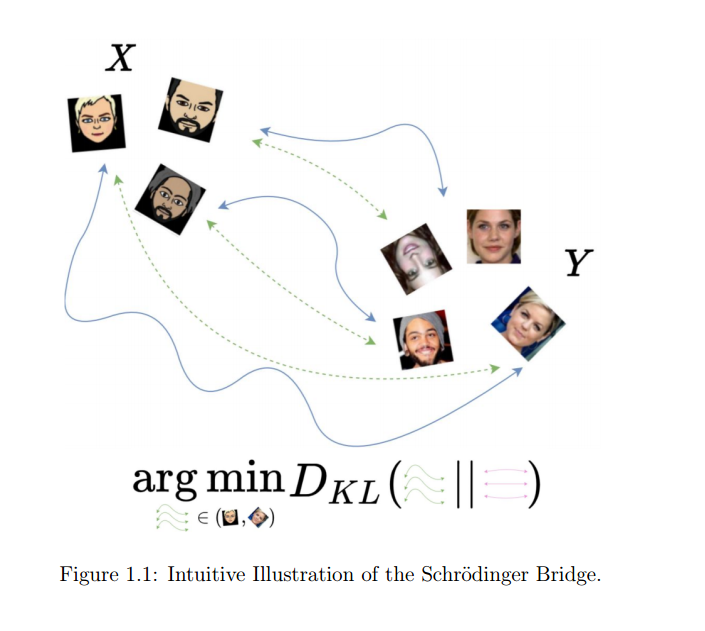

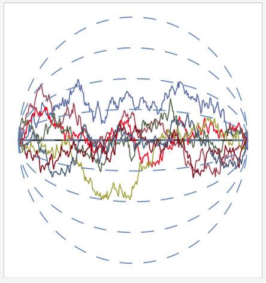

## 2.1 动态薛定谔问题（Dynamic Schrodinger Problem）

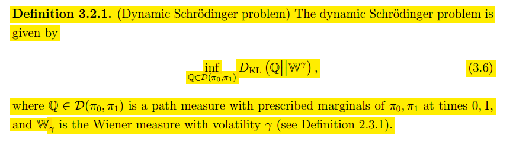

那么Q可以看做是一个从 $\pi_0$ 到 $\pi_1$ 的随机微分方程的解，那么相应的也可以看做是从 $\pi_1$ 到
 $\pi_0$ 的随机微分方程的解。

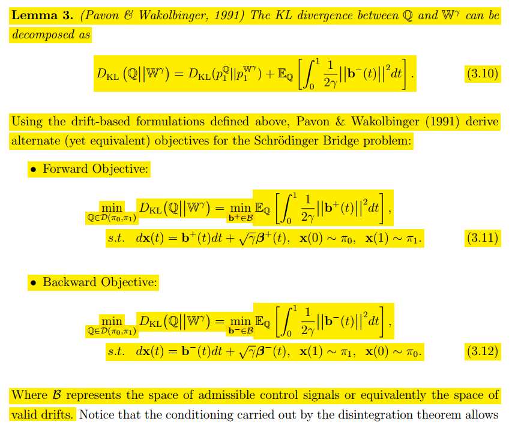

## 2.2 静态薛定谔问题（Static Schrodinger Problem）
与动态薛定谔问题的不同之处在于，静态问题将两端的边缘分布看作不同的随机变量，考虑它们的联合分布。

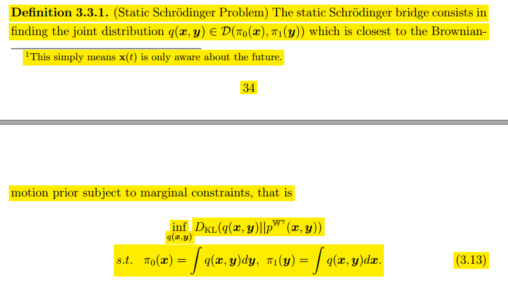

联系将条件和原图concat起来的diffusion。

## 2.3 薛定谔系统与IFPF
单个的薛定谔桥问题是在求与给定的先验最近的Path，其代价也是与先验的KL散度。对其进行扩展，如果要找到整个的Path measure 空间中传输代价最小的Path怎么办？ 求解一组薛定谔桥，而这些薛定谔桥就叫薛定谔系统，一种经典的求解方法就是IFPF。

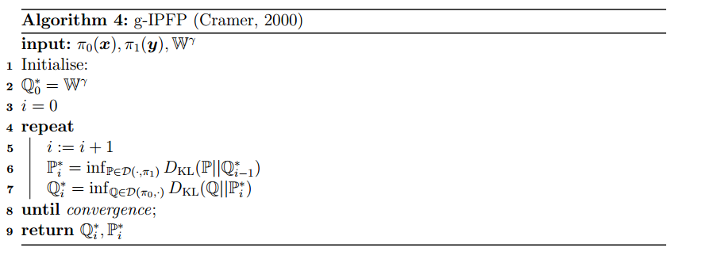

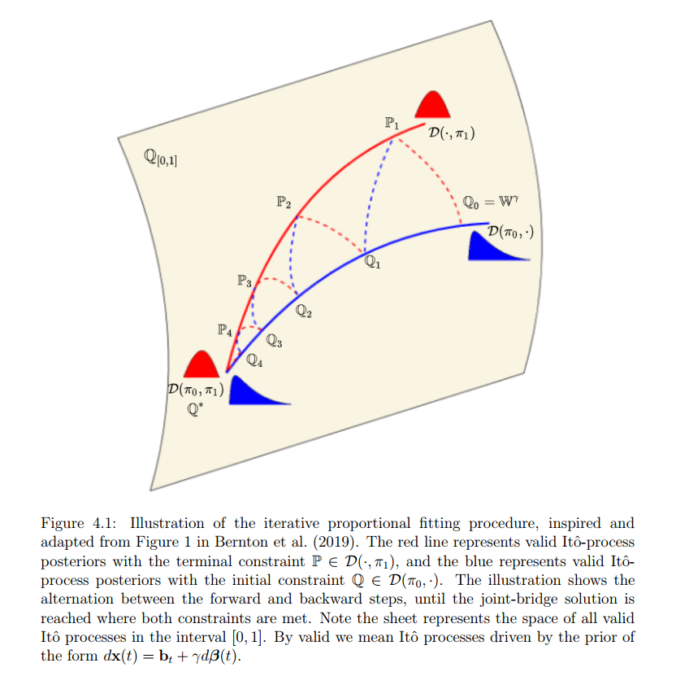

# 3. 薛定谔系统的应用
## Diffusion Schrödinger Bridge with Applications to Score-Based Generative Modeling

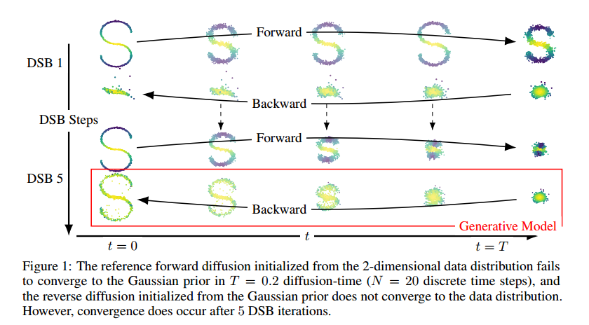

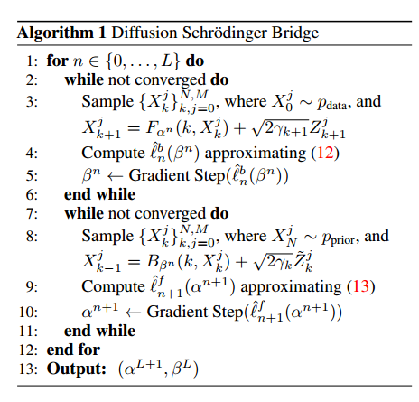
