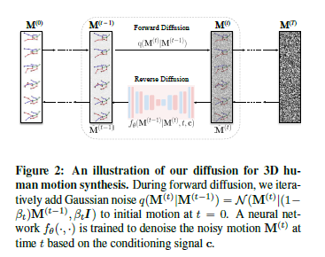
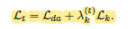
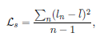

# MoFusion: A Framework for Denoising-Diffusion-based Motion Synthesis
本文提出了一种利用diffusion生成人体motion的方法。这种方法可以将音频和文本作为条件。

## 损失函数

对于diffusion的损失中，加入了运动损失。

其中第一项 $L_{da}$ 是原始的diffusion L2 损失。第二项为kinematic loss，运动损失，其权重 $\lambda_k^{(t)} = \bar{\alpha}_t$也就是。其包含三个项， $L_k = L_s + \lambda_a L_a + \lambda_m L_m$   

第一项是skeleton consistency loss, 利用骨骼长度的方差实现。

第二项 $L_a$ 是左右对称的loss。

第三项 $L_m$ 是重建的loss。

## 条件信息
条件信息转化为attention中的K，V项来实现。

