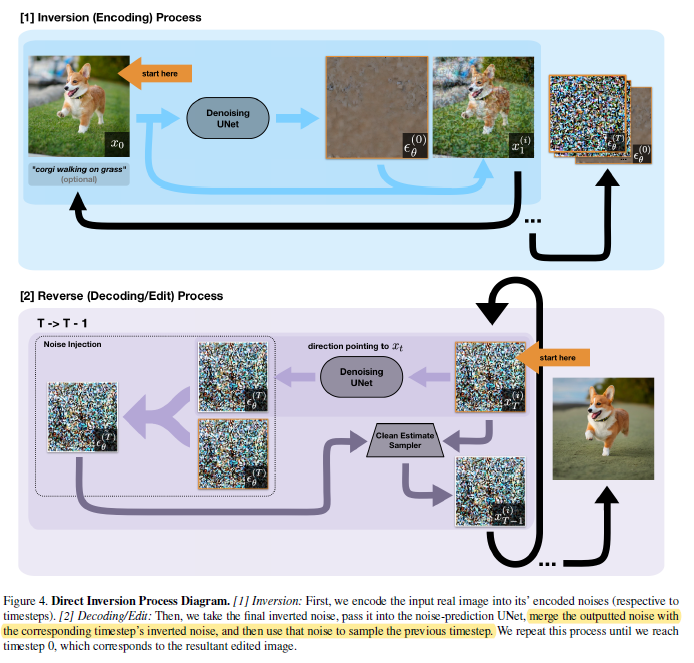
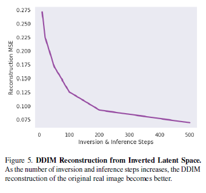
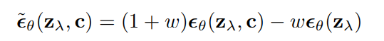
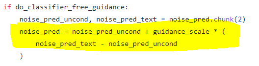
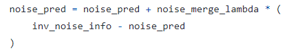
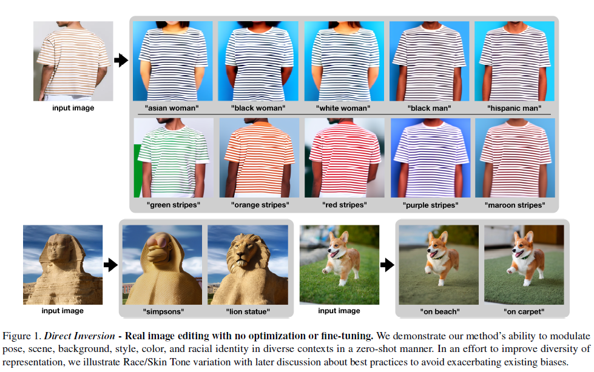
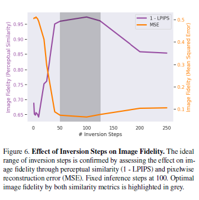
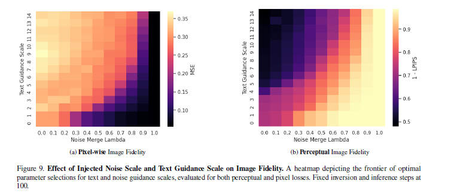
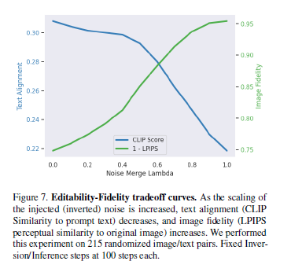

# Direct Inversion: Optimization-Free Text-Driven Real Image Editing with Diffusion Models

## 1. Introduction
#### 本文的主要贡献：
1. 本文提出了一种不需要优化，不需要微调的基于文本的语义图像编辑方法（Direct Inversion），这种方法在只给定输入图像和文本提示的条件下可以对全局和局部结构，属性，风格等进行灵活的编辑。
2. 作者实验验证了Direct Inversion在全局的基于风格的编辑和局部的object-level的编辑的能力。
3. 作者用实验证明了Direct Inversion可以对可编辑性和保真度的权衡作微调，以及通过实验对于一般的Diffusion模型的Inversion方法和参数进行了探究。
4. 作者用消融实验探究了不同的参数对图像保真度和编辑强度的影响。

#### 传统文本-图像编辑方法的缺点:
1. 需要大量的per-instance训练或者微调。
2. 受限于特定的图像类型。
3. 需要额外输入mask或者目标物体的多个图像
4. 内在的耦合了编辑强度和任意结构相似性，大大限制了可能的图像编辑类型和范围。

## 2. Methodology

### 2.1 DDIM and Determinism
DDIM提出了determinism的前向过程和反向过程。可以实现Inversion。作者测试了用隐空间DDIM Reconstruction，可以达到比较好的结果。

### 2.2 Direct Inversion
#### classifier-free guidance
就是用加条件的生成的 $\epsilon_t$ 和无条件生成的 $\epsilon_t$ 进行线性组合。

#### Direct Inversion
在给定输入图像和文本信息，Direct Inversion先把给定的 $x_0$ 经过DDIM的固定前向过程得到对应的 $\tilde{x}_T$。然后利用DDIM的固定反向过程，并使用classifier-free guidance 添加文本条件，并且用U-Net预测的 $\epsilon$ 和 前向过程保存的对应步的 $\epsilon$ 线性组合后作为反向用的 $\epsilon$。

具体的做法是：
先对文本条件做classifier-free guidance

然后对前向和反向的 $\epsilon_t$ 再做一次classifier-free guidance

后边作者会对guidance_scale和noise_merge_lambda作进一步的讨论。

## 3. Experiments

### 3.1 Qualitative Results

### 3.2 Ablation Study
#### Effect of Inference and Inversion Steps
作者在固定Inference Step=100的条件下，改变Inversion Step发现存在最优的重建区间。根据这些实验结果，本文作者采用Inversion Step=100， Inference Step=100.

### 3.3 Editability-Fidelity Tradeoff
作者用CLIP和LPIPS分别来衡量Editability和fidelity。

