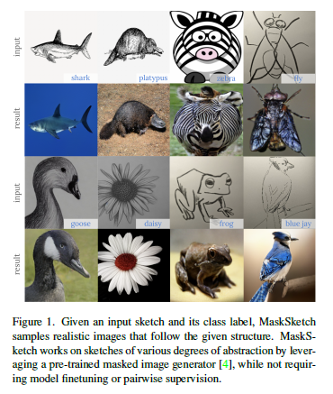
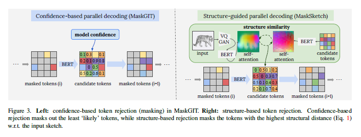
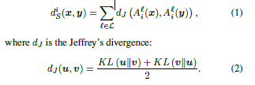
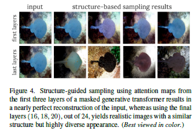
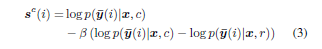
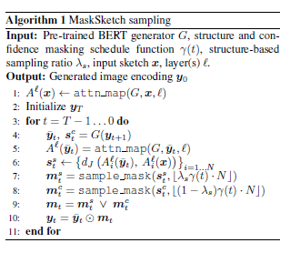
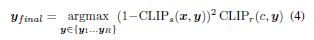
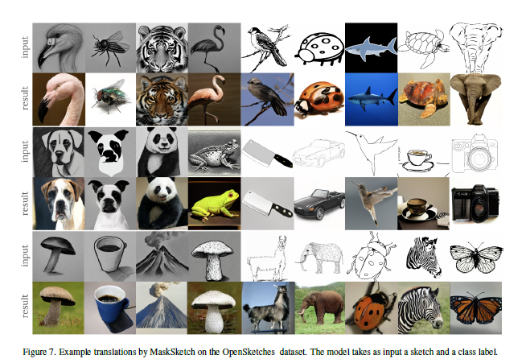
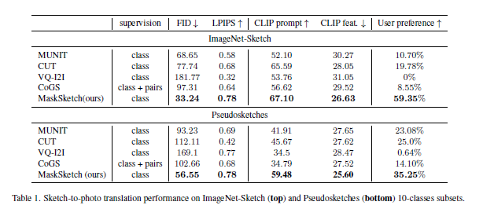

# MaskSketch: Unpaired Structure-guided Masked Image Generation

## 1. Introduction
本文在MaskGIT的基础上进行了改进，提出了MaskSketch用于sketch-to-photo。MaskSketch直接使用预训练好的MaskGIT，不需要进行模型的训练，而且不需要成对的监督信息，并且可以使用不同抽象程度的sketch作为输入。

作者指出MaskGIT中间层的self-attention map包含了输入图像的重要的结构信息，例如场景布局和对象形状等， MaskSketch利用了self-attention map的这一特性，从而实现结构引导生成。

本文的主要贡献：
1. 本文展示了MaskGIT的self-attention map编码了重要的结构信息，这些信息应用于sketch和image的转换仍然很鲁棒。
2. 本文提出了一种基于self-attention similarity的采样方式，可以平衡输入的sketch的结构引导和图像先验。
3. 作者实验证明MaskSketch在unpaired sketch-to-photo Translation有SOTA的效果。
4. MaskSketch是第一个只需要class label的用于sketch-to-photo Translation的generative Transformer。

## 2. Methodology

### 2.1 Masked Image Generation
MaskGIT的内容参考上一篇笔记[MaskGIT](https://blog.csdn.net/D_Trump/article/details/128938328?spm=1001.2014.3001.5502)。

### 2.2 Structural Similarity via Attention Maps
作者观察到在ImageNet上训练的class-conditional MaskGIT的attention map有很强的域不变性因而具有捕捉域外不同分布的结构相似性比如sketch。

接下来利用attention map来衡量结构相似性。假设 $x \in Z^n$ 是输入图像经过VQGAN encoder得到的隐式编码token序列，$y$ 是生成的token序列。$A^l(x) \in [0,1]^{N \times N}$ 表示transformer第 $l$ 层的self-attention map。

作者定义x和y的第i个token之间的structural distance为：

### 2.2 Structure-guided Parallel Decoding
在采样的阶段，MaskGIT每一次迭代会把低置信度的token重新加上mask。而MaskSketch基于structure distance额外加入一层mask，使得结构相似性低和置信度低的token都被加上mask。

作者通过实验发现，选择transformer的前几层的attention map得到的结果能够得到几乎和输入图像一样的结果，而选择transformer后几层的attention map得到的结果则更真实，并且能和输入的sketch保持结构一致。

### 2.3 Structure fidelity vs realism trade-off
由于输入的sketch和要输出的图像在结构上相似，但是在外观上有很大差异，因此需要保证图像在有结构相似的基础上还要有真实性。为此作者引入了参数 $\lambda_s \in [0,10]$ 用来控制每次迭代的mask中因为相似度低加入的mask和因为置信度低加入的mask的比例。

更详细的来说，在MaskGIT中，每一次迭代会基于置信度保留 $\gamma(t)N$ 的mask，而MaskSketch中，则是细分为因为置信度保留 $(1-\lambda_s)\gamma(t) N$ 的mask，因为结构相似性保留 $\lambda_s \gamma(t) N$ 的mask。之后将构造出的两种mask $m_t^s$ 和 $m_t^c$ 进行逻辑OR操作，得到当前迭代的最终mask。

而构造的过程，则是利用 sample_mask 函数，选择 top_k 的score值所在位置加mask。

#### Classifier-free Guidance
为了更准确的计算置信度，从而提高生成结果的真实性。作者采用了classifier-free guidance。也就是在计算每个token的条件概率分布的时候，减去无条件的概率分布。而无条件的概率分布通过将正确的图像的class guidance $c$ 替换为随机的条件class guidance $r$。

整体的采样算法如下

#### Global CLIP-based rejection sampling
为了提高MaskSketch的稳定性，并且提高生成结果的保真度，对于同一个输入的sketch，作者通过设置不同的随机种子和classifier-free guidance scale $\beta$ 得到多个结果，然后利用CLIP score得到效果最好的结果。

## 3. Experiments

