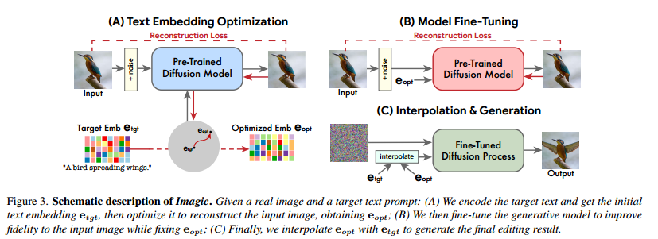
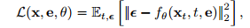
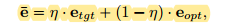
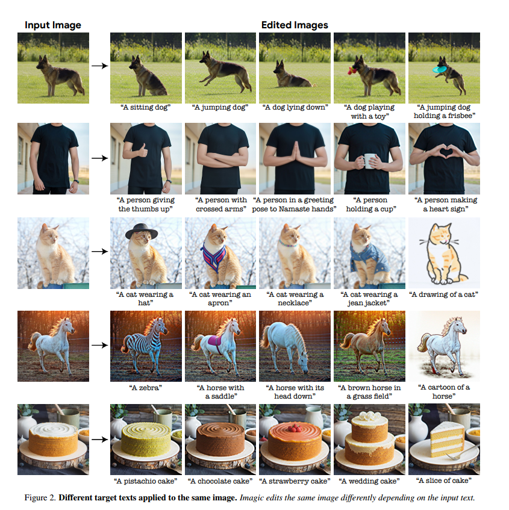
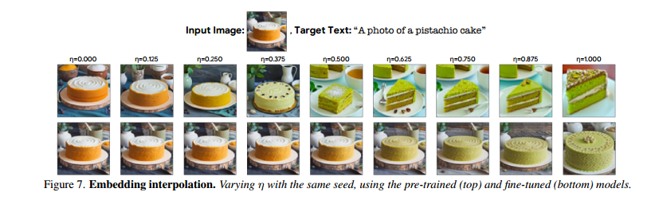

# Imagic: Text-Based Real Image Editing with Diffusion Models

## 1. Introduction
本文提出了一种新的基于Diffusion的方法称作Imagic，可以实现复杂的基于文本的图像编辑。与之前的方法不同，本文的方法只需要一张输入图像和一个目标文本，并且可以直接用于真实的图像而不需要额外的输入比如mask。

### 传统方法的缺点
1. 受限于特定的编辑方式比如添加一个物体，风格迁移。
2. 只能处理特定类型的图片或者生成的图片。
3. 需要额外的输入，比如mask，相同物体的多张图片，或者对于原图的文本描述

### 本文的主要贡献
1. 提出了Imagic，第一个基于文本的图像语义编辑方法，可以对于单张输入图像实现复杂的非刚性的编辑，同时保持其总体的结构和组成。
2. 本文展示了两个文本嵌入序列之间具有语义意义的线性插值，揭示了文本到图像扩散模型的强大组合能力。
3. 本文提出了TEdBench，一种新的具有挑战性的复杂图像编辑benchmark，可以同于比较不同的基于文本的图像编辑方法。

## 2. Methodology
类似于基于GAN的图像编辑方法，本文首先找到有意义的表示，把这些表示提供给模型可以生成与输入图像相似的图像。然后微调生成模型以更好地重建输入图像，最后操纵隐式表示以获得编辑结果。

具体分为三个步骤：
对于一个预训练好的文本-图像Diffusion模型
1. 第一步，优化文本embedding以找到与目标文本embedding相近的与给定图像最匹配的文本嵌入。
2. 第二步，微调Diffusion模型使其更匹配输入的图像
3. 第三步，在优化后的文本embedding和目标文本embedding之间进行线性插值，从而找到既能与原图像有较高的保真度，又与目标文本描述一致的图像。

### Text embedding optimization
由于本文的方法没有原图像对应的文本，而只有目标文本，因此需要先得到原图像的文本embedding。具体的做法是， 在第一阶段，首先通过text encoder得到目标文本的target embedding $e_{tgt}$ ，然后将其和原图像一起作为固定文本-图像模型中Diffusion的部分输入，但是固定模型的参数而只优化输入的 $e_{tgt}$ 。 训练的目标为Diffusion的目标函数。

这一步优化只进行很少的step，得到与目标文本很接近而与原图像匹配的embedding $e_{opt}$ 。并且 $e_{opt}$ 和 $e_{tgt}$ 之间可以进行有意义的线性插值。

### Model fine-tuning
由于第一部分只优化了很少的步数，因此得到的 $e_{opt}$ 并不能特别严格的与原图像匹配。因此在第二阶段固定了 $e_{opt}$ 然后用同样的第一阶段的目标函数来优化Diffusion model的参数。

如果需要得到高分辨率的图像的话，会有一些超分模型之类的辅助模型。而对于这些模型的优化的微调则要用 $e_{tgt}$ 作为输入，来保证模型最终结果能够保持原图像的细节。

### Text embedding interpolation
第三个阶段是在 $e_{tgt}$ 和 $e_{opt}$ 之间做线性插值，然后利用 $\bar{e}$ 得到低分辨率的图像。但是最后用辅助模型得到高分辨率图像的输入则需要是 $e_{tgt}$

## 3. Experiments

### Implementation details
具体参数不罗列。本文的实验第一部分训练了100step，第二步训练了1500步，同样对于辅助模型也训练了1500步。

### 实验结果

### TEdBench
本文收集了100对输入图像和目标文本，作为benchmark

### Albation Study
#### 线性插值
对于线性插值的参数 $\eta$ 的实验，发现在 $\eta \in [0.6,0.8]$ 时可以达到较好的结果。

