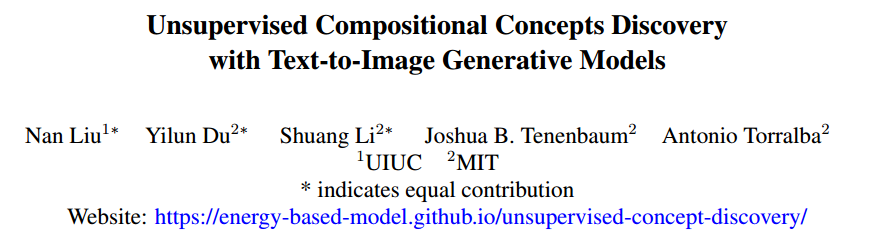
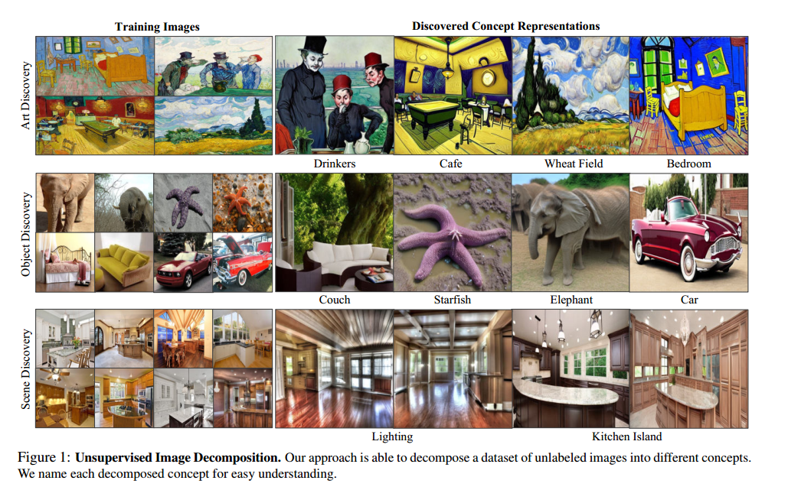
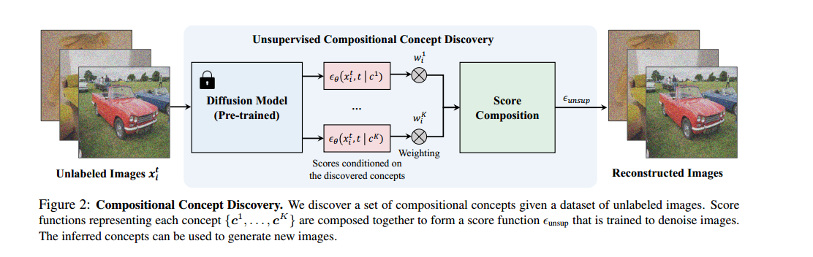
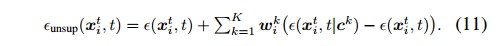
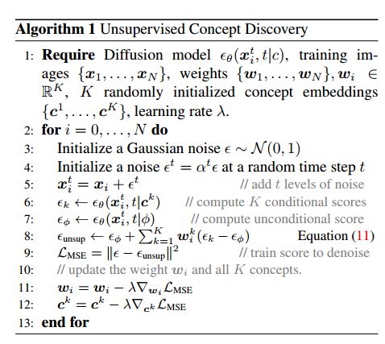

# Unsupervised Compositional Concepts Discovery with Text-to-Image Generative Models

## 1. Motivation & Arguments & Contributions
本文提出了一种利用Diffusion模型，无监督的从少量图片中提取共同的构图概念的方法。

大多数现有的concept discovery方法都集中在发现代表单个概念的潜在向量或方向，但需要监督数据标记每个concept。其他方法只关注图片中的物体对象，而不关注图片风格等信息。

这项工作的贡献：  
(1) 本文提出了一种可扩展的方法，可以使用现有的生成模型在真实图像中无监督的发现构图概念。  
(2) 本文的方法在不同域的概念发现方面实现了SOTA，包括全局和局部概念发现，例如自动发现绘画风格，以及将场景分解为照明和物体。  
(3) 实验证明本文提出的方法可以用于不同的任务

## 2. Methodology

第一步利用text-to-diffusion模型，随机初始化 K 个concept的embedding，这些concept的embedding是可学习的。然后针对少量的输入图片，固定diffusion参数，而去学习这些embedding和其对应的权重w。每个concept对应一个梯度方向。训练的目标就是融合loss

## 3. Experiments

