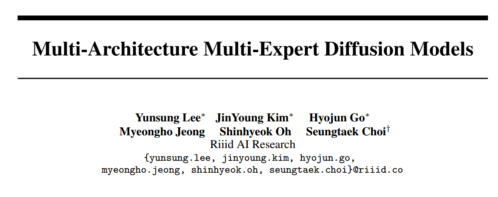
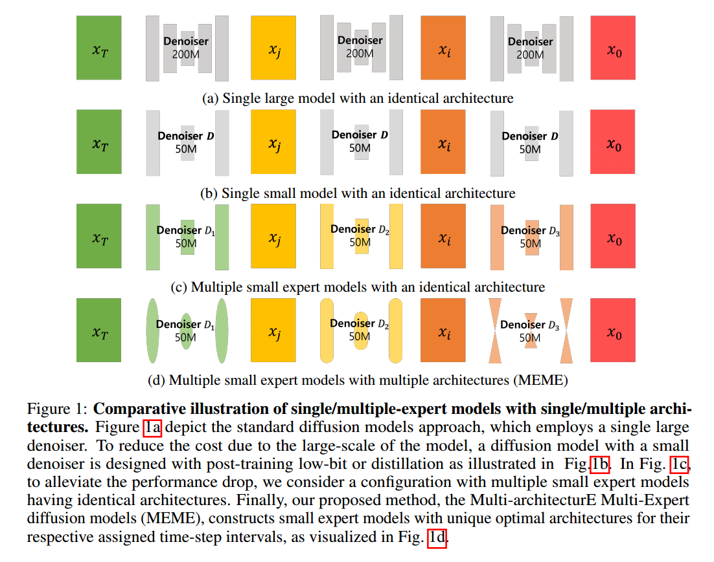
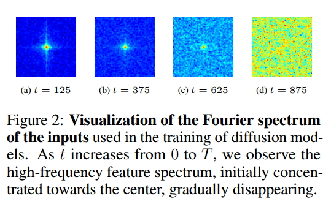
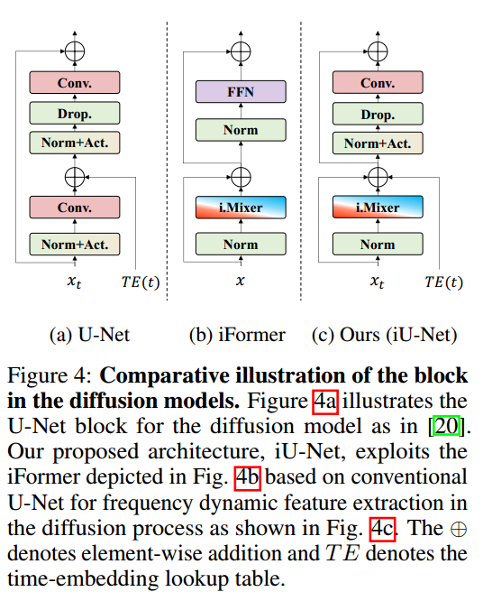
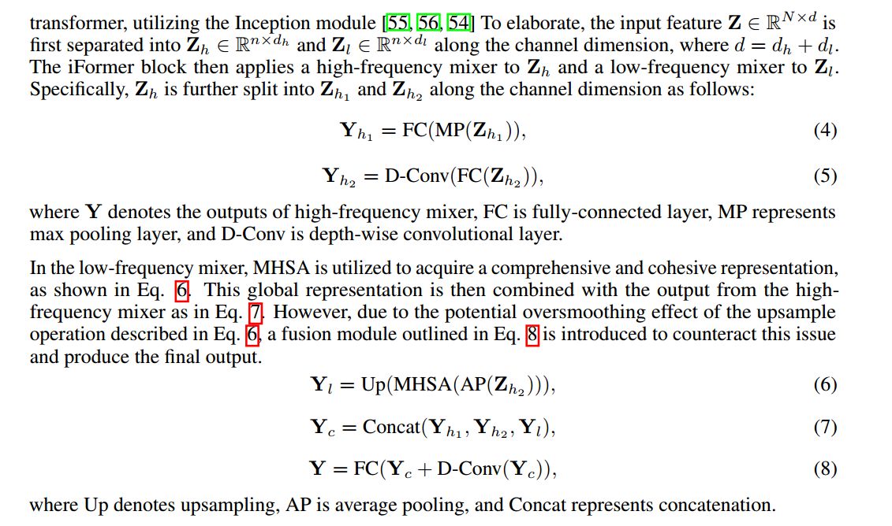

# Multi-Architecture Multi-Expert Diffusion Models

## 1. Motivations & Arguments & Contributions
本文提出了一种在diffusion的不同步数采用不同的网络结构的方法提高生成质量和效率。

Diffusion模型需要大量的计算时间成本，改进方式主要有两个方面：  
（1）减少采样步数  
（2）降低网络规模  
现有的工作更多的关注于减少采样步。本文旨在降低网络规模。

原始的Diffusion模型因为要建模不同步数，不同的噪声尺度下的特征，因此模型需要大量的参数。并且Diffusion更倾向于先学到低频的信息，然后逐渐学到高频的信息。  

现有的降低网络规模的方法在所有的时间步仍然采用相同的网络结构，这就忽视了输入数据的频率分布在不同时间步是不同的。  

本文的主要贡献：  
（1）本文提出了一种新的在不同的时间步采用不同结构的专家网络的方法来提高Diffusion效率
（2）本文提出了一种新的网络结构MEME（Multi-architecturE Multi-Expert diffusion models）
（3）实验结果证明本文方法的有效性

## 2. Methodology
首先看不同时间步的输入图像的傅里叶频谱

（1）可以看出随着t增大会逐渐丢失高频信息。  

（2）同时卷积网络更利于处理高频信息，而多头自注意力则更利于处理低频信息。  

基于这两个思想，本文提出了一种新的网络结构

而iMixer通过将输入数据分为高频信息和低频信息，然后分别用卷积和多头注意力来处理从而达到更好的效果。

最后就是在不同的时间步设置不同的mixer中的特征维度。训练的时候，为了能让噪声尺度比较大的网络也能学到有意义的信息，作者没有让某个t区间的只能用固定的一个专家网络训练，而是在t比较大的专家网络也有一定概率用t比较小的数据训练。

## 3. Experiments
实验结果在FFHQ和CelebA上，采用MEME可以提高3.3倍的速度，并提高FID 0.62和0.37
