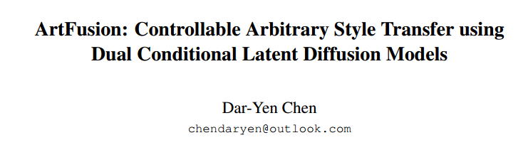
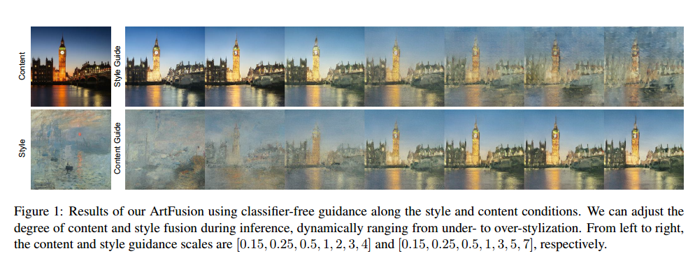
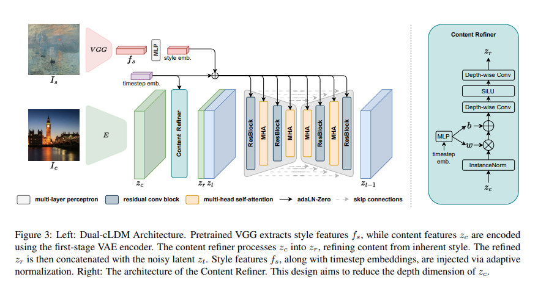
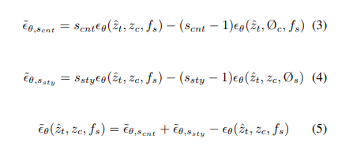

# ArtFusion: Controllable Arbitrary Style Transfer using Dual Conditional Latent Diffusion Models

## 1. Motivations & Arguments & Contributions

### Motivations

本文提出了一种基于Latent Diffusion Model的un-paired风格迁移方法。

### Arguments

**现有的风格迁移方法的缺点**：  
（1）缺乏针对用户主观需求定制的可调整结果，导致结果过于僵化，风格化不足或过度风格化  
（2）由于风格相似性的偏差，这些模型通常有重复的伪影和艺术细节的严重损失  

**直接将Diffusion模型用于风格化存在的问题**：  
最大似然学习需要成对的训练数据，这在许多复杂的多条件生成任务，包括风格迁移中无法满足。

### Contributions
**本文的主要贡献**：  
（1）本文提出了第一个基于Diffusion模型的feed-forward风格迁移方法  
（2）本文提出的Dual-cLDM，打破了Conditional Diffusion(cDM)模型在多条件任务中需要成对训练数据的局限性  
（3）本文提出了2D-CFG（Classifier Free Guidance）来提高生成质量。  
（4）实验证明本文方法的有效性  

## 2. Methodology

将输入数据分为风格条件图像 $I_s$ 和内容条件图像 $I_c$ 。风格图像经过预训练的VGG网络得到其特征 $f_s$ 然后经过MLP进行嵌入，与时间步的嵌入concat之后输入 U-Net 网络。内容图像先编码到隐空间 $z_c$ ，然后经过一个content refiner来保留内容信息，去除风格信息得到 $z_r$。之后与每一步的 $z_t$ concat之后作为 U-Net 的另一个输入。

**那么本文是如何做到un-paired？** 在训练的时候将风格和内容条件图像都用同一个图像，但是在采样的时候则用不同的图像。由于预训练好的VGG提取到的信息可以当做是风格信息先验，所以本文也可以看做是一种解耦。

**2D-CFG** 本文用了风格和内容两个维度的CFG

## 3. Experiments

