# Counting Guidance for High Fidelity Text-to-Image Synthesis

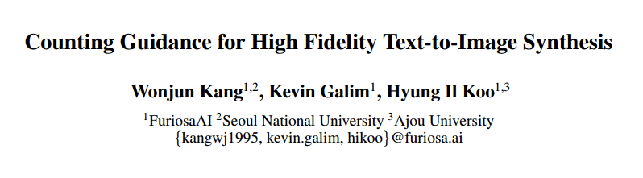

## 1. Motivations & Arguments & Contributions

#### Motivations & Arguments
现有的Stable Diffusion在文本生成图像时不能准确的生成指定数量的物体。

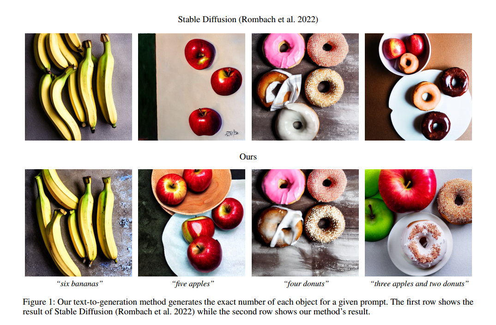

#### Contributions
本文提出了一种可以生成准确数量物体的guidance方法，和现有的stable Diffusion相结合。同时本文提出了一种新的attention map guidance。

## 2. Methodology
本文对于单种物体和多种物体的情形区别处理。

### 单种物体
首先是单种物体的情况，这种情况相对容易一些，也就是利用已有的Count网络得到每一步得到的图像的物体个数，之后通过Count损失对每一步采样的方向进行修正。  

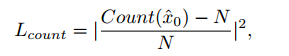

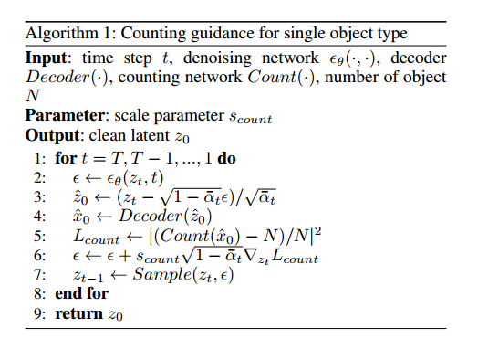

### 多种物体
多种物体的情况下，由于采样过程前几步的图像不够清晰，因此直接用类别敏感的Count网络效果不好，因此本文提出了一种基于mask attention map的方法，利用attention map区别每一类物体。之后对于同一类的物体，在attention map中mask掉其他物体，再进行Count网络计数。  

但是现有的stable diffusion的attention map会混淆部分物体，如图所示，橘子和鸡蛋的图像，有一部分橘子和鸡蛋的attention map就被混淆了。

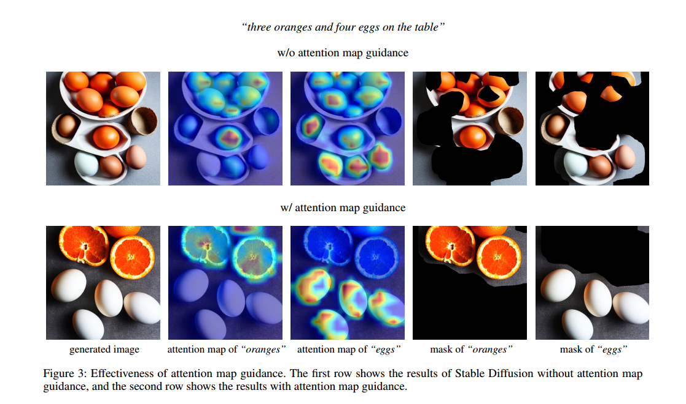

于是要计数首先要区分不同类别的物体。
首先得到每一类物体的attention map，然后进行归一化

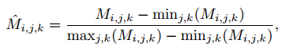

为了约束每个像素只表示一个物体，对其最小值累加作为损失:

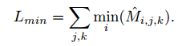

为了保证每个像素至少表示一个物体，对其最大值累加作为损失：

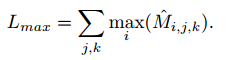

最小值损失和最大值损失线性组合，就是本文用的attention loss：

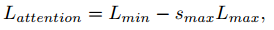

接下来是对attention map进行mask来区分物体，mask操作就相对的容易一些：

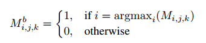

最后就是对于每个物体，利用mask之后的attention map进行Count操作。

总体的流程如图所示。

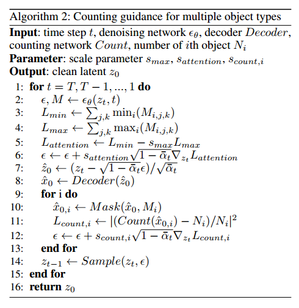

## 3. Experiments

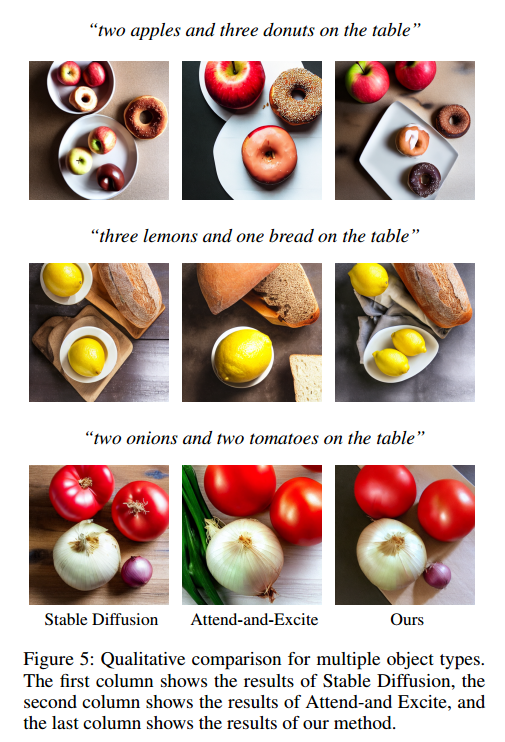

## 4. Limitations
1. 对于不同的文本需要有不同的scale parameter。  
2. 图像的总体结构在最初几步就确定了，有些时候会影响效果。  
