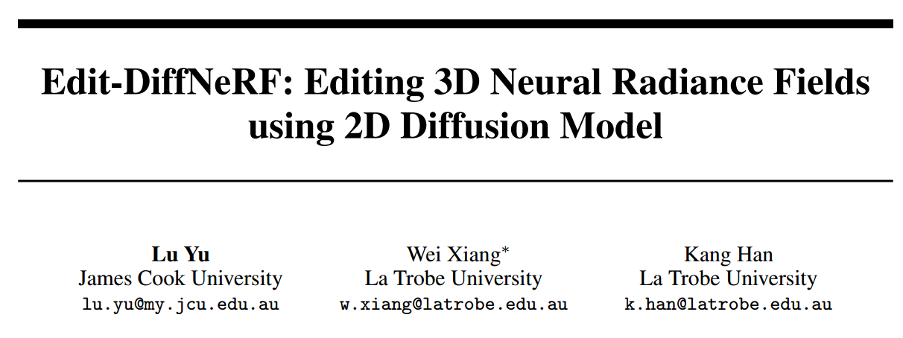
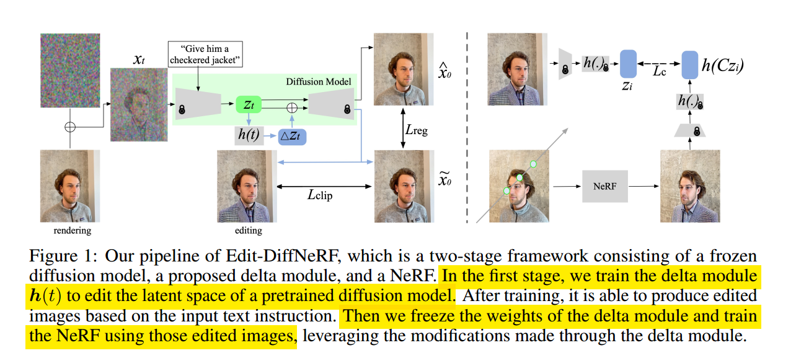
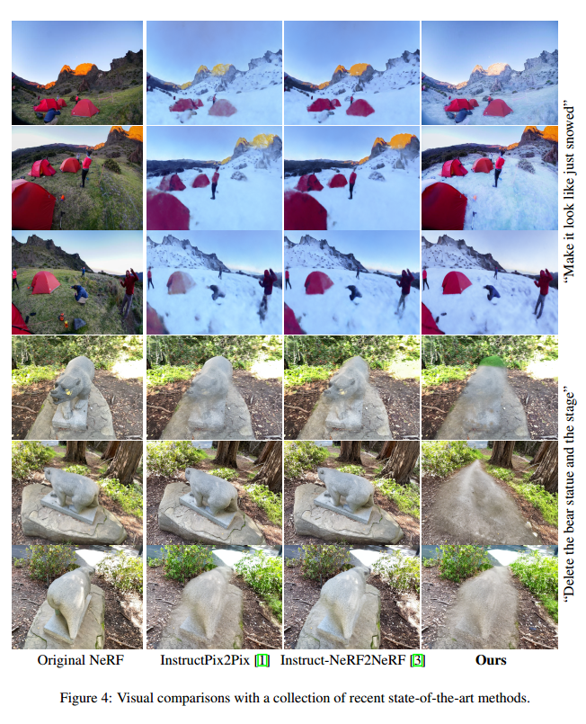

# Edit-DiffNeRF: Editing 3D Neural Radiance Fields using 2D Diffusion Model

## 1. Motivations & Arguments & Contributions
本文提出了一种两个阶段的利用Diffusion实现NeRF编辑的方法。  

#### Arguments
（1）现有的NeRF编辑方法仅限于改变颜色和形状，每个编辑任务都需要复杂和巨大的计算量。  
（2）现有的编辑NeRF的方法得到的图像真实性和几何的准确性都不够  
（3） Instruct-NeRF2NeRF等方法有着显著的多视图不一致和渲染伪像，包括噪声和模糊  

#### Contributions
本文提出了两个阶段的NeRF编辑方法，第一阶段先利用一个delta模块，给预训练好的Diffusion的中间结果加入偏置，使得Diffusion可以生成目标结果，第二阶段利用训练好的第一阶段的Diffusion来训练NeRF。相较于Instruct-NeRF2NeRF，本文的NeRF编辑方法与文本的一致性提高了25%。  

## 2.Methodology

整体分为两个阶段：  
第一阶段是训练一个网络 $h(t)$ 来学到偏移量。损失函数用CLIP损失和重建损失。而训练的图像是从已有的NeRF生成出来的。  
第二阶段利用第一阶段编辑的结果作为输入，来训练NeRF。  

### Multi-view semantic consistency loss
为了能够保证多视角的一致性，在第二阶段中，NeRF渲染的视角和作为损失约束语义图像的视角不一样。这里假设不同视角得到的delta module输出都是一样的。这篇文章写的很粗糙，没有写清楚。      

## 3. Experiments

 
