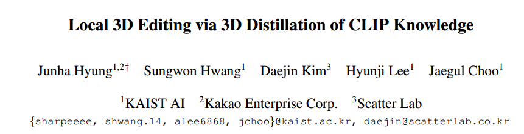
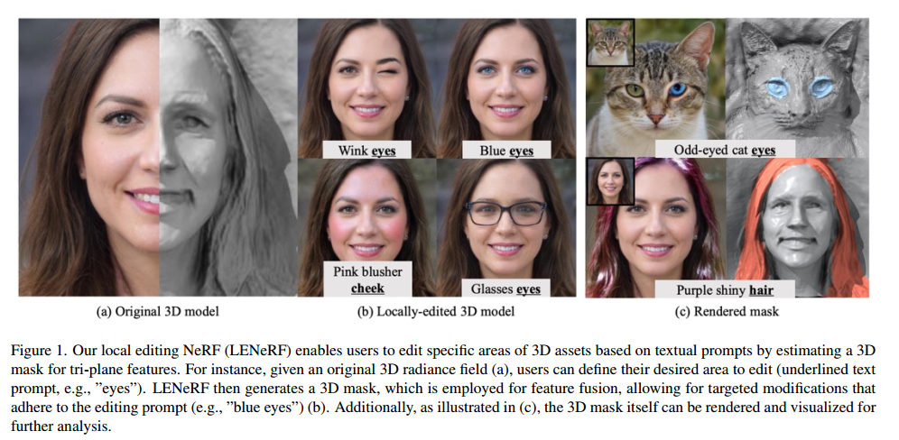
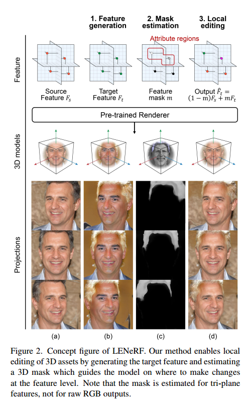
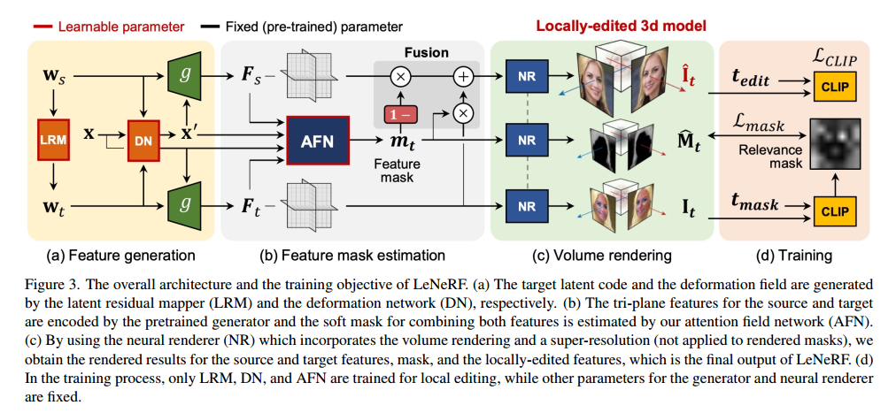
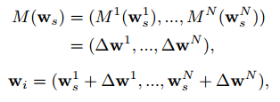
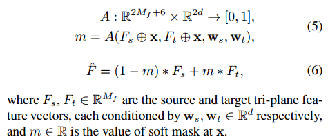
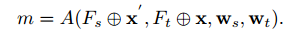
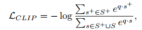
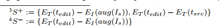
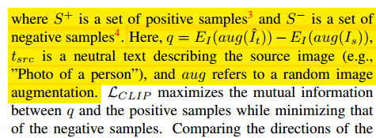

# Local 3D Editing via 3D Distillation of CLIP Knowledge

## 1. Motivations & Arguments & Contributions
本文提出了一种在预训练好的EG3D的基础上添加额外的部件实现NeRF编辑的方法。输入信息为文本表示的属性，以及文本表示的编辑区域。  

#### Arguments
（1）基于显式的3D表示比如voxel和mesh的生成和编辑，空间消耗大且编辑的结果缺少真实性  
（2）现有的NeRF编辑方法的缺陷：2D 引导对于 3D 编辑来说并不理想，并且缺乏细粒度编辑所需的描述性。此外，这些方法需要inversion，并且难以跨不同领域推广，因为它们依赖于语义mask标记。

#### Contributions
（1）本文提出了LENeRF，一种仅用文本信息就可以实现的NeRF编辑方法  
（2）本文的方法包含了add-on modules，不需要额外的域信息的标记，具有更好的泛化性。  
（3）本文提出了一种新的基于CLIP的蒸馏损失。  
（4）实验证明本文方法的有效性

## 2. Methodology

总体流程如图所示。整体基于EG3D，原来的隐变量为 $w_s$，Latent Residual Mapper(LRM)模块将其转变为编辑后的隐变量 $w_t$。x为三维空间坐标，Deformation Network(DN)建立空间点的形变的映射关系。Attention Field Network(AFN)模块生成mask来得到要编辑的区域，从而保证编辑后的场景结果在无关区域不变。

#### 2.1 Latent Residual Mapper(LRM)
利用本文设计的CLIP损失来约束，LRM输出的结果是StyleGAN2中，每个卷积部分对应的w的偏移量。

#### 2.2 Attention Field Network(AFN)
AFN的作用是根据输入信息中的编辑区域得到相应的区域的mask。  

#### 2.3 Deformation Network
额外用一个网络来建立场景的形变信息。于是AFN得到mask的式子5就要写成以下形式：  

#### 2.4 CLIP Loss
作者指出直接使用原始的CLIP损失会造成结果的退化，这是因为退化的图片反而会有更低的CLIP损失。因此作者提出了新的CLIP损失：

其中 $E_T$ 和 $E_I$ 分别为CLIP的text encoder和image encoder。

这里不太理解，感觉原文的符号有些问题，公式里的S符号没有定义，而且 $S^-$ 的元素是 $S^+$ 里的。但是总体上可以看出是在使得编辑前后的图像之间的差异与文本之间的差异尽可能相同。  

## 3. Experiments
