# Continuous Layout Editing of Single Images with Diffusion Models

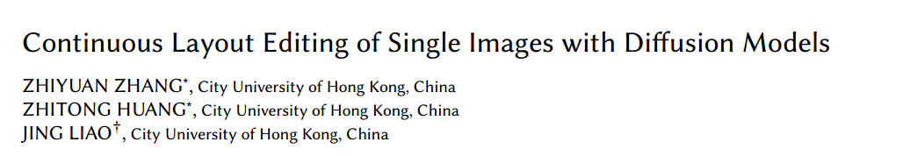

## 1. Motivations & Arguments & Contributions
本文提出了一种对于单张的输入图片，基于diffusion，编辑其中的物体布局的方法。  

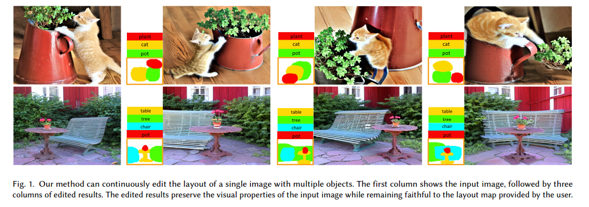

#### Arguments
（1）现有的Diffusion方法，可以实现基于layout生成，但是不能很好的编辑。  
（2）需要微调模型的布局编辑方法需要额外的微调数据集。  
（3）不需要微调模型的布局编辑方法在物体边界部分会造成模糊和重叠。  

#### Contributions
（1）本文提出了第一个对于单张图像实现连续的基于布局编辑的框架。  
（2）本文提出了masked textual inversion来对图像的文本表示的物体进行解耦  
（3）本文提出了一种不需要训练的优化方法来实现布局控制diffusion生成图像  

## 2. Methodology
整体分为三个部分。  
第一部分 学到单张图片中每个物体对应的text token。  
第二部分 微调模型使得模型与text token更契合。  
第三部分 利用attention map进行基于layout的编辑。  

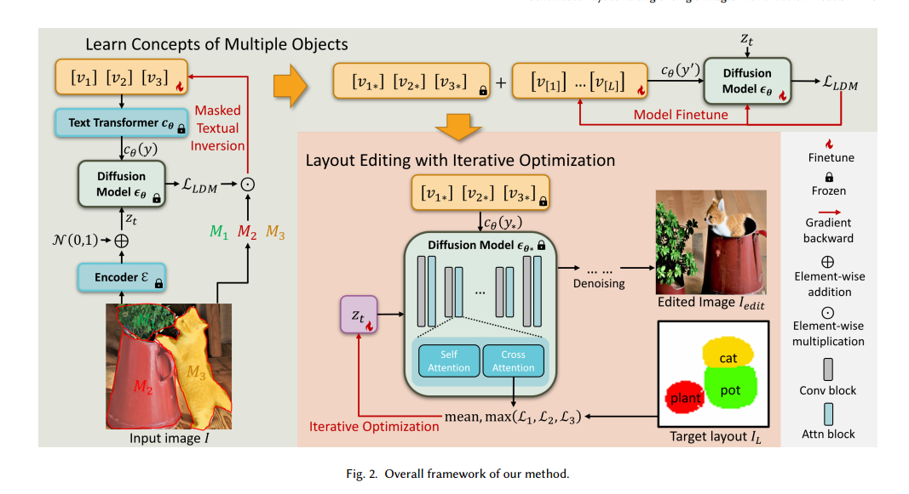

#### 第一部分 学到单张图片中每个物体对应的text token  
首先对于输入的单张图像，要先获得其中每个物体对应的text token。于是可以人工的或者是利用现有图像分割方法，对于这个单张图像加一个mask。  

然后对于每个物体初始化一个token（可能是随机初始化），这N个token与N个mask一一对应。  

之后只对mask区域的loss进行回传，从而得到每个物体的token。  

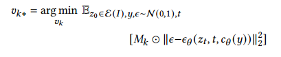

为了防止过拟合，这一部分只优化200步。而其他的textual inversion方法需要3000-5000步。

#### 第二部分 微调模型
text token中的信息有限，为了能够得到细节更好的图像，需要微调Stable Diffusion。这一步只优化U-Net中的cross attention部分。同时为了防止过拟合，除了第一步的token外，额外加入了一些可学习token。  

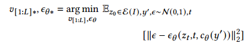

#### 第三部分 不需要训练的layout生成
基于前两部分得到的token，这一步进行新layout的生成。但是用到的是text-based stable diffusion，并不能直接支持layout的条件输入。对此，本文利用attention map，也就是每个token对应的图像区域在attention map中可以显示出来，用attention map对应的区域和目标区域乘积作为loss，也就是在约束attention map与mask尽可能重合。然后平均加上最大值来保证所有的物体都能有损失约束，同时偏离最大的物体又能够更好的约束。

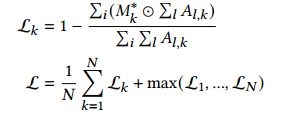

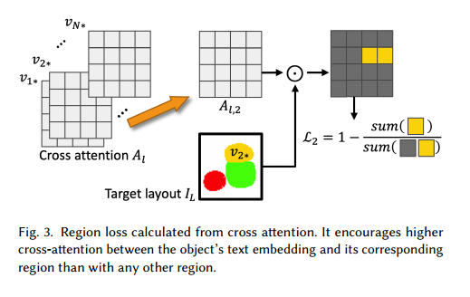

基于layout的loss直接更新latent code，这一步只在采样开始的部分 t >= 0.5的时候进行。同时为了能够保持原图的背景，在t >= 0.7时，将没有物体的区域和输入图像进行blend

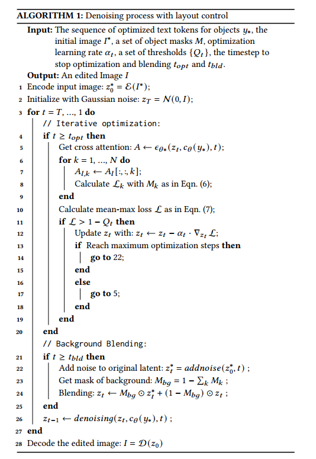

## 3. Experiments

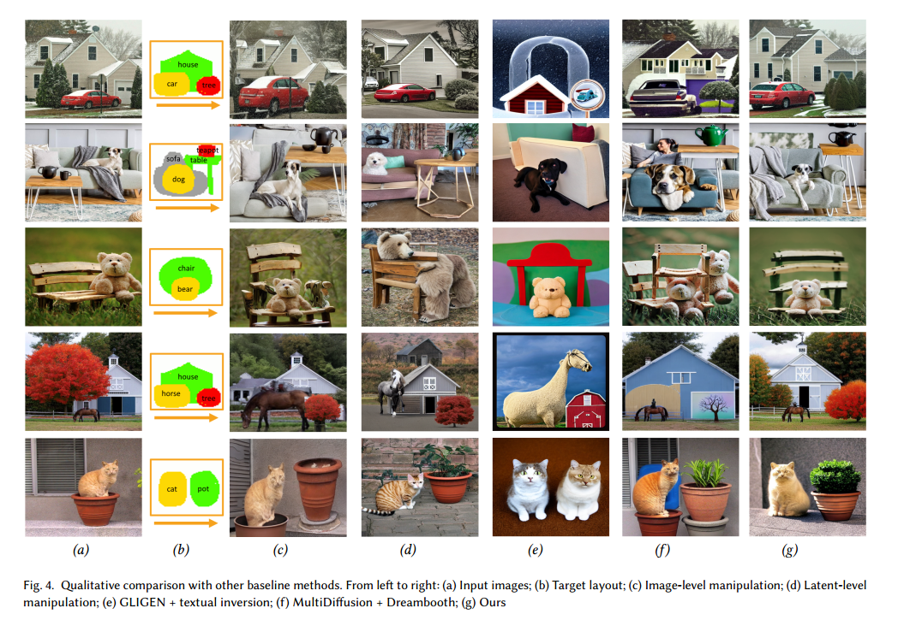

## 4. Ablation Study
#### textual inversion
当图片中有多个物体的时候，没有mask的texttual inversion不能很好的解耦每个物体。

#### Layout Control Method

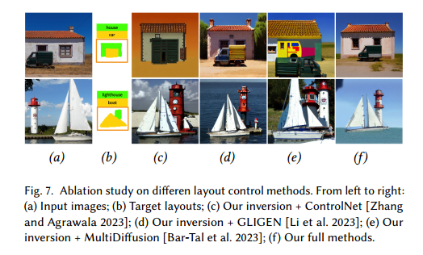

#### Optimization loss

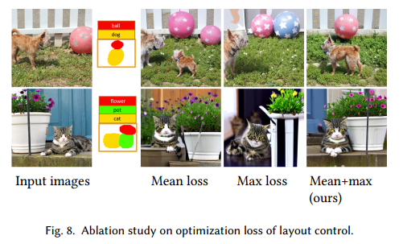

#### Iterative Optimizaiton

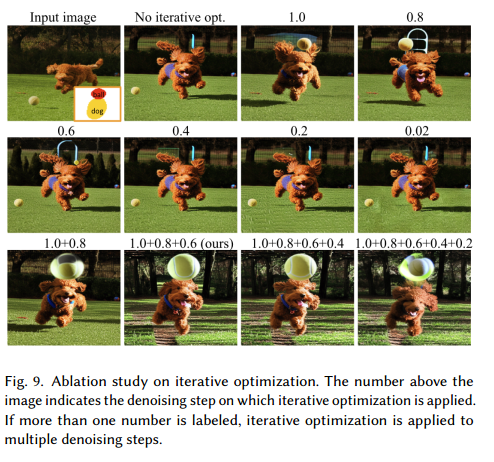

##### Blending

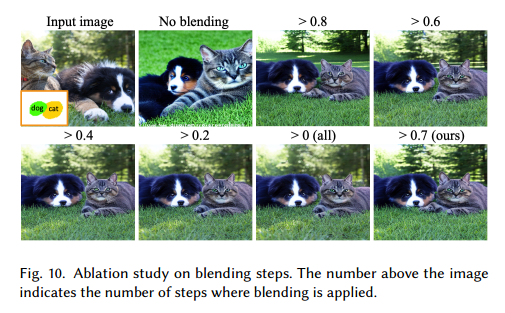

#### Continuous Layout Editing

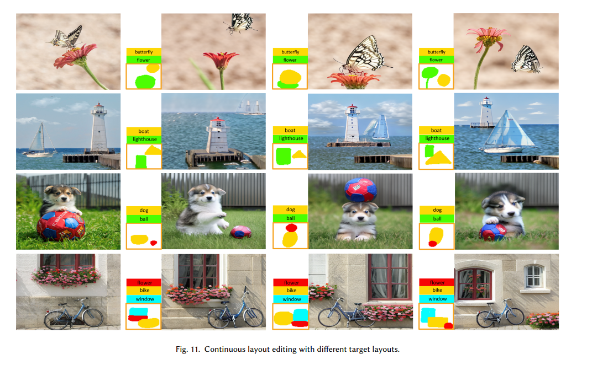
