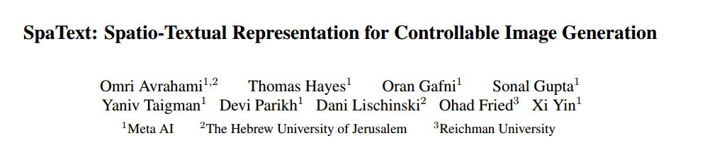
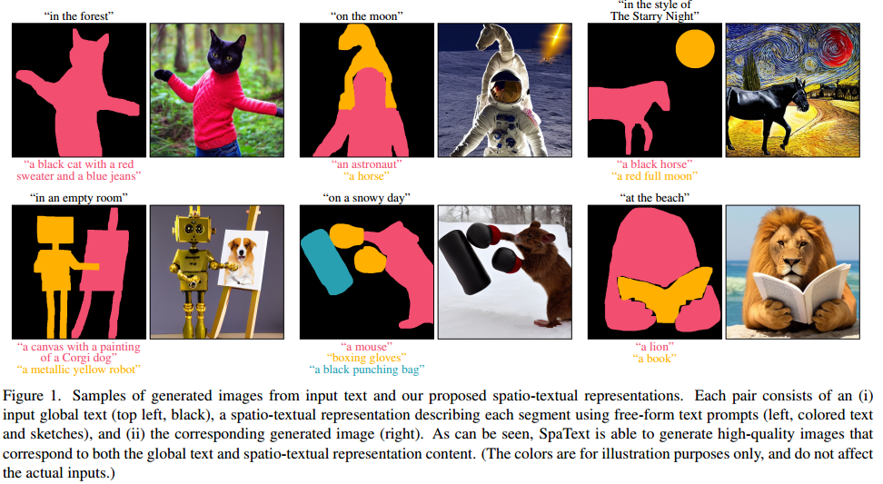
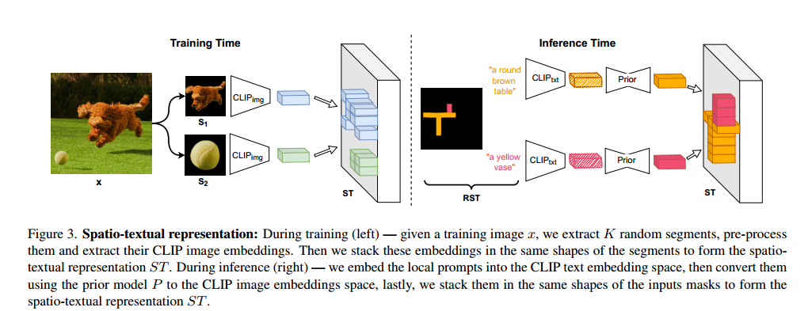
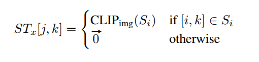
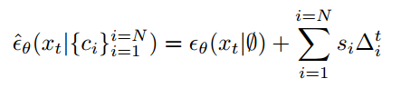
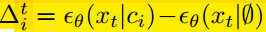
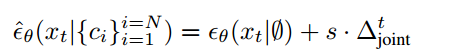
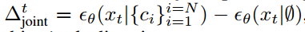
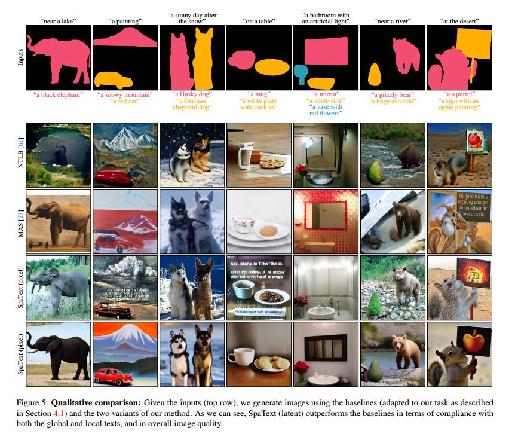

# SpaText: Spatio-Textual Representation for Controllable Image Generation

## 1. Motivations & Arguments & Contributions

本文提出了一种基于text-based Diffusion实现利用文本和mask精细化可控生成图像的方法。  

#### Arguments
（1）现有的text-to-image diffusion文本图像生成方法不能精细化的控制生成图片中物体的形状，布局等。  

（2）传统方法则需要额外的带label的数据集，而且通常这些数据集中的label是固定数量的，对于没有出现在训练数据中的物体就会效果很差。  

（3）在实际应用中，用户也不能提供特别精细化的segmentation map。  

（4）传统的方法对于生成的每一种物体的属性也不能很好的控制。    

#### Contributions
本文提出了一种新的文本图像生成方法，这种方法有三个输入，第一个输入文本控制图像全局的内容，第二个是一组文本精细化的描述每一类物体，第三个输入是粗糙的segmentation map，用来大概给出每一类物体所在的布局位置，从而利用这三个输入信息精细化的控制生成图像中的物体属性和位置布局。  

## 2. Methodology

### 2.1 CLIP-based Spatio-Textual Representation

由于不存在对图像中的每一个物体做出细致描述的数据集，因此本文采用了预训练的CLIP和图像分割模型。首先将给定图像分割出其中的单个物体，然后利用CLIP对于这些物体提取特征。然后对每个特征进行组合。

这里应该是笔误，后边应该是 $[j,k] \in S_i$ 表示当前位置属于第i个物体。

由于CLIP可以对齐文本和图像，在采样的时候就可以用每个文本信息对应的CLIP编码作为物体的特征进行采样。不过为了能够让CLIP的文本和图像更一致，本文额外用了一个单独训练的模型P来实现CLIP文本编码转图像编码。

### 2.2 Incorporating Spatio-Textual Representation into SoTA Diffusion Models  
本文分别用了像素空间的DALLE2和隐空间的Stable Diffusion。在利用DALLE2的时候，由于没有公开的模型和参数，因此作者设计了DALLE2 like model   

本文的方法包含了三个部分：  
（1）prior model P用来将CLIP文本编码转换为其对应的图像编码   
（2）decoder model D用来将CLIP图像编码转换为低分辨率的图像 64x64 这个部分就是现有的Diffusion model  
（2）super-resolution model SR用来将低分辨率的图像转换为高分辨率的图像 256x256  

### 2.3 Multi-Conditional Classifier-Free Guidance  
本文提出了一种多条件的Classifier-free Guidance。  

一种直观的思路是：

  

  

但是这种方式需要的时间会正比于条件的个数。为此作者提出了一种折中的方法：  

  

  

## 3. Experiments

  

## 4. Ablation Study
作者指出本文方法的一个缺点是在存在多个segment的时候，容易出现丢失segment或者广播这个物体的特征的情况。  
