## 040 DifFSS: Diffusion Model for Few-Shot Semantic Segmentation
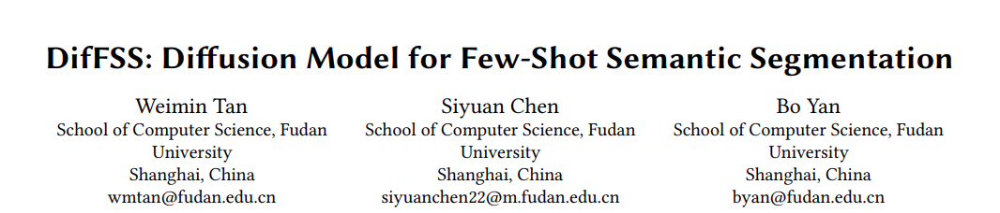

小样本图像分割

三个步骤，输入few-shot，比如一张图和对应的mask以及对应文本，ControlNet生成多张同mask的图，之后对于新的图就可以做分割。

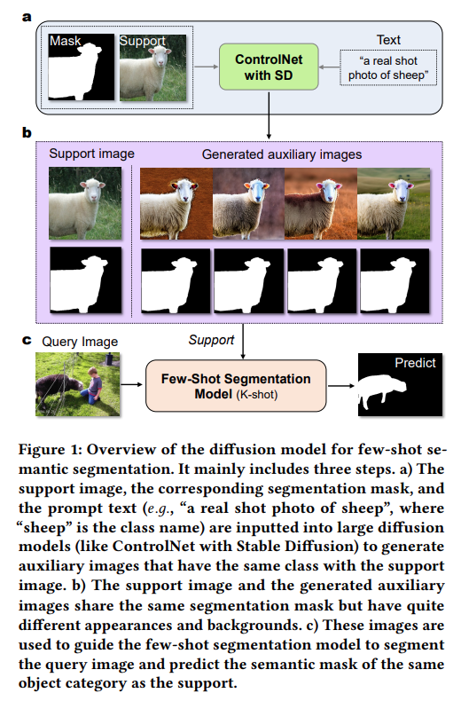

## 041 LEDITS: Real Image Editing with DDPM Inversion and Semantic Guidance
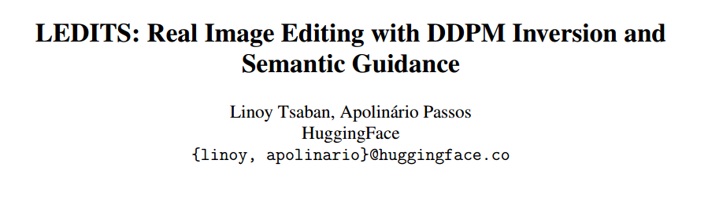

基于文本的图像编辑

本文是A+B类型的工作，在Edit friendly DDPM inversion的基础上加入semantic guidance，这两个内容都是别的文章提出来的。

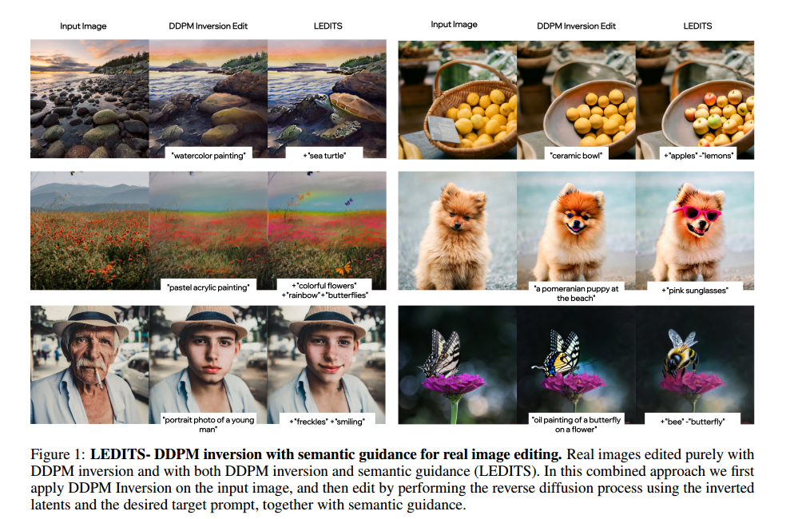

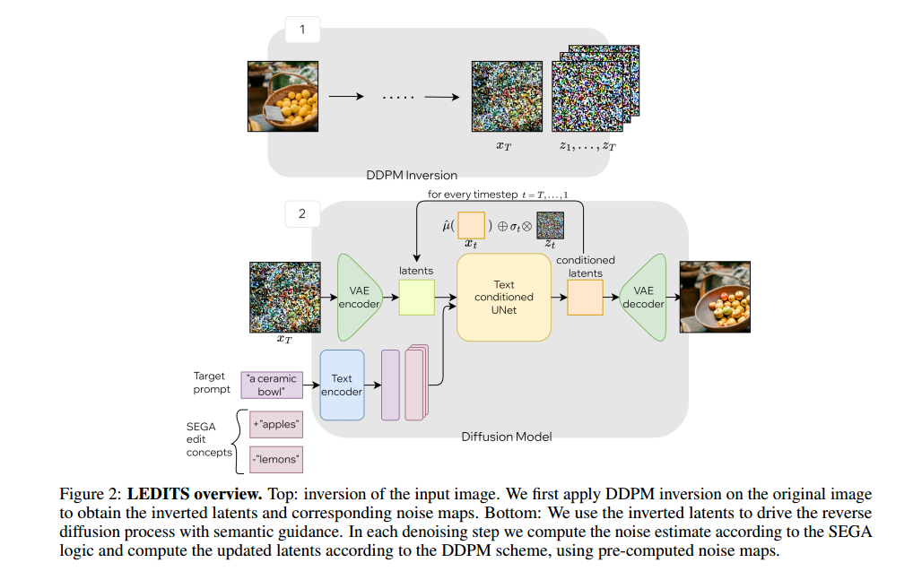

## 042 An Edit Friendly DDPM Noise Space: Inversion and Manipulations
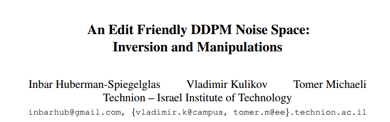

基于文本的图像编辑

这篇文章不是用的DDIM inversion而是DDPM Inversion。  

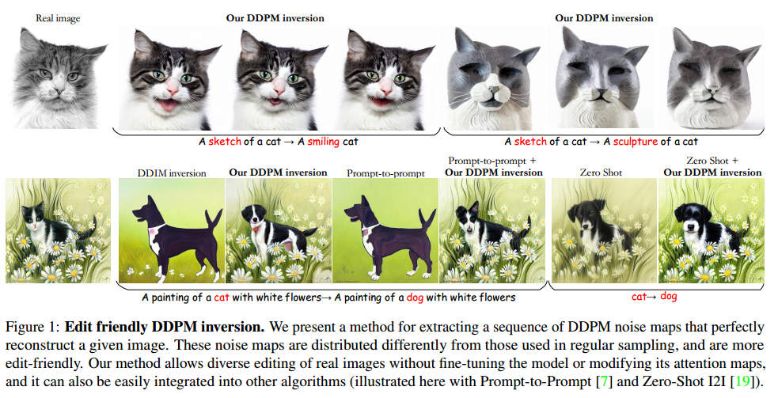  

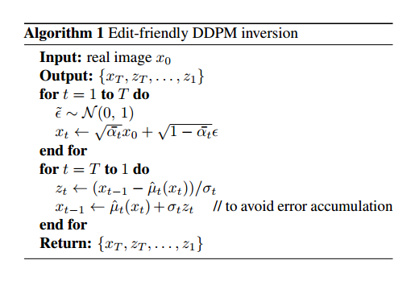  

## 043 MissDiff: Training Diffusion Models on Tabular Data with Missing Values
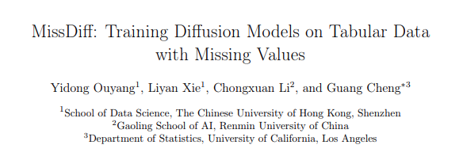

在有缺失的表格数据集上训练Diffusion，只在观测到的数据部分计算loss，而在没有观测到的部分不计算。

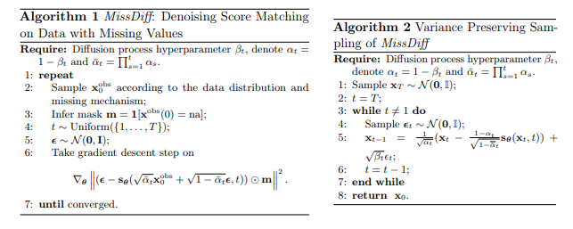

## 050 Semi-Implicit Denoising Diffusion Models (SIDDMs)
本文建议直接看原文，公式比较多，需要细看。

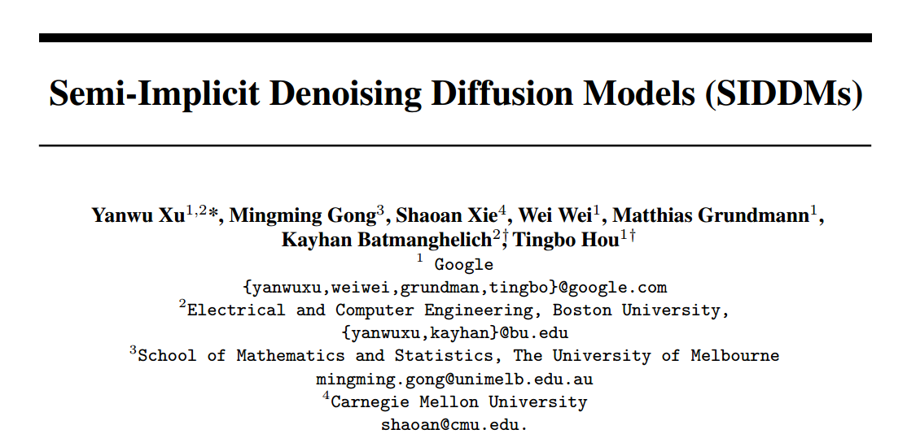

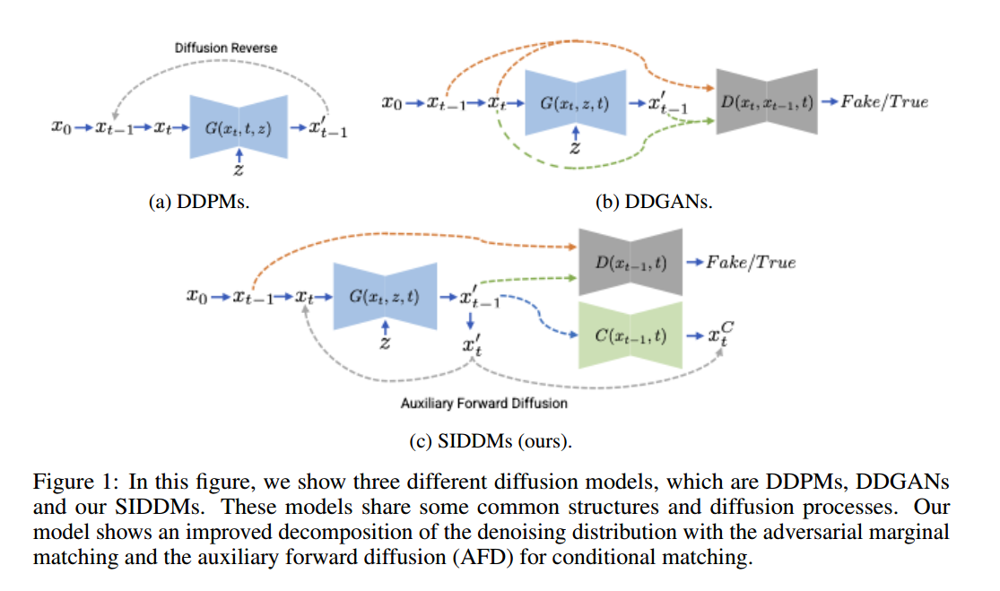
