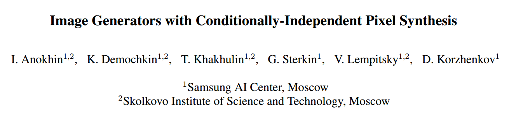
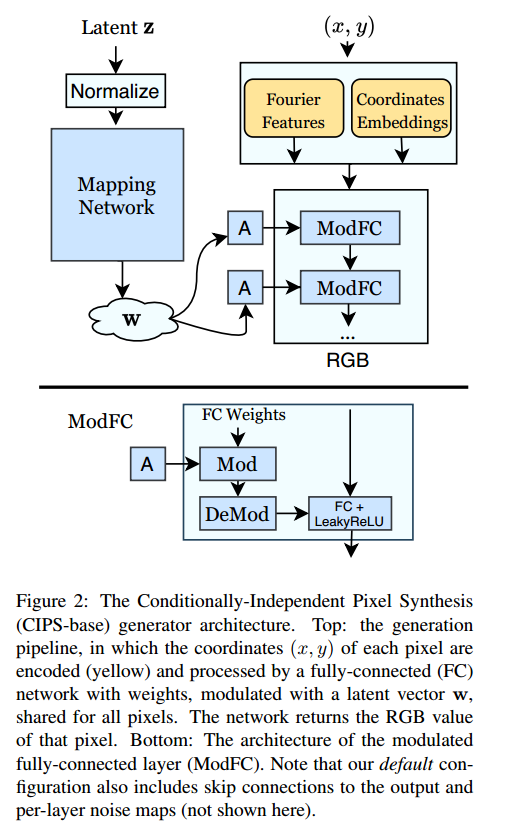

# Image Generators with Conditionally-Independent Pixel Synthesis

## 1. Motivations & Arguments & Contributions
现有的深度模型依赖于卷积或者attention，本文作者只利用MLP，不依赖于任何的卷积或attention，实现从坐标到图像的生成。  

#### Arguments
（1）现有的深度模型依赖卷积或attention。  
（2）现有的基于MLP的图像隐式表示仅能拟合一张图像或者是同一场景的一组图像。  

#### Contributions
本文提出了一种新的只用MLP的从图像坐标生成图像的方法。Conditionally-Independent Pixel Synthesis(CIPS)  可以实现与现有的StyleGANv2相似的生成结果。  

## 2. Methodology
本文利用了GAN的架构，生成器用MLP实现。  

  

生成器的输入是一个高斯噪声z，和二维坐标(x, y)。z经过和stylegan类似的映射网络之后对于MLP中间结果进行调制。

## 3. Experiments

## 4. Ablation Study
