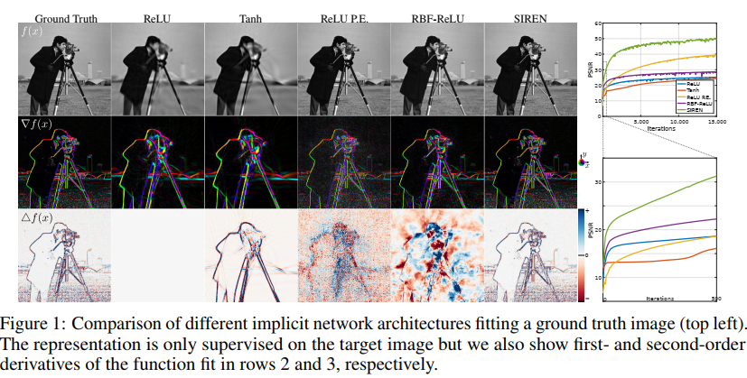
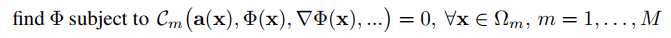
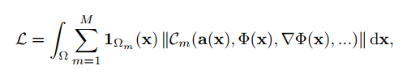
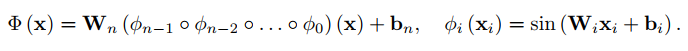
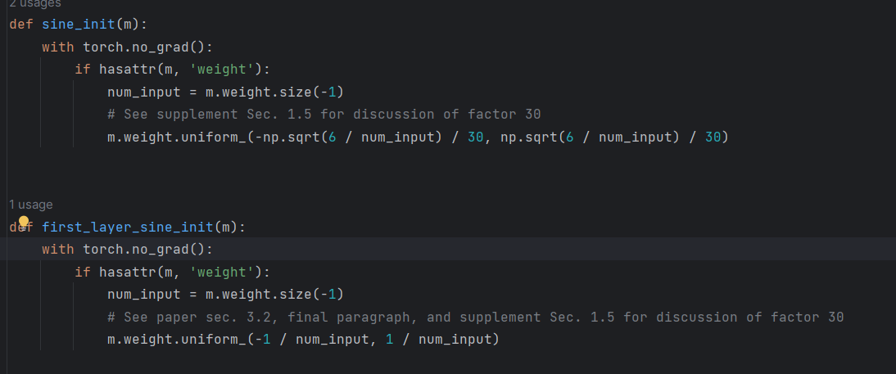

# Implicit Neural Representations with Periodic Activation Functions

## 1. Motivations & Arguments & Contributions

本文利用周期性激活函数实现神经隐式表示。

#### Arguments

* 现有的神经隐式表示不能建模信号的细节。
* 现有的神经隐式表示不能准确建模信号的时空导数。

#### Contributions

* 一种使用周期激活函数的连续神经隐式表示，可以鲁棒的拟合复杂信号以及它们的导数。
* 用于训练这些表示并验证可以使用超网络学习这些表示的分布的初始化方案。
* 实验证明本文方法的有效性。包括图像，视频，音频，3D shape重建；求解一阶微分方程来评估信号的导数；求解二阶微分方程。

## 2. Methodology

### 2.1 问题定义

本文的目标是找到一个函数 $\Phi$ 使其能够满足 M 个约束条件：  

这 M 个约束条件可以表示为损失函数的形式。  

### 2.2 周期激活函数

本文提出了SIREN，一种周期激活函数用于神经隐式表示。

SIREN的任意阶导数，都是SIREN的组合。

### 2.3 初始化机制

初始化机制的核心思想是保证网络的输出在初始化之后可以与网络的层数无关。并且，SIREN的初始化对于最终网络的收敛速度和准确度影响很大。

参数初始化，第一层参数服从均匀分布 $U(-1, 1)$ ，外部乘上30。其他层参数服从 $U(-\sqrt{6/n}, \sqrt{6/n})$ 均匀分布，不需要乘30。

推导见原文附录。

## 3. Experiments

