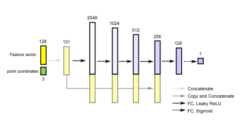
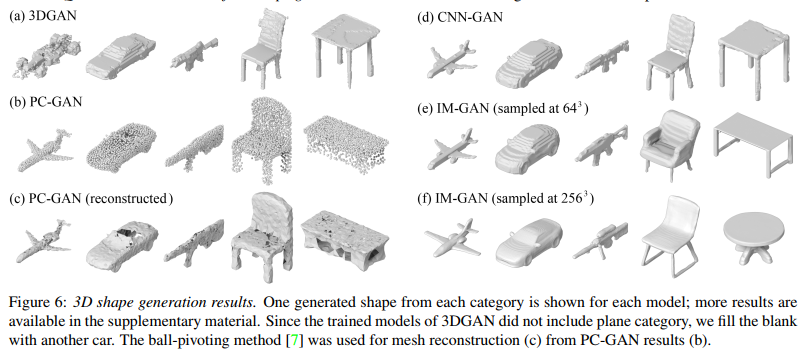
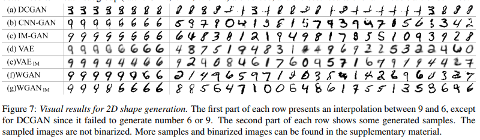
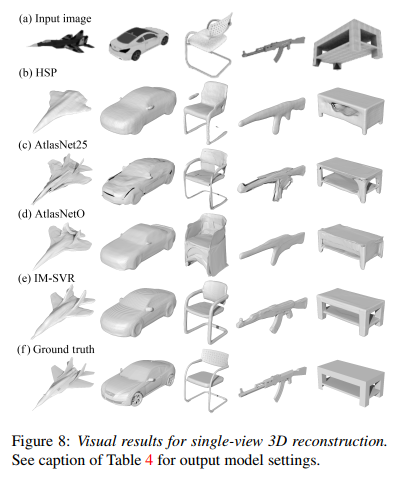

# Learning Implicit Fields for Generative Shape Modeling

2019.09.16 CVPR2019

## 1. Motivations & Arguments & Contributions

本文提出了一种神经隐式表示用于生成shape模型。  

#### Arguments

现有的方法生成的3D模型视觉质量不高。原因是分辨率太低，太过平滑，或者表面不连续，以及各种拓扑噪声和不规则。  

#### Contributions

本文的主要贡献是提出了一种神经隐式表示的方法，用于3D shape，2D shape的模型生成以及3D 单视角重建。  

## 2. Methodology

主要的方法就是把隐式神经表示作为解码器，结合GAN或者VAE等的结构。  

## 3. Experiments

3D Shape生成。  

2D shape生成  

3D 单视角重建  

## 4. Ablation Study

本文的方法需要更长的训练时间。