# Image Manipulation and Synthesis

## 01. ADIR: Adaptive Diffusion for Image Reconstruction

无代码

#### 应用
SR，Deblur，Denoise，Inpainting

#### 方法
基于目标图像可以表示为 $y =  Ax + e$ 利用泰勒展开等近似方法得到。

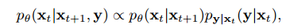

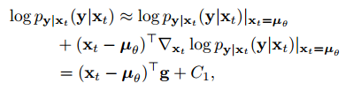

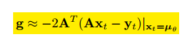

在一个大数据集中，利用CLIP得到与条件图像最邻近的K张，用来对预训练好的Diffusion进行微调。

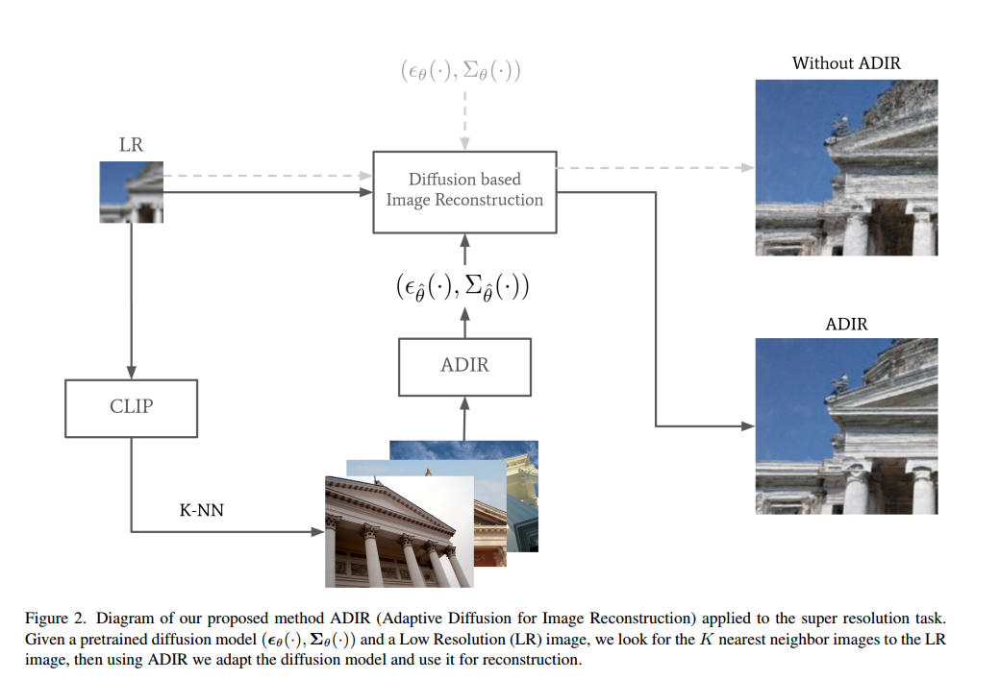

采样算法：

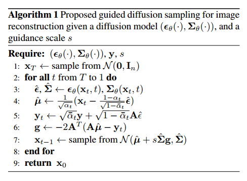

#### 问题
 A矩阵怎么得到？

## 02. SDM: Spatial Diffusion Model for Large Hole Image Inpainting

https://github.com/fenglinglwb/SDM
但是还没有更新代码和模型

#### 应用
Large Hole Inpainting

#### 方法
#### 训练
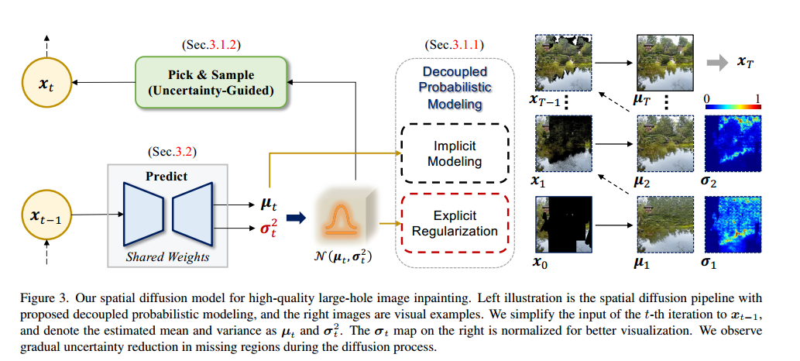

通过其Loss的设置可以很清晰的看出来。U-Net的输出为两个，一个是均值，一个是方差。

第一项是控制中间数据分布与正态分布要一致。这一项只对输出的方差有效，对均值项stop-gradient。不太明白怎么实现，具体实现需要参考源码。

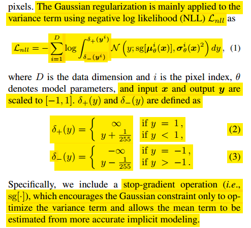

第二项是对抗损失，判别器用了stylegan的判别器。

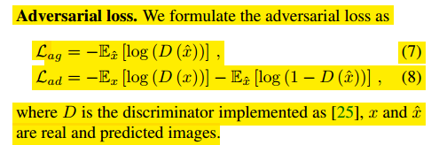

第三项是感知损失。用预训练的ResNet50。

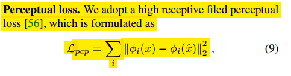

#### 采样
三个步骤
1. 预测
模型输入是三个部分masked image $x_{t-1}$，mask $m_{t-1}$，uncertainty map $u_{t-1}$。然后得到 $x_t$, $u_t$。其中 $u_t$ 是由 $\sigam_t$ 得到的。

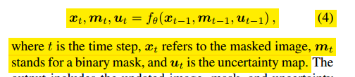

2. Pick
第二步是利用uncertainty map得到置信度最高的部分像素添加进去，然后更新mask和uncertainty map。
按照本文的设计置信度高和无mask的部分的方差会趋向于0

3. Sample
第三步是对于没有mask的部分直接用 x_0, 对于有mask的部分需要采样。

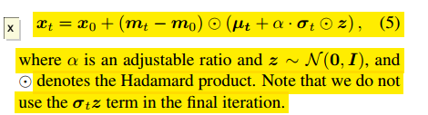

## 6. Direct Inversion: Optimization-Free Text-Driven Real Image Editing with Diffusion Models

https://blog.csdn.net/D_Trump/article/details/128937997?spm=1001.2014.3001.5501

## 7. Fine-tuning Diffusion Models with Limited Data

https://blog.csdn.net/D_Trump/article/details/128938260?spm=1001.2014.3001.5501

## 8. MaskGIT: Masked Generative Image Transformer(CVPR2022)

https://blog.csdn.net/D_Trump/article/details/128938328?spm=1001.2014.3001.5501

## 9. MaskSketch: Unpaired Structure-guided Masked Image Generation

https://blog.csdn.net/D_Trump/article/details/128950613?spm=1001.2014.3001.5501

## 10. Imagic: Text-Based Real Image Editing with Diffusion Models

https://blog.csdn.net/D_Trump/article/details/129031253?spm=1001.2014.3001.5501

## 11. EDICT: Exact Diffusion Inversion via Coupled Transformations

从Flow中得到的灵感，精髓在于两个式子

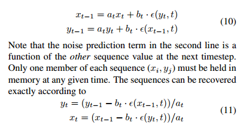

## 12. SINE: Single Image Editing with Text-to-Image Diffusion Models

single image， patch

## 13. Zero-shot Image-to-Image Translation

1. 利用大量的GPT生成源域和目标域的文本，计算edit方向。
2. DDIM Inversion加入噪声正则化。

## 5. An Image is Worth One Word

用特殊字符及其 embedding 代替物体或者风格。

# Video

## 14. VIDM：Video Implicit Diffusion Models

https://github.com/MKFMIKU/VIDM

#### 应用
video generation

#### 方法

##### Truncation Trick
思想来自于StyleGAN的固定的可学输入c

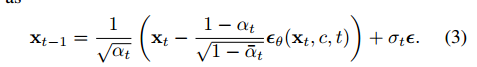

##### Robustness Penalty
去掉dropout层，而在损失中加入一个小量。

#### Video Implicit Diffusion Model
将视频生成分成两个部分，Content Generator和Motion Generator。

Content Generator用Diffusion来生成首帧。加入了Truncation Trick。
Motion Generator根据输入的首帧和n来输出到第n帧的变化量。

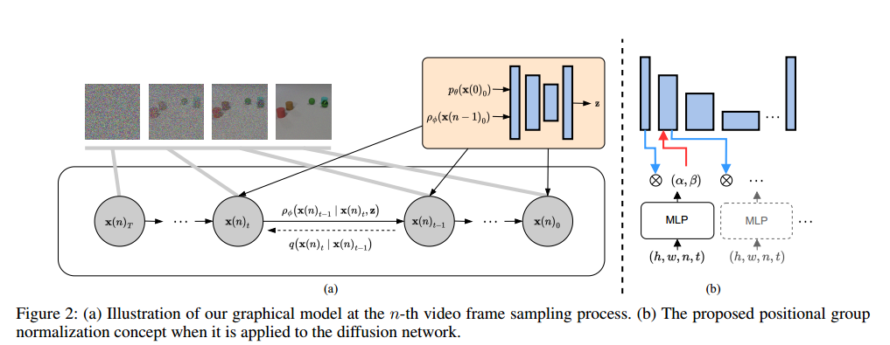

#### Positional Group Normalization
一个改进是在U-Net中引入时空坐标（h,w,n,t）增强结果的连续性。做法就是用PosGN

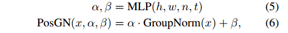

# 3D

## 15. DiffMotion： Speech-Driven Gesture Synthesis Using Denoising Diffusion Models

主要思想是把Diffusion当做LSTM的解码器。

需要串行训练。
