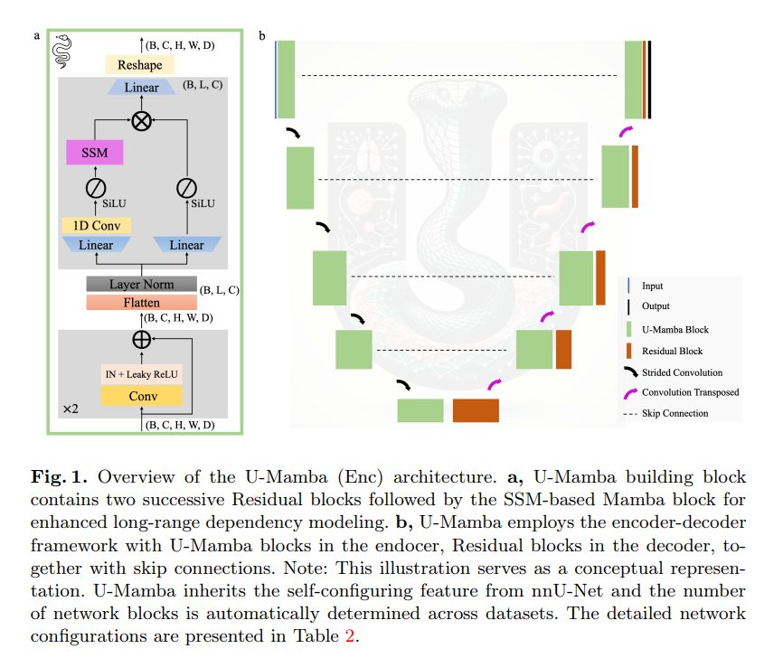
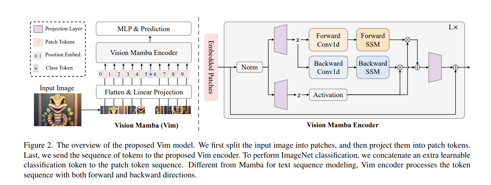
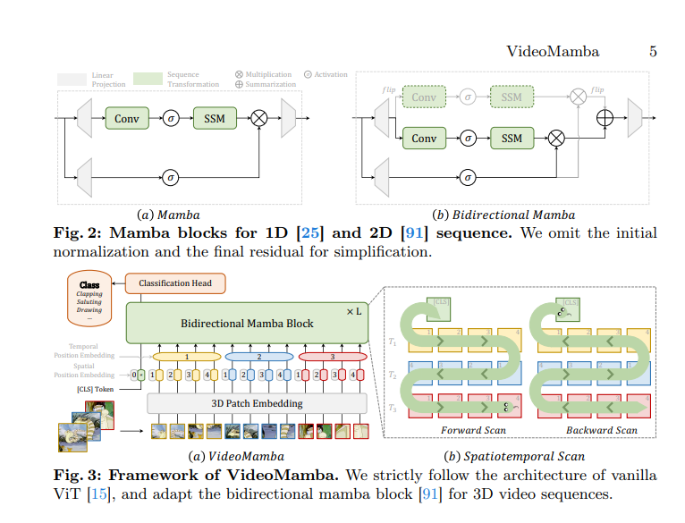

# 2401 U-Mamba: Enhancing Long-range Dependency for Biomedical Image Segmentation

Arxiv / University of Toronto

结合Mamba与U-Net

# 2401 Vision Mamba: Efficient Visual Representation Learning with Bidirectional State Space Model

Arxiv / Huazhong University of Science and Technolog

图像分Patch之后利用双向的两个mamba block

# 2403 VideoMamba: State Space Model for Efficient Video Understanding

Arxiv / Chinese Academy of Sciences

与上一篇思路类似，区别是把双向mamba用于视频

