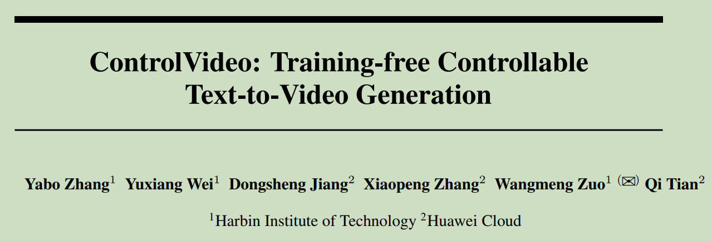
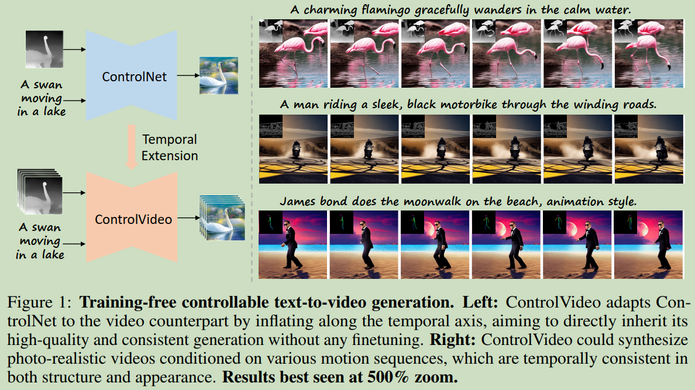
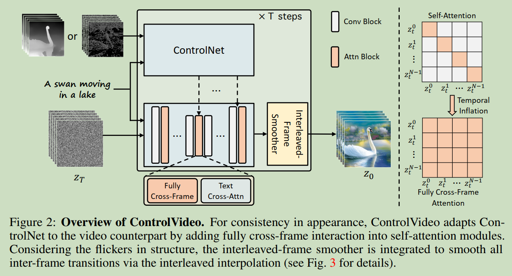
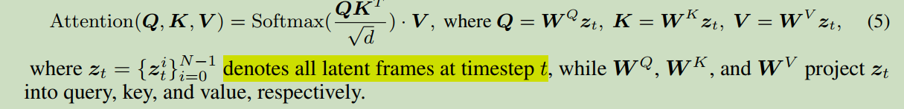
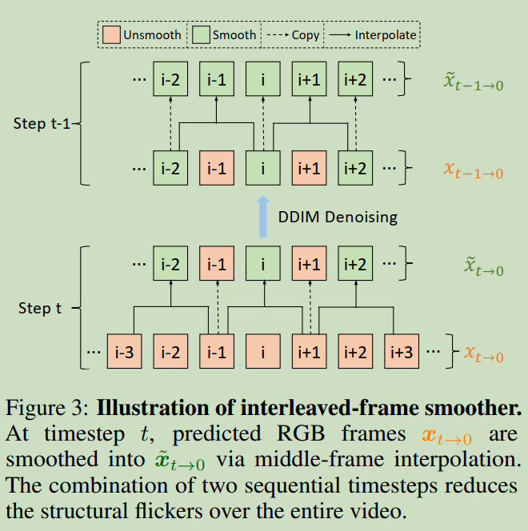
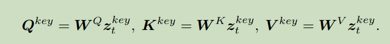
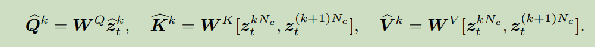
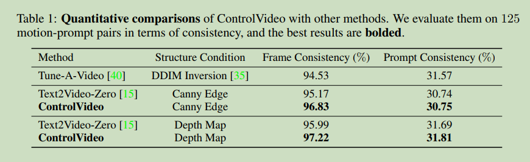
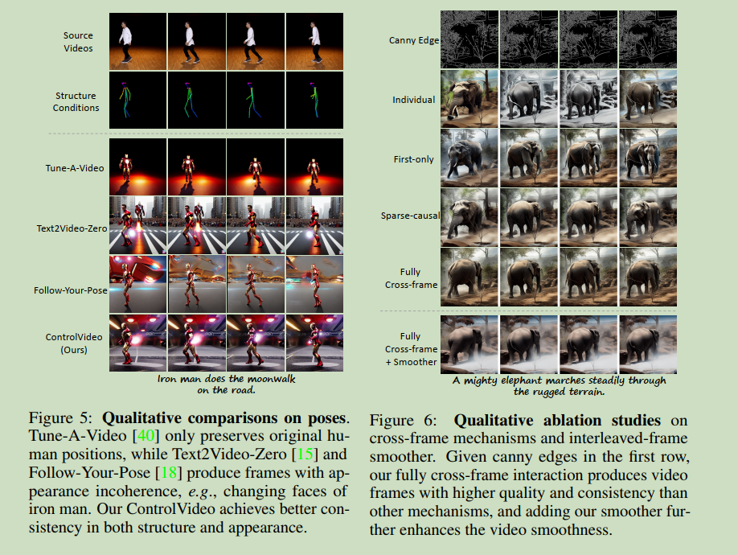

# 007 ControlVideo: Training-free Controllable Text-to-Video Generation  

### Origin: ICLR2024, Harbin Institute of Technology
### Code: https://github.com/YBYBZhang/ControlVideo
### Label: zero-shot; text-to-video; Stable Diffusion 

 

## 1. Arguments & Motivations & Contributions

 **Arguments:**  
 1. excessive training cost  
 2. appearance inconsistency and structural flickers  

 **Contributions:**  
 1. propose a training-free ControlVideo for controllable text-to-video generation   
 2. fully cross-attention demonstrates higher video quality and appearance consistency  
 3. interleaved-frame smoother further reduces structural flickers throughout a whole video  
 4. hierarchical sampler enables efficient long-video generation in commodity GPUs  

 

 

## 2. Method

 Controllable text-to-video generation aims to produce a video of length $N$ conditioned on motion sequences $\bm{c} = \lbrace \bm{c}^i \rbrace_{i=0}^{N-1}$ and a text prompt $\tau$.

   

 **Fully Cross-Frame Interaction:**  

 计算所有帧的attention  

   

 **with the efficient implementation, the fully cross-frame attention only brings little memory and acceptable computational burden in short-video generation (< 16 frames).**  

 **Interleaved-frame smoother:**  

 propose an interleaved-frame smoother to mitigate the flicker effect in structure.  

   

 在指定的时间步中, 先从隐空间得到像素空间, 然后在像素空间做 middle-frame Interpolation, 之后再转换回隐空间继续采样.  

 **Hierarchical Sampler:**  

 对于长视频, 将其按照关键帧进行分割  
 先利用fully cross-frame attention生成关键帧, 

   

 之后补全关键帧之间帧  

   

  

## 3. Experiments

 **ControVideo could produce both short and long videos with one NVIDIA RTX 2080Ti in about 2 and 10 minutes.**

   

   