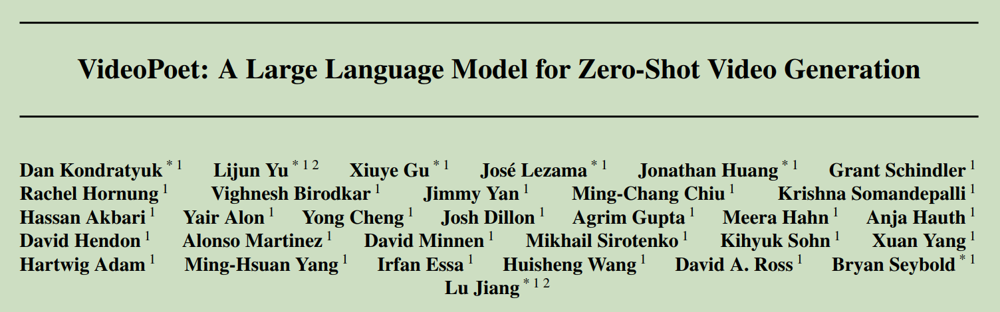
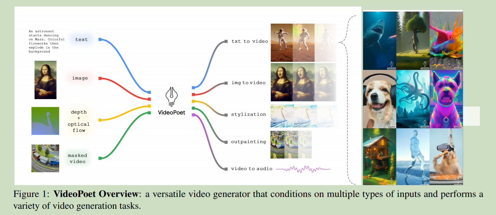

# 008 VideoPoet: A Large Language Model for Zero-Shot Video Generation

  

### Origin: ICML2024, Google
### Code: No code, Demo Page: https://sites.research.google/videopoet/
### Label: zero-shot; text-to-video; LLM

google 大力出奇迹的模型.  

  

利用训练大语言模型的思路训练多模态视频模型.  

先在多任务上预训练模型,然后在单个任务上微调.  