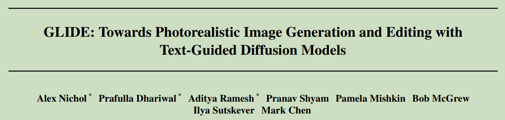
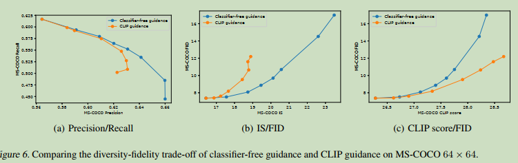
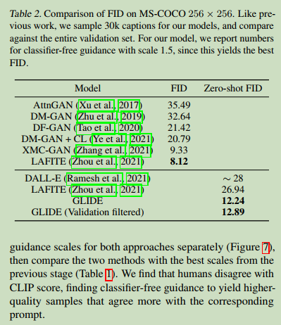
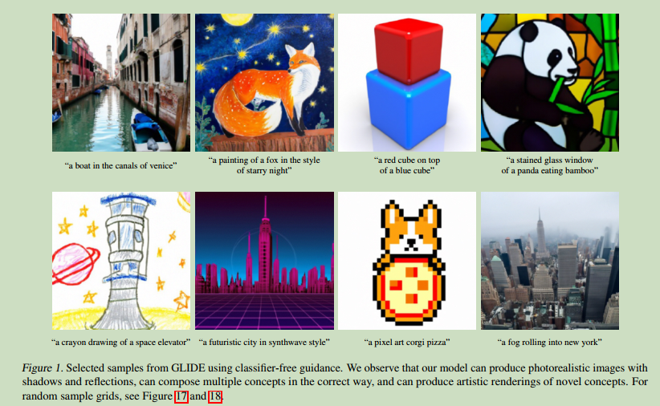
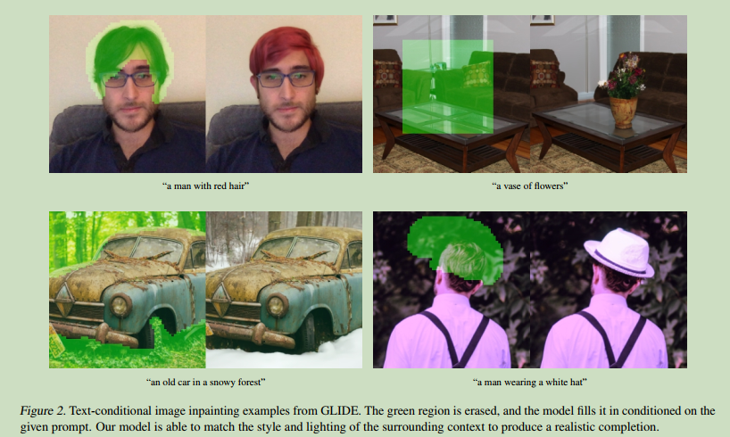

# GLIDE: Towards Photorealistic Image Generation and Editing with Text-Guided Diffusion Models

  

**Origin:** PMLR2022; OpenAI; **[[Project Code](https://github.com/openai/glide-text2im)]**  
**Authors:** Alex Nichol, Prafulla Dhariwal, Aditya Ramesh, etc.    
**Label:** text-to-image; diffusion model;   
**Abastract:** The first text-to-image diffusion model. Using Classifier-Free Guidance.     

 

## 1. Arguments & Motivations & Contributions

### Motivations
1. A tool capable of generating realistic images from natural language can empower humans to create rich and diverse visual content with unprecedented ease.  

2. The ability to edit images using natural language further allows for iterative refinement and fine-grained control  

### Contributions

1. 提出了GLIDE
2. 探究了CLIP Guidance和Classifier-Free Guidance的不同效果, 后者效果更好.  
3. 可以进行edit

 

## 2. Methodology

先训练64x64的文本图像模型,包含了扩散模型的2.3B参数和transformer text encoder的1.2B参数. 之后训练1.5B参数的超分辨率扩散模型, 从64x64上采样到256x256.  

To condition on the text, we first encode it into a sequence of K tokens, and feed these tokens into a Transformer model. The output of this transformer is used in two ways: first, the final token embedding is used in place of a class embedding in the ADM model; second, the last layer of token embeddings (a sequence of K feature vectors) is separately projected to the dimensionality of each attention layer throughout the ADM model, and then concatenated to the attention context at each layer.

之后微调模型, 20% 的empty sequence, 以实现classifier free guidance.  

为了实用classifier guidance, 训练了noised CLIP model, 并加入了额外的image encoder, 训练目标与原始CLIP相同.  

## 3. Experiments

### Classifier-free and CLIP Guidance

本文比较了classifier-free guidance和CLIP guidance.  

  

可以看出 classifier-free guidance的量化指标更高.  

### 与其他方法的比较

  

本文方法比DALL E的12B参数量要少很多.  

  

  