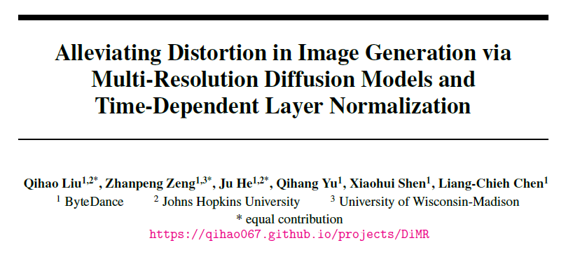
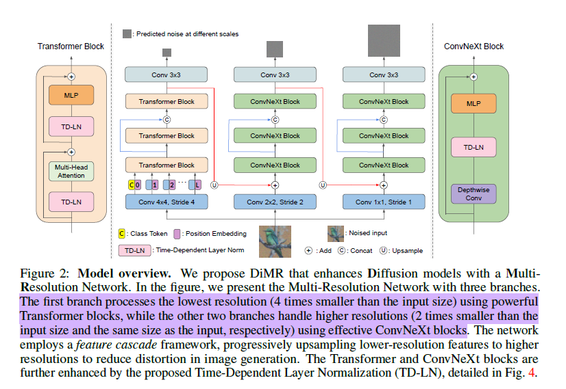
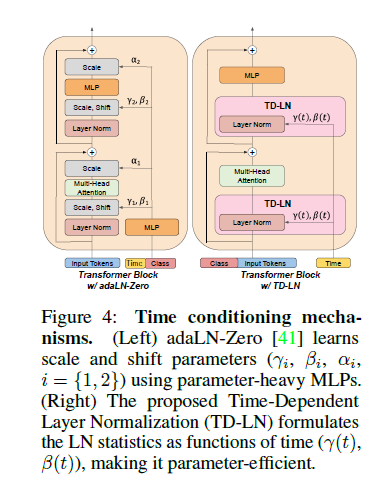

# Alleviating Distortion in Image Generation via Multi-Resolution Diffusion Models and Time-Dependent Layer Normalization

### Motivations

the distortion in U-ViT and DiT arises from their oversimplified upsampling module, where lower-resolution feature maps are upsampled directly to the target size of the generated images via a simple linear layer (for increasing channels) and pixel shuffling upsampling.

