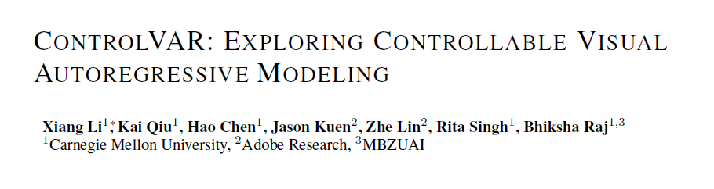
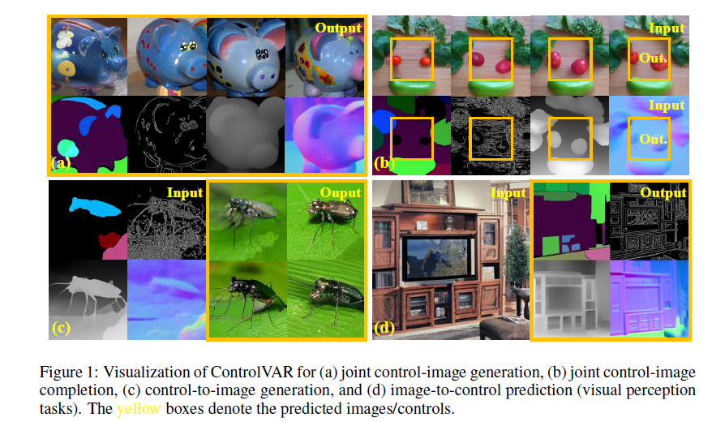
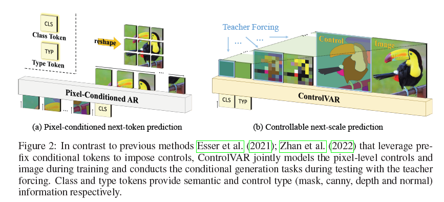
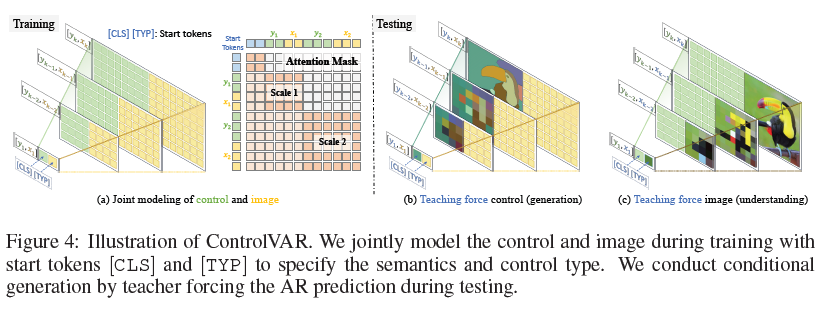

# CONTROLVAR: EXPLORING CONTROLLABLE VISUAL AUTOREGRESSIVE MODELING

### Motivations
challenges such as expensive computational cost, high inference latency,
and difficulties of integration with large language models (LLMs) have necessitated exploring alternatives to DMs.

ControlVAR jointly models the distribution of image and pixel-level conditions during training and imposes conditional controls during testing.
To enhance the joint modeling, we adopt the next-scale AR prediction paradigm and unify control and image representations. A teacher-forcing guidance strategy is proposed to further facilitate controllable generation with joint modeling.

