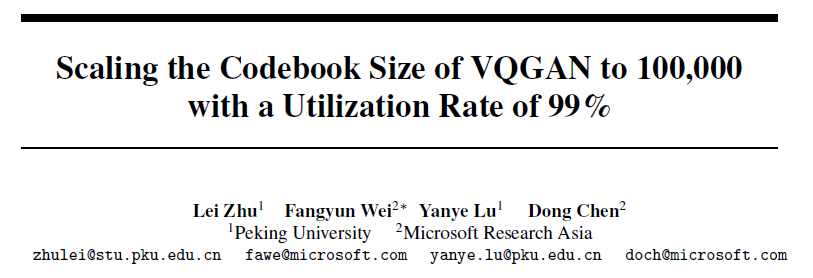
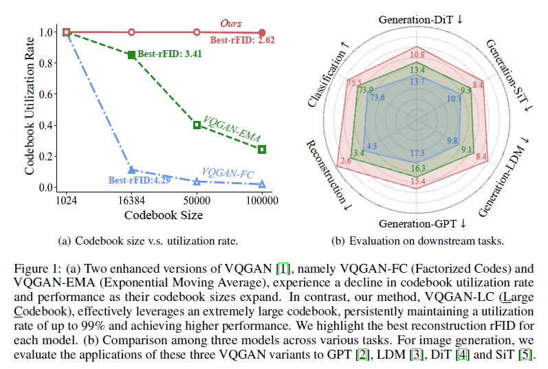
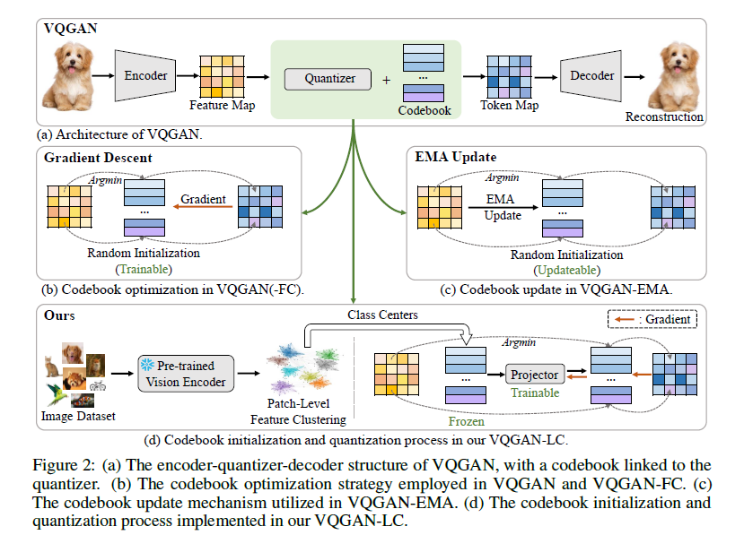
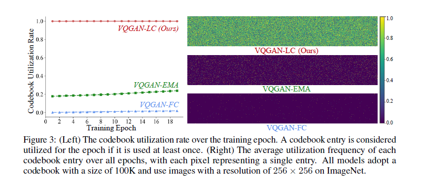
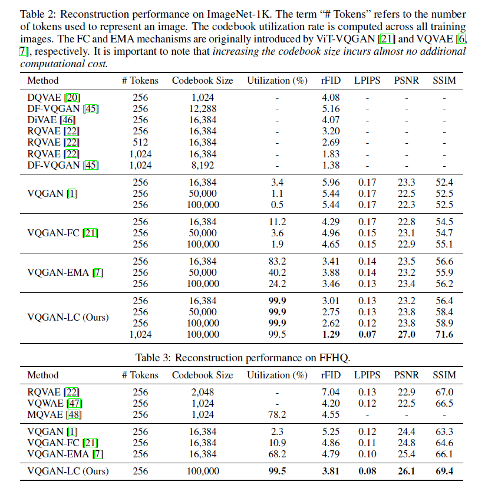

# Scaling the Codebook Size of VQGAN to 100,000 with a Utilization Rate of 99%

### Motivations

Recent advancements, particularly with LLAMA 3, reveal that enlarging the codebook significantly enhances model performance. However, VQGAN and its derivatives, such as VQGAN-FC (Factorized Codes) and VQGAN-EMA, continue to grapple with challenges related to expanding the codebook size and enhancing codebook utilization.

