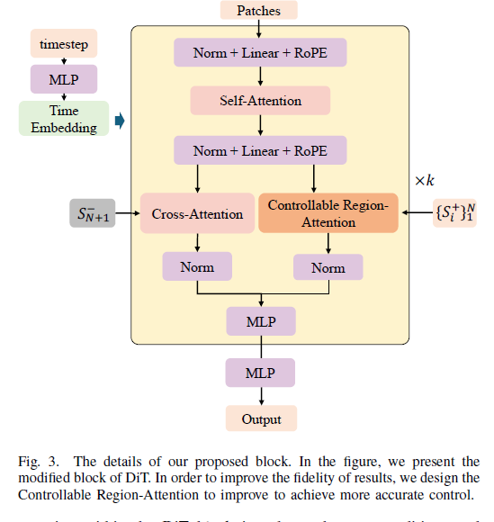
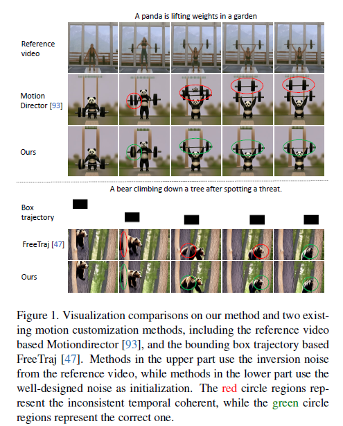

### 001 [Perception-as-Control: Fine-grained Controllable Image Animation with 3D-aware Motion Representation](https://arxiv.org/abs/2501.05020)

There are two kinds of motion: **camera motion** and **object motion**  

The framework takes a single reference image and the perception results of the corresponding 3D-aware motion representation as motion control signals, which are spatially aligned with the reference image.  

 

### 002 [Beyond Flat Text: Dual Self-inherited Guidance for Visual Text Generation](https://arxiv.org/abs/2501.05892)

This paper introduce a new training-free framework which accurately generates visual texts in challenging scenerios.  

The model contains two branches:  
**semantic rectification branch**
**Structure Injection Branch**

**AdaIN** can be adapted to maintain reference image hight-level information in zero-shot manner, like style etc.

 

### 003 [Enhancing Image Generation Fidelity via Progressive Prompts](https://arxiv.org/abs/2501.07070)

This paper proposes a coarse-to-fine generation pipeline for regional prompt-following generation.

The image is diveded into different adjacent regions, then using LLM to generate prompt for each region. Using attention fusion to generate the final image. 

 

### 004 [Training-Free Motion-Guided Video Generation with Enhanced Temporal Consistency Using Motion Consistency Loss](https://arxiv.org/abs/2501.07563)

This paper proposes a novel training-free motion-guided video generation method. It contains two main contributions: 
**initial-noise-based approach**
**a novel motion consistency loss**

 

### 005 [Tuning-Free Long Video Generation via Global-Local Collaborative Diffusion](https://arxiv.org/abs/2501.05484)

